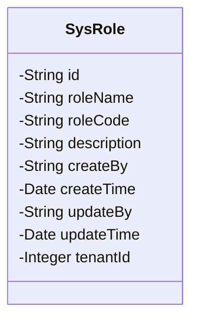
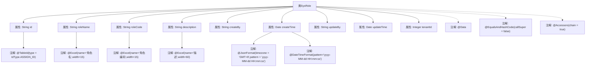

# 基础信息

|      |      |
|------|------|
| 名称 | SysRole |
| 编码语言 | .java |
| 代码路径 | JeecgBoot/jeecg-boot/jeecg-module-system/jeecg-system-biz/src/main/java/org/jeecg/modules/system/entity/SysRole.java |
| 包名 | org.jeecg.modules.system.entity |
| 依赖项 | ['java.io.Serializable', 'java.time.LocalDateTime', 'java.util.Date', 'org.jeecgframework.poi.excel.annotation.Excel', 'org.springframework.format.annotation.DateTimeFormat', 'com.baomidou.mybatisplus.annotation.IdType', 'com.baomidou.mybatisplus.annotation.TableId', 'com.fasterxml.jackson.annotation.JsonFormat', 'lombok.Data', 'lombok.EqualsAndHashCode', 'lombok.experimental.Accessors'] |
| 概述说明 | SysRole类包含角色ID、名称、编码、描述、创建人、创建时间、更新人、更新时间和租户ID。 |

# 说明

SysRole类是一个用于管理角色信息的实体类，包含角色ID、角色名称、角色编码、角色描述、创建人、创建时间、更新人、更新时间和租户ID等关键属性。这些属性分别用于标识角色的唯一性、记录角色的基本信息、描述角色的功能、追踪角色的创建和更新信息以及区分不同租户的角色数据。该类为角色管理提供了全面的数据支持。

# 类列表 Class Summary

| 名称   | 类型  | 说明 |
|-------|------|-------------|
| SysRole | class | SysRole类包含角色ID、名称、编码、描述、创建人、创建时间、更新人、更新时间和租户ID。 |

## 类 SysRole

|      |      |
|------|------|
| 访问范围 | @Data;@EqualsAndHashCode(callSuper = false);@Accessors(chain = true);public |
| 类型 | class |
| 名称 | SysRole |
| 说明 | SysRole类包含角色ID、名称、编码、描述、创建人、创建时间、更新人、更新时间和租户ID。 |

### UML类图

**描述：**  
`SysRole` 类是一个用于表示系统角色的实体类，包含了角色的基本信息如 `id`、`roleName`、`roleCode`、`description` 等。此外，它还记录了角色的创建和更新时间、创建人和更新人信息，以及租户ID。该类实现了 `Serializable` 接口，以确保对象可以被序列化。通过注解 `@Data`、`@EqualsAndHashCode` 和 `@Accessors`，该类自动生成了常用的方法如 `getter`、`setter`、`equals`、`hashCode` 等，并且支持链式调用。

### 内部方法调用关系图

这段代码定义了一个名为`SysRole`的Java类，该类实现了`Serializable`接口，表明它可以被序列化。类中包含多个属性，如`id`、`roleName`、`roleCode`、`description`等，每个属性都有相应的注解来定义其行为或格式。例如，`@TableId`注解用于标识主键，`@Excel`注解用于定义Excel导出时的列名和宽度，`@JsonFormat`和`@DateTimeFormat`注解用于定义日期格式。类上还使用了`@Data`、`@EqualsAndHashCode`和`@Accessors`等Lombok注解，用于自动生成getter、setter、equals、hashCode等方法，并支持链式调用。

### 字段列表 Field List

| 名称  | 类型  | 说明 |
|-------|-------|------|
| serialVersionUID = 1L | long | 声明一个私有的静态常量序列化版本UID。 |
| updateBy | String | 私有字符串变量用于记录更新者信息。 |
| createBy | String | 创建者字段，类型为私有字符串。 |
| roleName | String | Excel表格中定义了一个名为“角色名”的字符串类型字段。 |
| roleCode | String | 角色编码字段，类型为字符串，宽度15。 |
| id | String | 表主键使用自定义ID生成策略，类型为字符串。 |
| updateTime | Date | 使用GMT+8时区，定义日期格式为yyyy-MM-dd HH:mm:ss。 |
| description | String | Excel中定义了一个宽度为60的描述字段。 |
| tenantId | java.lang.Integer | 私有整型变量tenantId，用于存储租户ID。 |
| createTime | Date | 定义日期格式为GMT+8，模式为yyyy-MM-dd HH:mm:ss。 |

### 方法列表 Method List

| 名称  | 类型  | 说明 |
|-------|-------|------|

