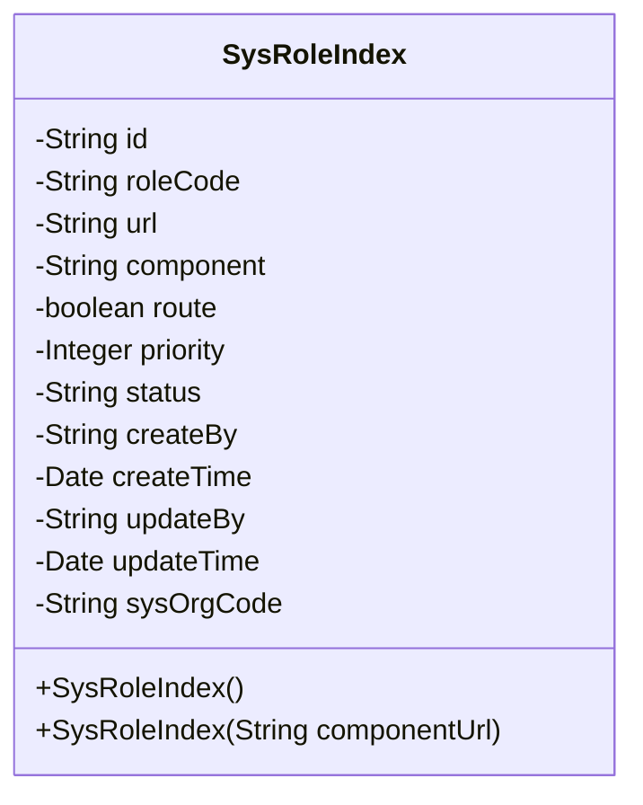

# 基础信息

|      |      |
|------|------|
| 名称 | SysRoleIndex |
| 编码语言 | .java |
| 代码路径 | JeecgBoot/jeecg-boot/jeecg-module-system/jeecg-system-biz/src/main/java/org/jeecg/modules/system/entity/SysRoleIndex.java |
| 包名 | org.jeecg.modules.system.entity |
| 依赖项 | ['java.io.Serializable', 'java.util.Date', 'com.baomidou.mybatisplus.annotation.IdType', 'com.baomidou.mybatisplus.annotation.TableId', 'com.baomidou.mybatisplus.annotation.TableName', 'com.baomidou.mybatisplus.annotation.TableField', 'io.swagger.v3.oas.annotations.media.Schema', 'lombok.Data', 'lombok.EqualsAndHashCode', 'lombok.experimental.Accessors', 'com.fasterxml.jackson.annotation.JsonFormat', 'org.springframework.format.annotation.DateTimeFormat', 'org.jeecgframework.poi.excel.annotation.Excel'] |
| 概述说明 | SysRoleIndex类用于角色首页配置，包含ID、编码、路由、组件、菜单、优先级、状态、创建人、创建日期、更新人、更新日期及部门字段。 |

# 说明

SysRoleIndex类用于角色首页配置，包含多个关键字段：ID用于唯一标识，角色编码标识角色类型，路由地址和组件定义页面路径和组件，是否路由菜单指示是否为菜单项，优先级决定显示顺序，状态表示当前状态，创建人和更新人记录操作者，创建日期和更新日期记录时间戳，所属部门标识角色所属部门。这些字段共同确保角色首页配置的完整性和可管理性。

# 类列表 Class Summary

| 名称   | 类型  | 说明 |
|-------|------|-------------|
| SysRoleIndex | class | SysRoleIndex类用于角色首页配置，包含ID、角色编码、路由地址、组件、是否路由菜单、优先级、状态、创建人、创建日期、更新人、更新日期及所属部门等字段。 |

## 类 SysRoleIndex

|      |      |
|------|------|
| 访问范围 | @Data;@TableName("sys_role_index");@EqualsAndHashCode(callSuper = false);@Accessors(chain = true);@Schema(description="角色首页配置");public |
| 类型 | class |
| 名称 | SysRoleIndex |
| 说明 | SysRoleIndex类用于角色首页配置，包含ID、角色编码、路由地址、组件、是否路由菜单、优先级、状态、创建人、创建日期、更新人、更新日期及所属部门等字段。 |

### UML类图

**描述：**  
`SysRoleIndex` 类是一个用于描述角色首页配置的实体类，包含了多个属性，如角色编码、路由地址、组件、是否路由菜单、优先级、状态、创建人、创建日期、更新人、更新日期以及所属部门。类中定义了两个构造函数，一个无参构造函数和一个带有 `componentUrl` 参数的构造函数。该类通过注解与数据库表 `sys_role_index` 进行映射，并提供了对属性的描述和格式化信息。

### 内部方法调用关系图

```mermaid
graph TD
    A["类SysRoleIndex"]
    B["属性: java.lang.String id"]
    C["属性: java.lang.String roleCode"]
    D["属性: java.lang.String url"]
    E["属性: java.lang.String component"]
    F["属性: boolean route"]
    G["属性: java.lang.Integer priority"]
    H["属性: java.lang.String status"]
    I["属性: java.lang.String createBy"]
    J["属性: java.util.Date createTime"]
    K["属性: java.lang.String updateBy"]
    L["属性: java.util.Date updateTime"]
    M["属性: java.lang.String sysOrgCode"]
    N["构造方法: SysRoleIndex()"]
    O["构造方法: SysRoleIndex(String componentUrl)"]

    A --> B
    A --> C
    A --> D
    A --> E
    A --> F
    A --> G
    A --> H
    A --> I
    A --> J
    A --> K
    A --> L
    A --> M
    A --> N
    A --> O
```

这段代码定义了一个名为 `SysRoleIndex` 的类，用于表示角色首页配置。该类包含多个属性，如 `id`、`roleCode`、`url`、`component` 等，分别用于存储不同的配置信息。类中还定义了两个构造方法，一个无参构造方法和一个带有 `componentUrl` 参数的构造方法。这些属性和构造方法共同构成了该类的核心功能，用于管理和存储角色首页的相关配置数据。

### 字段列表 Field List

| 名称  | 类型  | 说明 |
|-------|-------|------|
| component | java.lang.String | 路由地址组件字段定义为字符串类型。 |
| sysOrgCode | java.lang.String | 字段描述：所属部门，类型为字符串。 |
| url | java.lang.String | 路由地址字段，类型为字符串，用于存储路由信息。 |
| updateBy | java.lang.String | 更新人登录名称字段，类型为字符串。 |
| status | java.lang.String | Excel状态字段，类型为字符串，宽度15字符。 |
| route | boolean | 该代码定义了一个布尔类型字段route，用于标识是否为路由菜单。 |
| createBy | java.lang.String | 创建人登录名称字段，类型为字符串。 |
| id | java.lang.String | 表ID字段，类型为ASSIGN_ID，描述为id，数据类型为String。 |
| createTime | java.util.Date | 创建日期字段，格式为yyyy-MM-dd HH:mm:ss，时区GMT+8。 |
| priority | java.lang.Integer | Excel字段“优先级”对应Java整型变量priority，用于表示优先级。 |
| updateTime | java.util.Date | 更新日期字段，格式为yyyy-MM-dd HH:mm:ss，使用GMT+8时区。 |
| roleCode | java.lang.String | 角色编码字段，类型为字符串，宽度15。 |

### 方法列表 Method List

| 名称  | 类型  | 说明 |
|-------|-------|------|

