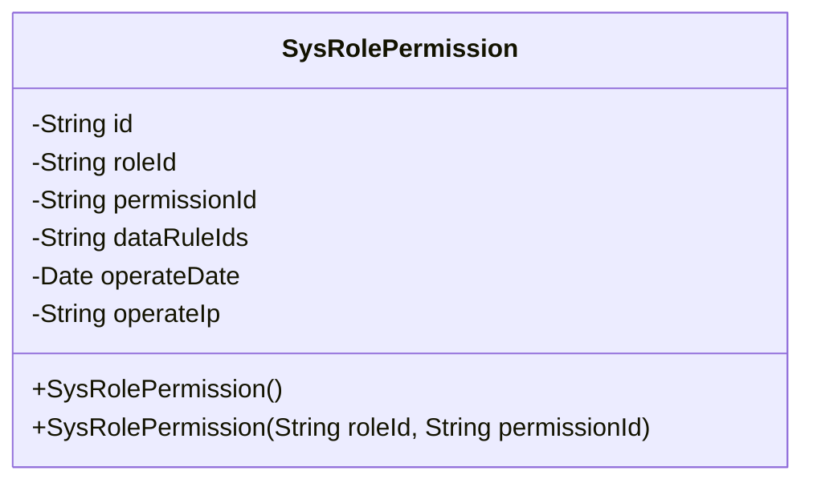
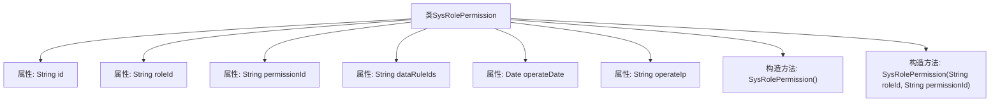

# 基础信息

|      |      |
|------|------|
| 名称 | SysRolePermission |
| 编码语言 | .java |
| 代码路径 | JeecgBoot/jeecg-boot/jeecg-module-system/jeecg-system-biz/src/main/java/org/jeecg/modules/system/entity/SysRolePermission.java |
| 包名 | org.jeecg.modules.system.entity |
| 依赖项 | ['java.io.Serializable', 'java.util.Date', 'com.baomidou.mybatisplus.annotation.IdType', 'com.baomidou.mybatisplus.annotation.TableId', 'com.fasterxml.jackson.annotation.JsonFormat', 'lombok.Data', 'lombok.EqualsAndHashCode', 'lombok.experimental.Accessors', 'org.springframework.format.annotation.DateTimeFormat'] |
| 概述说明 | SysRolePermission类存储角色与权限关联信息，包含ID、角色ID、权限ID等字段。 |

# 说明

SysRolePermission类主要用于存储角色与权限之间的关联信息。该类包含多个关键属性，包括唯一标识的ID、角色ID、权限ID、数据权限、操作时间以及操作IP。这些属性共同记录了角色与权限的关联关系，以及相关的操作记录和来源信息，确保系统能够准确管理和追踪权限分配情况。

# 类列表 Class Summary

| 名称   | 类型  | 说明 |
|-------|------|-------------|
| SysRolePermission | class | SysRolePermission类用于存储角色与权限的关联信息，包含ID、角色ID、权限ID、数据权限、操作时间和操作IP。 |

## 类 SysRolePermission

|      |      |
|------|------|
| 访问范围 | @Data;@EqualsAndHashCode(callSuper = false);@Accessors(chain = true);public |
| 类型 | class |
| 名称 | SysRolePermission |
| 说明 | SysRolePermission类用于存储角色与权限的关联信息，包含ID、角色ID、权限ID、数据权限、操作时间和操作IP。 |

### UML类图

这段代码定义了一个名为 `SysRolePermission` 的类，该类实现了 `Serializable` 接口，表明其实例可以被序列化。类中包含多个私有字段，如 `id`、`roleId`、`permissionId` 等，用于存储角色权限相关的信息。类提供了两个构造函数，一个无参构造函数和一个接受 `roleId` 和 `permissionId` 作为参数的构造函数。该类主要用于管理系统中角色与权限的关联关系。

### 内部方法调用关系图

这段代码定义了一个名为 `SysRolePermission` 的类，该类实现了 `Serializable` 接口，表明其实例可以被序列化。类中包含多个属性，如 `id`、`roleId`、`permissionId`、`dataRuleIds`、`operateDate` 和 `operateIp`，分别用于存储角色权限的相关信息。类中还定义了两个构造方法，一个无参构造方法和一个带有 `roleId` 和 `permissionId` 参数的构造方法，用于初始化对象。代码通过注解 `@Data`、`@EqualsAndHashCode` 和 `@Accessors` 自动生成了一些常用方法，如 `getter`、`setter` 和 `equals` 等。

### 字段列表 Field List

| 名称  | 类型  | 说明 |
|-------|-------|------|
| operateIp | String | 定义私有字符串变量operateIp。 |
| serialVersionUID = 1L | long | 声明一个静态不可变的序列化版本号，值为1L。 |
| dataRuleIds | String | 私有字符串变量存储数据规则ID。 |
| roleId | String | 定义私有字符串变量roleId。 |
| permissionId | String | 定义私有字符串变量permissionId。 |
| operateDate | Date | 定义日期字段，使用GMT+8时区，格式为yyyy-MM-dd HH:mm:ss。 |
| id | String | 使用ASSIGN_ID类型注解定义私有字符串ID字段。 |

### 方法列表 Method List

| 名称  | 类型  | 说明 |
|-------|-------|------|

