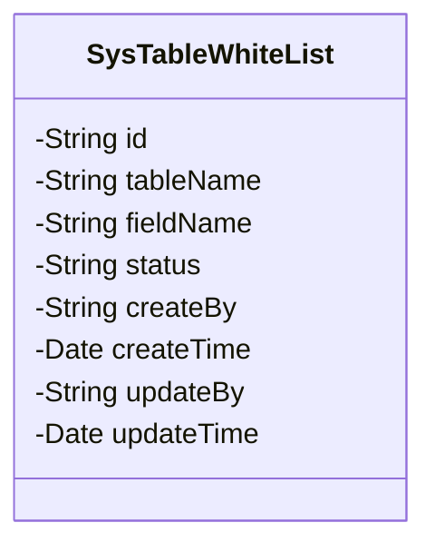

# 基础信息

|      |      |
|------|------|
| 名称 | SysTableWhiteList |
| 编码语言 | .java |
| 代码路径 | JeecgBoot/jeecg-boot/jeecg-module-system/jeecg-system-biz/src/main/java/org/jeecg/modules/system/entity/SysTableWhiteList.java |
| 包名 | org.jeecg.modules.system.entity |
| 依赖项 | ['com.baomidou.mybatisplus.annotation.IdType', 'com.baomidou.mybatisplus.annotation.TableId', 'com.baomidou.mybatisplus.annotation.TableName', 'com.fasterxml.jackson.annotation.JsonFormat', 'io.swagger.v3.oas.annotations.media.Schema', 'lombok.Data', 'lombok.EqualsAndHashCode', 'lombok.experimental.Accessors', 'org.jeecgframework.poi.excel.annotation.Excel', 'org.springframework.format.annotation.DateTimeFormat'] |
| 概述说明 | 系统表白名单类含主键、表名、字段名、状态、创建及更新信息。 |

# 说明

系统表白名单类是一个用于管理表结构信息的类，包含多个关键字段。主键用于唯一标识每条记录，表名表示所涉及的数据表名称，字段名则对应表中的具体字段。状态字段用于记录当前记录的生效状态。创建人和更新人分别记录了记录的创建者和最后更新者，而创建时间和更新时间则分别记录了记录的创建时间和最后更新时间。这些字段共同构成了一个完整的表结构信息管理类。

# 类列表 Class Summary

| 名称   | 类型  | 说明 |
|-------|------|-------------|
| SysTableWhiteList | class | 系统表白名单类，包含主键、表名、字段名、状态、创建人、创建时间、更新人、更新时间等字段。 |

## 类 SysTableWhiteList

|      |      |
|------|------|
| 访问范围 | @Data;@TableName("sys_table_white_list");@EqualsAndHashCode(callSuper = false);@Accessors(chain = true);@Schema(description = "系统表白名单");public |
| 类型 | class |
| 名称 | SysTableWhiteList |
| 说明 | 系统表白名单类，包含主键、表名、字段名、状态、创建人、创建时间、更新人、更新时间等字段。 |

### UML类图

**描述：**  
`SysTableWhiteList` 类是一个用于管理系统表白名单的实体类，包含了表名、字段名、状态等关键信息。类中的字段通过注解与数据库表进行映射，并提供了详细的描述信息。该类主要用于存储和操作系统中允许访问的表和字段的相关数据，支持链式调用，便于在业务逻辑中进行数据处理和传递。

### 内部方法调用关系图

```mermaid
graph TD
    A["类SysTableWhiteList"]
    B["属性: String id"]
    C["属性: String tableName"]
    D["属性: String fieldName"]
    E["属性: String status"]
    F["属性: String createBy"]
    G["属性: Date createTime"]
    H["属性: String updateBy"]
    I["属性: Date updateTime"]
    J["注解: @Data"]
    K["注解: @TableName('sys_table_white_list')"]
    L["注解: @EqualsAndHashCode(callSuper = false)"]
    M["注解: @Accessors(chain = true)"]
    N["注解: @Schema(description = '系统表白名单')"]
    O["注解: @TableId(type = IdType.ASSIGN_ID)"]
    P["注解: @Excel(name = '允许的表名', width = 15)"]
    Q["注解: @Excel(name = '允许的字段名', width = 15)"]
    R["注解: @Excel(name = '状态', width = 15)"]
    S["注解: @Excel(name = '创建人', width = 15)"]
    T["注解: @Excel(name = '创建时间', width = 20, format = 'yyyy-MM-dd HH:mm:ss')"]
    U["注解: @JsonFormat(timezone = 'GMT+8', pattern = 'yyyy-MM-dd HH:mm:ss')"]
    V["注解: @DateTimeFormat(pattern = 'yyyy-MM-dd HH:mm:ss')"]
    W["注解: @Excel(name = '更新人', width = 15)"]
    X["注解: @Excel(name = '更新时间', width = 20, format = 'yyyy-MM-dd HH:mm:ss')"]
    Y["注解: @JsonFormat(timezone = 'GMT+8', pattern = 'yyyy-MM-dd HH:mm:ss')"]
    Z["注解: @DateTimeFormat(pattern = 'yyyy-MM-dd HH:mm:ss')"]

    A --> J
    A --> K
    A --> L
    A --> M
    A --> N
    A --> B
    A --> C
    A --> D
    A --> E
    A --> F
    A --> G
    A --> H
    A --> I
    B --> O
    C --> P
    D --> Q
    E --> R
    F --> S
    G --> T
    G --> U
    G --> V
    H --> W
    I --> X
    I --> Y
    I --> Z
```

**描述：**
该代码定义了一个名为 `SysTableWhiteList` 的类，用于表示系统表白名单的实体。类中包含多个属性，如 `id`、`tableName`、`fieldName` 等，并使用了多种注解来标注这些属性的特性，如 `@Data`、`@TableName`、`@Excel` 等。这些注解用于生成 getter/setter 方法、指定数据库表名、以及格式化 Excel 导出等功能。

### 字段列表 Field List

| 名称  | 类型  | 说明 |
|-------|-------|------|
| fieldName | java.lang.String | 允许的字段名定义为私有字符串类型。 |
| id | java.lang.String | 表主键ID，类型为ASSIGN_ID，描述为主键id。 |
| status | java.lang.String | 状态字段，类型为字符串，用于描述状态。 |
| tableName | java.lang.String | 允许的表名字段，类型为字符串。 |
| createBy | java.lang.String | Excel列名为“创建人”，宽度15，描述为“创建人”，数据类型为String。 |
| updateBy | java.lang.String | Excel字段“更新人”对应Java类中的updateBy属性。 |
| createTime | java.util.Date | 定义日期类型字段，格式为yyyy-MM-dd HH:mm:ss，时区GMT+8。 |
| updateTime | java.util.Date | 更新时间字段，使用日期时间格式，遵循GMT+8时区。 |

### 方法列表 Method List

| 名称  | 类型  | 说明 |
|-------|-------|------|

