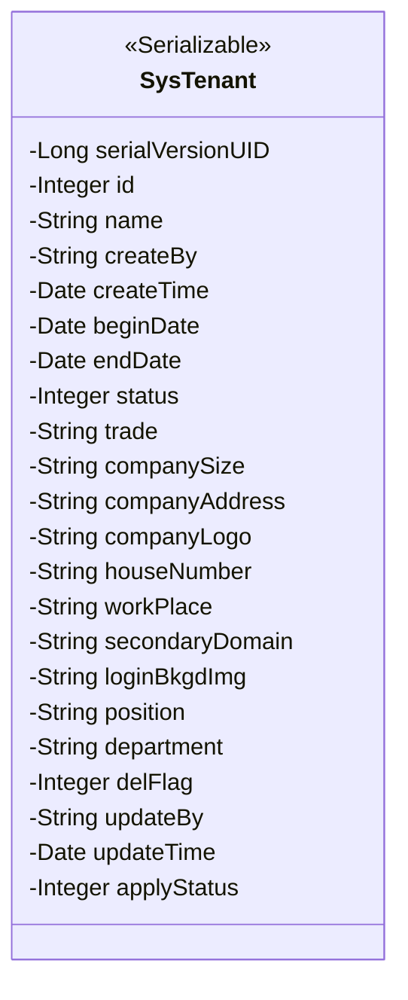

# 基础信息

|      |      |
|------|------|
| 名称 | SysTenant |
| 编码语言 | .java |
| 代码路径 | JeecgBoot/jeecg-boot/jeecg-module-system/jeecg-system-biz/src/main/java/org/jeecg/modules/system/entity/SysTenant.java |
| 包名 | org.jeecg.modules.system.entity |
| 依赖项 | ['com.baomidou.mybatisplus.annotation.TableId', 'com.baomidou.mybatisplus.annotation.TableLogic', 'com.baomidou.mybatisplus.annotation.TableName', 'com.fasterxml.jackson.annotation.JsonFormat', 'lombok.Data', 'org.jeecg.common.aspect.annotation.Dict', 'org.springframework.format.annotation.DateTimeFormat', 'java.io.Serializable', 'java.util.Date'] |
| 概述说明 | SysTenant类存储租户信息，含ID、名称、创建人、时间、状态、行业、规模、地址等字段。 |

# 说明

SysTenant类用于存储和管理租户的相关信息，包含多个关键字段。这些字段包括租户的唯一标识ID、租户名称、创建该租户的用户、创建时间、租户的当前状态、所属行业、规模以及地址等详细信息。通过这些字段，SysTenant类能够全面记录和描述租户的基本属性，便于系统进行租户信息的管理和查询。

# 类列表 Class Summary

| 名称   | 类型  | 说明 |
|-------|------|-------------|
| SysTenant | class | SysTenant类包含租户信息，如ID、名称、创建人、时间、状态、行业、规模、地址等字段。 |

## 类 SysTenant

|      |      |
|------|------|
| 访问范围 | @Data;@TableName("sys_tenant");public |
| 类型 | class |
| 名称 | SysTenant |
| 说明 | SysTenant类包含租户信息，如ID、名称、创建人、时间、状态、行业、规模、地址等字段。 |

### UML类图

**描述：**  
`SysTenant` 类是一个实现了 `Serializable` 接口的实体类，用于表示系统中的租户信息。它包含了租户的基本信息如编码、名称、创建人、创建时间等，以及一些扩展信息如公司规模、公司地址、职级等。类中的多个字段使用了注解进行格式化或字典映射，如 `@JsonFormat`、`@DateTimeFormat` 和 `@Dict`，这些注解用于处理日期格式化和字典数据映射。此外，`@TableLogic` 注解用于逻辑删除标记。

### 内部方法调用关系图

```mermaid
graph TD
    A["类SysTenant"]
    B["属性: Integer id"]
    C["属性: String name"]
    D["属性: String createBy"]
    E["属性: Date createTime"]
    F["属性: Date beginDate"]
    G["属性: Date endDate"]
    H["属性: Integer status"]
    I["属性: String trade"]
    J["属性: String companySize"]
    K["属性: String companyAddress"]
    L["属性: String companyLogo"]
    M["属性: String houseNumber"]
    N["属性: String workPlace"]
    O["属性: String secondaryDomain"]
    P["属性: String loginBkgdImg"]
    Q["属性: String position"]
    R["属性: String department"]
    S["属性: Integer delFlag"]
    T["属性: String updateBy"]
    U["属性: Date updateTime"]
    V["属性: Integer applyStatus"]

    A --> B
    A --> C
    A --> D
    A --> E
    A --> F
    A --> G
    A --> H
    A --> I
    A --> J
    A --> K
    A --> L
    A --> M
    A --> N
    A --> O
    A --> P
    A --> Q
    A --> R
    A --> S
    A --> T
    A --> U
    A --> V
```

这段代码定义了一个名为 `SysTenant` 的类，该类包含多个属性，用于表示租户系统的相关信息。属性包括租户的编码、名称、创建人、创建时间、开始时间、结束时间、状态、所属行业、公司规模、公司地址、公司logo、门牌号、工作地点、二级域名、登录背景图片、职级、部门、删除标志、更新人、更新时间和允许申请管理员状态。每个属性都带有相应的注解，用于描述其在数据库中的映射关系或格式化要求。

### 字段列表 Field List

| 名称  | 类型  | 说明 |
|-------|-------|------|
| serialVersionUID = 1L | long | 定义序列化版本ID为1L。 |
| companyAddress | String | 定义私有字符串变量companyAddress。 |
| createBy | String | 系统用户表中，通过用户名关联创建者字段。 |
| loginBkgdImg | String | 定义私有字符串变量loginBkgdImg。 |
| companyLogo | String | 定义了一个私有字符串变量companyLogo。 |
| status | Integer | 租户状态字段，类型为整数。 |
| houseNumber | String | 定义私有字符串变量houseNumber。 |
| id | Integer | 定义一个私有整型变量id。 |
| name | String | 声明一个私有的字符串类型变量name。 |
| department | String | 公司部门字典代码为"company_department"，包含部门信息。 |
| secondaryDomain | String | 定义了一个私有的字符串类型变量secondaryDomain。 |
| beginDate | Date | 定义日期格式为"yyyy-MM-dd HH:mm:ss"，时区为GMT+8。 |
| createTime | Date | 定义日期字段，使用GMT+8时区，格式为yyyy-MM-dd HH:mm:ss。 |
| companySize | String | 定义公司规模的字典项，包含私有字符串变量companySize。 |
| delFlag | Integer | 使用`@TableLogic`注解标记`delFlag`字段为逻辑删除标识。 |
| workPlace | String | 定义私有字符串变量workPlace。 |
| position | String | 公司排名信息中的职位字段。 |
| applyStatus | Integer | 私有整型变量applyStatus表示申请状态。 |
| updateTime | Date | 定义日期字段，使用GMT+8时区，格式为yyyy-MM-dd HH:mm:ss。 |
| endDate | Date | 定义日期格式为yyyy-MM-dd HH:mm:ss，时区为GMT+8。 |
| updateBy | String | 私有字符串变量updateBy用于记录更新者信息。 |
| trade | String | 字典代码为trade的私有字符串变量。 |

### 方法列表 Method List

| 名称  | 类型  | 说明 |
|-------|-------|------|

