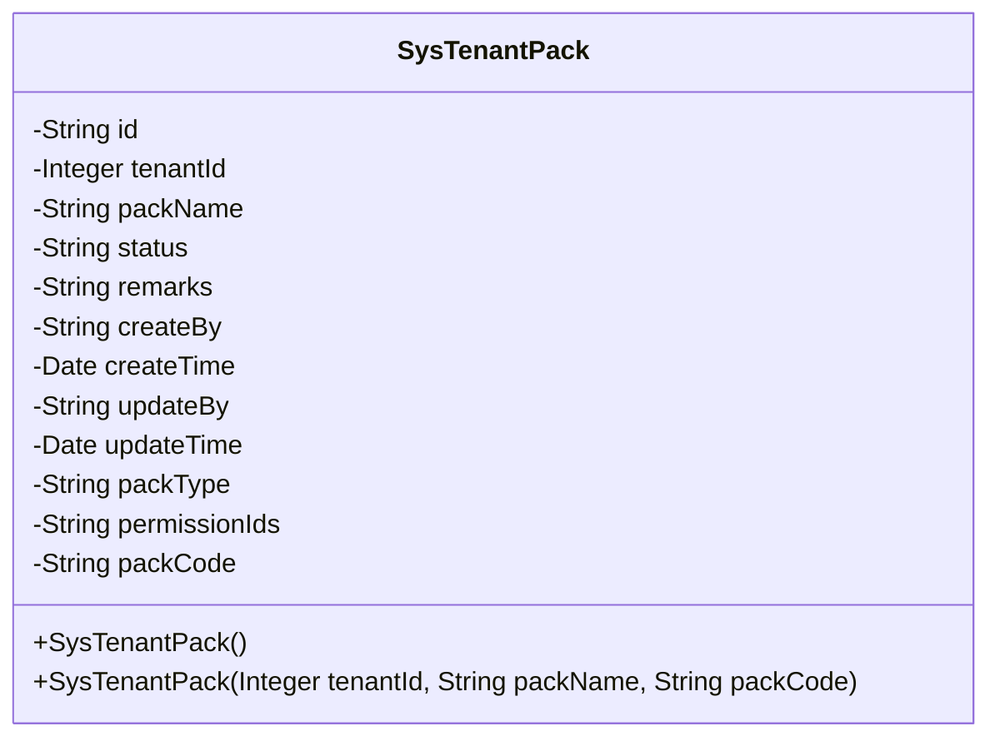

# 基础信息

|      |      |
|------|------|
| 名称 | SysTenantPack |
| 编码语言 | .java |
| 代码路径 | JeecgBoot/jeecg-boot/jeecg-module-system/jeecg-system-biz/src/main/java/org/jeecg/modules/system/entity/SysTenantPack.java |
| 包名 | org.jeecg.modules.system.entity |
| 依赖项 | ['java.io.Serializable', 'java.util.Date', 'com.baomidou.mybatisplus.annotation', 'io.swagger.v3.oas.annotations.media.Schema', 'lombok.Data', 'com.fasterxml.jackson.annotation.JsonFormat', 'org.springframework.format.annotation.DateTimeFormat', 'org.jeecgframework.poi.excel.annotation.Excel', 'lombok.EqualsAndHashCode', 'lombok.experimental.Accessors'] |
| 概述说明 | SysTenantPack类管理租户产品包，包含主键、租户ID、产品包名等字段。 |

# 说明

SysTenantPack类负责管理租户产品包信息，包含多个关键字段：主键用于唯一标识每个产品包，租户ID关联特定租户，产品包名描述产品包名称，状态表示当前状态，备注提供额外信息，创建人和创建时间记录产品包的创建者及时间，更新人和更新时间记录最后修改者及时间，产品包类型区分不同种类的产品包。这些字段共同构成了租户产品包的完整管理框架。

# 类列表 Class Summary

| 名称   | 类型  | 说明 |
|-------|------|-------------|
| SysTenantPack | class | SysTenantPack类用于管理租户产品包，包含主键、租户ID、产品包名、状态、备注、创建人、创建时间、更新人、更新时间、产品包类型等字段。 |

## 类 SysTenantPack

|      |      |
|------|------|
| 访问范围 | @Data;@TableName("sys_tenant_pack");@Accessors(chain = true);@EqualsAndHashCode(callSuper = false);@Schema(description="租户产品包");public |
| 类型 | class |
| 名称 | SysTenantPack |
| 说明 | SysTenantPack类用于管理租户产品包，包含主键、租户ID、产品包名、状态、备注、创建人、创建时间、更新人、更新时间、产品包类型等字段。 |

### UML类图

**描述**：`SysTenantPack` 类是一个用于表示租户产品包的实体类，包含了租户产品包的各种属性，如主键ID、租户ID、产品包名称、开启状态、备注、创建人、创建时间、更新人、更新时间等。该类实现了 `Serializable` 接口，支持序列化操作。类中定义了两个构造函数，一个无参构造函数和一个带有租户ID、产品包名称和产品包编码的构造函数。

### 内部方法调用关系图

```mermaid
graph TD
    A["类SysTenantPack"]
    B["属性: String id"]
    C["属性: Integer tenantId"]
    D["属性: String packName"]
    E["属性: String status"]
    F["属性: String remarks"]
    G["属性: String createBy"]
    H["属性: Date createTime"]
    I["属性: String updateBy"]
    J["属性: Date updateTime"]
    K["属性: String packType"]
    L["属性: String permissionIds"]
    M["属性: String packCode"]
    N["构造方法: SysTenantPack()"]
    O["构造方法: SysTenantPack(Integer tenantId, String packName, String packCode)"]

    A --> B
    A --> C
    A --> D
    A --> E
    A --> F
    A --> G
    A --> H
    A --> I
    A --> J
    A --> K
    A --> L
    A --> M
    A --> N
    A --> O
```

这段代码定义了一个名为`SysTenantPack`的类，该类包含多个属性，如`id`、`tenantId`、`packName`等，用于描述租户产品包的相关信息。类中还定义了两个构造方法，一个无参构造方法和一个带参构造方法，用于初始化对象。类使用了多个注解来标记属性的用途和格式，如`@TableId`、`@Excel`、`@Schema`等，这些注解提供了数据库映射、Excel导出和API文档生成的支持。

### 字段列表 Field List

| 名称  | 类型  | 说明 |
|-------|-------|------|
| createBy | String | 创建人字段定义。 |
| serialVersionUID = 1L | long | 定义静态长整型常量serialVersionUID，值为1L。 |
| updateBy | String | 更新人字段用于记录最后修改者的信息。 |
| packCode | String | 私有字符串变量packCode。 |
| packType | String | 产品包类型字段定义，用于存储产品包类型信息。 |
| id | String | 实体类主键ID字段，使用自定义分配策略。 |
| createTime | Date | 创建时间字段，使用GMT+8时区，格式为yyyy-MM-dd。 |
| status | String | 字段"status"表示开启状态，0为未开启，1为开启。 |
| packName | String | 产品包名字段定义，宽度为15字符。 |
| remarks | String | Excel表格中备注字段，宽度15，存储备注信息。 |
| tenantId | Integer | 租户ID字段，宽度15，用于标识租户。 |
| permissionIds | String | 类中未映射数据库的权限ID字段。 |
| updateTime | Date | 更新时间的日期格式为"yyyy-MM-dd"，时区为GMT+8。 |

### 方法列表 Method List

| 名称  | 类型  | 说明 |
|-------|-------|------|

