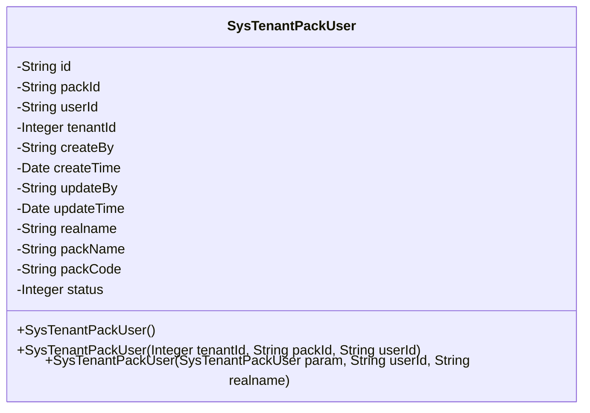

# 基础信息

|      |      |
|------|------|
| 名称 | SysTenantPackUser |
| 编码语言 | .java |
| 代码路径 | JeecgBoot/jeecg-boot/jeecg-module-system/jeecg-system-biz/src/main/java/org/jeecg/modules/system/entity/SysTenantPackUser.java |
| 包名 | org.jeecg.modules.system.entity |
| 依赖项 | ['com.baomidou.mybatisplus.annotation.IdType', 'com.baomidou.mybatisplus.annotation.TableId', 'com.baomidou.mybatisplus.annotation.TableName', 'com.fasterxml.jackson.annotation.JsonFormat', 'io.swagger.v3.oas.annotations.media.Schema', 'lombok.Data', 'lombok.EqualsAndHashCode', 'lombok.experimental.Accessors', 'org.jeecgframework.poi.excel.annotation.Excel', 'org.springframework.format.annotation.DateTimeFormat', 'java.io.Serializable'] |
| 概述说明 | 租户产品包用户关系表类，含ID、租户包ID、用户ID、租户ID、创建更新信息及状态字段。 |

# 说明

租户产品包用户关系表类用于记录租户、产品包与用户之间的关联关系。该表包含多个关键字段：唯一标识的ID、租户包ID用于关联特定产品包、用户ID用于标识关联用户、租户ID用于标识所属租户。此外，表还包含创建和更新的时间信息，以及状态字段用于记录当前关系的状态。这些字段共同确保了租户、产品包和用户之间的关系能够被准确追踪和管理。

# 类列表 Class Summary

| 名称   | 类型  | 说明 |
|-------|------|-------------|
| SysTenantPackUser | class | 租户产品包用户关系表类，包含ID、租户包ID、用户ID、租户ID、创建更新信息及状态字段。 |

## 类 SysTenantPackUser

|      |      |
|------|------|
| 访问范围 | @Data;@TableName("sys_tenant_pack_user");@Accessors(chain = true);@EqualsAndHashCode(callSuper = false);@Schema(description="租户产品包用户关系表");public |
| 类型 | class |
| 名称 | SysTenantPackUser |
| 说明 | 租户产品包用户关系表类，包含ID、租户包ID、用户ID、租户ID、创建更新信息及状态字段。 |

### UML类图

这段代码定义了一个名为 `SysTenantPackUser` 的类，用于表示租户产品包用户关系表。类中包含多个私有属性，如 `id`、`packId`、`userId` 等，用于存储租户产品包用户关系的详细信息。类提供了三个构造函数，分别用于不同的初始化场景。该类还实现了 `Serializable` 接口，表明其实例可以被序列化。

### 内部方法调用关系图

```mermaid
graph TD
    A["类SysTenantPackUser"]
    B["属性: String id"]
    C["属性: String packId"]
    D["属性: String userId"]
    E["属性: Integer tenantId"]
    F["属性: String createBy"]
    G["属性: Date createTime"]
    H["属性: String updateBy"]
    I["属性: Date updateTime"]
    J["属性: String realname"]
    K["属性: String packName"]
    L["属性: String packCode"]
    M["属性: Integer status"]
    N["构造方法: SysTenantPackUser()"]
    O["构造方法: SysTenantPackUser(Integer tenantId, String packId, String userId)"]
    P["构造方法: SysTenantPackUser(SysTenantPackUser param, String userId, String realname)"]

    A --> B
    A --> C
    A --> D
    A --> E
    A --> F
    A --> G
    A --> H
    A --> I
    A --> J
    A --> K
    A --> L
    A --> M
    A --> N
    A --> O
    A --> P
```

这段代码定义了一个名为`SysTenantPackUser`的Java类，用于表示租户产品包用户关系表。类中包含多个属性，如`id`、`packId`、`userId`等，用于存储用户和租户的相关信息。类中还定义了三个构造方法，分别用于初始化对象的不同属性组合。这些构造方法允许在创建对象时灵活地设置属性值，确保对象的正确初始化。

### 字段列表 Field List

| 名称  | 类型  | 说明 |
|-------|-------|------|
| serialVersionUID = 1L | long | 声明一个静态不可变的序列化版本号常量。 |
| packName | String | 私有临时字符串变量packName。 |
| updateBy | java.lang.String | 更新人字段，类型为字符串。 |
| status | Integer | 定义了一个私有的整型变量status。 |
| packCode | String | 私有瞬态字符串变量packCode。 |
| userId | java.lang.String | 用户ID字段，字符串类型，宽度15。 |
| createTime | java.util.Date | 创建时间字段，使用GMT+8时区，格式为yyyy-MM-dd。 |
| tenantId | java.lang.Integer | 租户ID字段，类型为整数。 |
| realname | String | 私有瞬态字符串变量realname。 |
| id | java.lang.String | 表ID字段，类型为ASSIGN_ID，描述为id，数据类型为String。 |
| createBy | java.lang.String | 该字段用于记录创建人信息，类型为字符串。 |
| packId | java.lang.String | 租户产品包ID字段，类型为字符串。 |
| updateTime | java.util.Date | 更新时间的Java Date类型字段，使用GMT+8时区，格式为yyyy-MM-dd。 |

### 方法列表 Method List

| 名称  | 类型  | 说明 |
|-------|-------|------|

