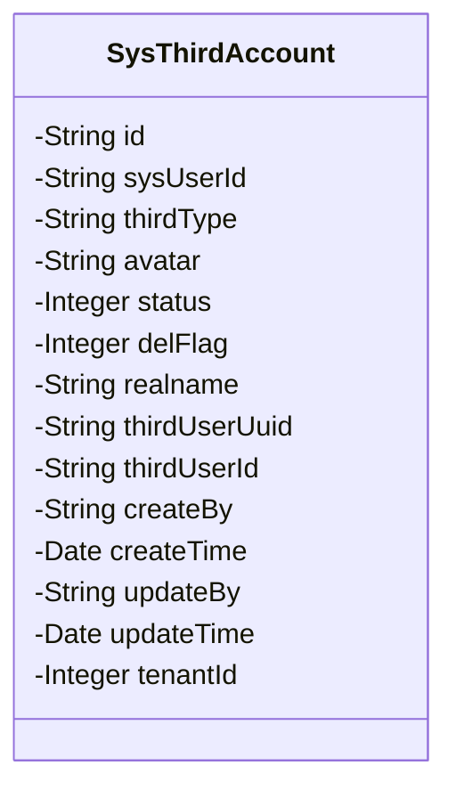

# 基础信息

|      |      |
|------|------|
| 名称 | SysThirdAccount |
| 编码语言 | .java |
| 代码路径 | JeecgBoot/jeecg-boot/jeecg-module-system/jeecg-system-biz/src/main/java/org/jeecg/modules/system/entity/SysThirdAccount.java |
| 包名 | org.jeecg.modules.system.entity |
| 依赖项 | ['com.baomidou.mybatisplus.annotation.IdType', 'com.baomidou.mybatisplus.annotation.TableId', 'com.baomidou.mybatisplus.annotation.TableName', 'com.fasterxml.jackson.annotation.JsonFormat', 'io.swagger.v3.oas.annotations.media.Schema', 'lombok.Data', 'lombok.EqualsAndHashCode', 'lombok.experimental.Accessors', 'org.jeecgframework.poi.excel.annotation.Excel', 'org.springframework.format.annotation.DateTimeFormat'] |
| 概述说明 | 第三方登录账号表包含编号、登录ID、来源、头像、状态、删除状态、真实姓名、用户UUID、账号、创建人、创建日期、修改人、修改日期、租户ID。 |

# 说明

第三方登录账号表记录了用户通过第三方平台登录的相关信息。表中包含编号、登录ID、来源平台、用户头像、账号状态、删除状态、用户真实姓名、用户UUID、账号信息、创建人、创建日期、修改人、修改日期以及租户ID。这些字段全面描述了第三方账号的创建、修改、状态及所属租户等关键信息，便于管理和追踪用户登录行为。

# 类列表 Class Summary

| 名称   | 类型  | 说明 |
|-------|------|-------------|
| SysThirdAccount | class | 第三方登录账号表，包含编号、登录ID、来源、头像、状态、删除状态、真实姓名、用户UUID、账号、创建人、创建日期、修改人、修改日期、租户ID。 |

## 类 SysThirdAccount

|      |      |
|------|------|
| 访问范围 | @Data;@TableName("sys_third_account");@EqualsAndHashCode(callSuper = false);@Accessors(chain = true);@Schema(description="第三方登录账号表");public |
| 类型 | class |
| 名称 | SysThirdAccount |
| 说明 | 第三方登录账号表，包含编号、登录ID、来源、头像、状态、删除状态、真实姓名、用户UUID、账号、创建人、创建日期、修改人、修改日期、租户ID。 |

### UML类图

这段代码定义了一个名为 `SysThirdAccount` 的类，用于表示第三方登录账号的相关信息。类中包含多个私有属性，如 `id`、`sysUserId`、`thirdType` 等，分别用于存储编号、第三方登录ID、登录来源等数据。该类使用了多个注解，如 `@TableName`、`@Schema` 等，用于指定数据库表名和字段描述。这些属性主要用于描述第三方登录账号的状态、创建和修改信息等，适用于需要管理第三方登录账号的系统。

### 内部方法调用关系图

```mermaid
graph TD
    A["类SysThirdAccount"]
    B["注解: @Data"]
    C["注解: @TableName('sys_third_account')"]
    D["注解: @EqualsAndHashCode(callSuper = false)"]
    E["注解: @Accessors(chain = true)"]
    F["注解: @Schema(description='第三方登录账号表')"]
    G["属性: java.lang.String id"]
    H["属性: java.lang.String sysUserId"]
    I["属性: java.lang.String thirdType"]
    J["属性: java.lang.String avatar"]
    K["属性: java.lang.Integer status"]
    L["属性: java.lang.Integer delFlag"]
    M["属性: java.lang.String realname"]
    N["属性: java.lang.String thirdUserUuid"]
    O["属性: java.lang.String thirdUserId"]
    P["属性: java.lang.String createBy"]
    Q["属性: java.util.Date createTime"]
    R["属性: java.lang.String updateBy"]
    S["属性: java.util.Date updateTime"]
    T["属性: java.lang.Integer tenantId"]

    A --> B
    A --> C
    A --> D
    A --> E
    A --> F
    A --> G
    A --> H
    A --> I
    A --> J
    A --> K
    A --> L
    A --> M
    A --> N
    A --> O
    A --> P
    A --> Q
    A --> R
    A --> S
    A --> T
```

这段代码定义了一个名为`SysThirdAccount`的Java类，用于表示第三方登录账号的相关信息。类中包含了多个属性，如`id`、`sysUserId`、`thirdType`等，每个属性都使用了不同的注解来定义其在数据库中的映射、Excel导出格式以及描述信息。类上的注解如`@Data`、`@TableName`等提供了自动生成getter/setter方法、数据库表名映射等功能。该类的设计主要用于处理第三方登录账号的数据存储和操作。

### 字段列表 Field List

| 名称  | 类型  | 说明 |
|-------|-------|------|
| thirdUserId | java.lang.String | 第三方用户账号字段，类型为字符串。 |
| id | java.lang.String | 表主键使用ASSIGN_ID类型，字段描述为“编号”。 |
| realname | java.lang.String | Excel字段：真实姓名，宽度15，类型字符串。 |
| delFlag | java.lang.Integer | 删除状态字段，0表示正常，1表示已删除。 |
| status | java.lang.Integer | 字段状态，1表示正常，2表示冻结。 |
| avatar | java.lang.String | 字段"avatar"存储用户头像信息，类型为字符串。 |
| thirdType | java.lang.String | 登录来源字段，类型为字符串。 |
| sysUserId | java.lang.String | 第三方登录ID字段定义，类型为字符串。 |
| tenantId | java.lang.Integer | 私有整型变量tenantId，用于存储租户ID。 |
| updateBy | java.lang.String | Excel列"修改人"对应字符串类型字段updateBy。 |
| updateTime | java.util.Date | Excel日期字段，格式为yyyy-MM-dd HH:mm:ss，时区GMT+8。 |
| createTime | java.util.Date | 字段createTime为日期类型，格式为yyyy-MM-dd HH:mm:ss，时区为GMT+8。 |
| createBy | java.lang.String | Excel列名“创建人”，宽度15，类型为字符串。 |
| thirdUserUuid | java.lang.String | 第三方用户UUID字段，类型为字符串。 |

### 方法列表 Method List

| 名称  | 类型  | 说明 |
|-------|-------|------|

