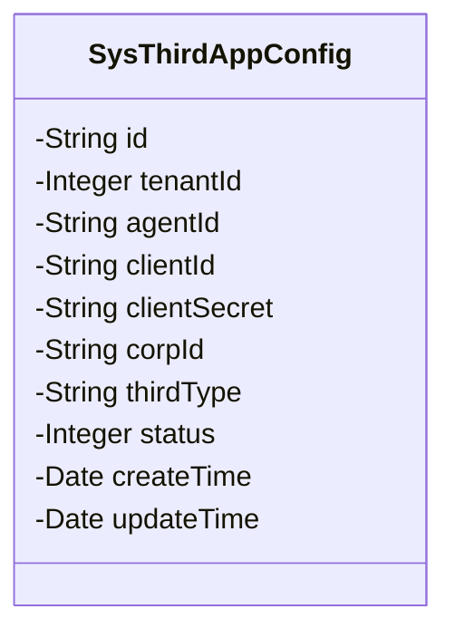
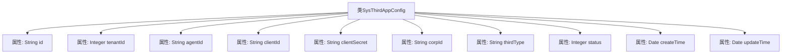

# 基础信息

|      |      |
|------|------|
| 名称 | SysThirdAppConfig |
| 编码语言 | .java |
| 代码路径 | JeecgBoot/jeecg-boot/jeecg-module-system/jeecg-system-biz/src/main/java/org/jeecg/modules/system/entity/SysThirdAppConfig.java |
| 包名 | org.jeecg.modules.system.entity |
| 依赖项 | ['com.baomidou.mybatisplus.annotation.IdType', 'com.baomidou.mybatisplus.annotation.TableId', 'com.baomidou.mybatisplus.annotation.TableName', 'com.fasterxml.jackson.annotation.JsonFormat', 'io.swagger.v3.oas.annotations.media.Schema', 'lombok.Data', 'lombok.EqualsAndHashCode', 'lombok.experimental.Accessors', 'org.jeecgframework.poi.excel.annotation.Excel', 'org.springframework.format.annotation.DateTimeFormat', 'java.util.Date'] |
| 概述说明 | 第三方配置表包含编号、租户ID、应用标识、应用ID、密钥、企业ID、类别、启用状态及创建修改日期。 |

# 说明

第三方配置表类用于存储和管理第三方系统的配置信息，包含编号、租户ID、应用标识、应用ID、密钥、企业ID、类别、启用状态、创建日期和修改日期等关键字段。这些字段共同确保配置信息的唯一性、安全性和可追溯性，支持多租户环境下的应用集成和管理。

# 类列表 Class Summary

| 名称   | 类型  | 说明 |
|-------|------|-------------|
| SysThirdAppConfig | class | 第三方配置表类，包含编号、租户ID、应用标识、应用ID、密钥、企业ID、类别、启用状态、创建和修改日期。 |

## 类 SysThirdAppConfig

|      |      |
|------|------|
| 访问范围 | @Data;@TableName("sys_third_app_config");@EqualsAndHashCode(callSuper = false);@Accessors(chain = true);@Schema(description="第三方配置表");public |
| 类型 | class |
| 名称 | SysThirdAppConfig |
| 说明 | 第三方配置表类，包含编号、租户ID、应用标识、应用ID、密钥、企业ID、类别、启用状态、创建和修改日期。 |

### UML类图

**描述：**  
`SysThirdAppConfig` 类是一个用于管理第三方应用配置的实体类，包含了与第三方应用相关的各种属性，如应用标识、应用ID、密钥、企业ID等。此外，该类还记录了配置的创建和修改时间，并提供了是否启用的状态标识。这些属性通过注解与数据库表和Excel文件进行映射，方便数据的持久化和导出。

### 内部方法调用关系图

这段代码定义了一个名为`SysThirdAppConfig`的类，用于表示第三方应用配置表。该类包含多个属性，如`id`、`tenantId`、`agentId`、`clientId`、`clientSecret`、`corpId`、`thirdType`、`status`、`createTime`和`updateTime`，每个属性都通过注解进行了详细描述和映射。这些属性分别用于存储第三方应用的配置信息，如租户ID、应用标识、应用ID、密钥、企业ID、第三方类型、启用状态以及创建和修改时间。

### 字段列表 Field List

| 名称  | 类型  | 说明 |
|-------|-------|------|
| tenantId | Integer | 租户ID字段，用于标识租户，宽度为15字符。 |
| clientId | String | 钉钉/企业微信应用ID字段定义。 |
| corpId | String | 钉钉企业ID字段，用于存储企业唯一标识。 |
| status | Integer | 字段status表示启用状态，0为否，1为是。 |
| agentId | String | 钉钉/企业微信第三方企业应用标识字段。 |
| id | String | 实体类字段使用自定义编号，标注为ID类型。 |
| createTime | Date | Excel字段：创建日期，格式为yyyy-MM-dd HH:mm:ss，时区GMT+8。 |
| clientSecret | String | 钉钉/企业微信应用ID的对应秘钥。 |
| thirdType | String | 第三方类别字段，包含钉钉和企业微信两种类型。 |
| updateTime | Date | 定义日期字段updateTime，格式为yyyy-MM-dd HH:mm:ss，时区GMT+8。 |

### 方法列表 Method List

| 名称  | 类型  | 说明 |
|-------|-------|------|

