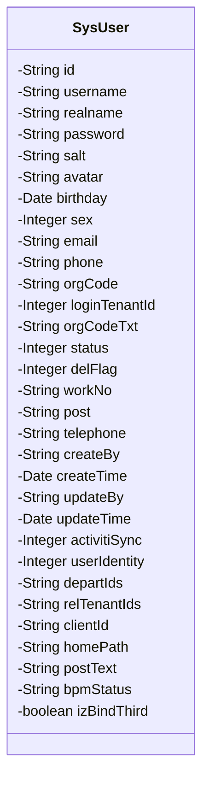

# 基础信息

|      |      |
|------|------|
| 名称 | SysUser |
| 编码语言 | .java |
| 代码路径 | JeecgBoot/jeecg-boot/jeecg-module-system/jeecg-system-biz/src/main/java/org/jeecg/modules/system/entity/SysUser.java |
| 包名 | org.jeecg.modules.system.entity |
| 依赖项 | ['java.util.Date', 'com.baomidou.mybatisplus.annotation.TableField', 'com.baomidou.mybatisplus.annotation.TableLogic', 'com.fasterxml.jackson.annotation.JsonProperty', 'org.jeecg.common.aspect.annotation.Dict', 'org.jeecgframework.poi.excel.annotation.Excel', 'org.springframework.format.annotation.DateTimeFormat', 'com.baomidou.mybatisplus.annotation.IdType', 'com.baomidou.mybatisplus.annotation.TableId', 'com.fasterxml.jackson.annotation.JsonFormat', 'java.io.Serializable', 'lombok.Data', 'lombok.EqualsAndHashCode', 'lombok.experimental.Accessors'] |
| 概述说明 | SysUser类包含用户信息字段，支持序列化和Excel导出。 |

# 说明

SysUser类是一个用于存储用户信息的类，包含多个关键字段，如账号、姓名、密码、性别和状态等。该类支持序列化操作，能够将对象转换为可存储或传输的格式。此外，SysUser类还具备Excel导出功能，可以将用户信息导出为Excel文件，便于数据管理和分析。该类设计全面，适用于需要处理用户信息的各种应用场景。

# 类列表 Class Summary

| 名称   | 类型  | 说明 |
|-------|------|-------------|
| SysUser | class | SysUser类包含用户信息字段，如账号、姓名、密码、性别、状态等，支持序列化和Excel导出。 |

## 类 SysUser

|      |      |
|------|------|
| 访问范围 | @Data;@EqualsAndHashCode(callSuper = false);@Accessors(chain = true);public |
| 类型 | class |
| 名称 | SysUser |
| 说明 | SysUser类包含用户信息字段，如账号、姓名、密码、性别、状态等，支持序列化和Excel导出。 |

### UML类图

### 描述：
`SysUser` 类是一个用于表示系统用户的实体类，包含了用户的基本信息、登录信息、状态信息、时间戳信息等。该类实现了 `Serializable` 接口，支持序列化操作。类中的字段使用了多种注解来定义其行为，如 `@TableId` 用于标识主键，`@Excel` 用于定义导出到 Excel 时的列名和格式，`@JsonProperty` 用于控制 JSON 序列化时的访问权限，`@TableLogic` 用于逻辑删除标记等。此外，类中还有一些临时字段，如 `relTenantIds` 和 `homePath`，它们不会持久化到数据库中。

### 内部方法调用关系图

```mermaid
graph TD
    A["类SysUser"]
    B["属性: String id"]
    C["属性: String username"]
    D["属性: String realname"]
    E["属性: String password"]
    F["属性: String salt"]
    G["属性: String avatar"]
    H["属性: Date birthday"]
    I["属性: Integer sex"]
    J["属性: String email"]
    K["属性: String phone"]
    L["属性: String orgCode"]
    M["属性: Integer loginTenantId"]
    N["属性: String orgCodeTxt"]
    O["属性: Integer status"]
    P["属性: Integer delFlag"]
    Q["属性: String workNo"]
    R["属性: String post"]
    S["属性: String telephone"]
    T["属性: String createBy"]
    U["属性: Date createTime"]
    V["属性: String updateBy"]
    W["属性: Date updateTime"]
    X["属性: Integer activitiSync"]
    Y["属性: Integer userIdentity"]
    Z["属性: String departIds"]
    AA["属性: String relTenantIds"]
    AB["属性: String clientId"]
    AC["属性: String homePath"]
    AD["属性: String postText"]
    AE["属性: String bpmStatus"]
    AF["属性: boolean izBindThird"]

    A --> B
    A --> C
    A --> D
    A --> E
    A --> F
    A --> G
    A --> H
    A --> I
    A --> J
    A --> K
    A --> L
    A --> M
    A --> N
    A --> O
    A --> P
    A --> Q
    A --> R
    A --> S
    A --> T
    A --> U
    A --> V
    A --> W
    A --> X
    A --> Y
    A --> Z
    A --> AA
    A --> AB
    A --> AC
    A --> AD
    A --> AE
    A --> AF
```

该流程图展示了`SysUser`类的结构，包括其所有属性和它们之间的关系。`SysUser`类是一个用户信息管理类，包含了用户的基本信息、登录信息、状态信息、时间信息等。每个属性都通过箭头与类`SysUser`相连，表示这些属性属于该类。该图清晰地展示了类的内部结构，便于理解和管理用户数据。

### 字段列表 Field List

| 名称  | 类型  | 说明 |
|-------|-------|------|
| id | String | 表主键类型为ASSIGN_ID，字段名为id。 |
| createTime | Date | 创建时间字段为私有日期类型。 |
| clientId | String | 定义了一个私有字符串变量clientId。 |
| postText | String | 字段postText在数据库中不存在。 |
| updateTime | Date | 私有日期类型变量updateTime。 |
| bpmStatus | String | 私有字符串变量bpmStatus。 |
| phone | String | Excel表格中电话列宽度为15，数据类型为字符串。 |
| password | String | 该代码片段定义了一个仅允许写入的密码字段。 |
| activitiSync | Integer | 私有整型变量activitiSync用于同步操作。 |
| email | String | Excel表格中电子邮件字段，宽度15字符，私有字符串类型。 |
| izBindThird | boolean | 实体类中声明未绑定第三方的布尔变量。 |
| orgCode | String | 定义私有字符串变量orgCode。 |
| telephone | String | Excel列名“座机号”，宽度15，存储电话号码。 |
| workNo | String | Excel列名为“工号”，宽度为15，存储工号信息。 |
| username | String | Excel表格中定义了一个名为“登录账号”的字段，宽度为15，类型为字符串。 |
| salt | String | 该代码定义了一个仅可写的私有字符串变量`salt`。 |
| userIdentity | Integer | 用户身份字段，1为普通成员，2为上级。 |
| status | Integer | Excel字段“状态”映射用户状态字典，宽度15。 |
| createBy | String | 创建者字段为私有字符串类型。 |
| departIds | String | 负责部门字段关联系统部门表，通过ID获取部门名称。 |
| homePath | String | 类中定义了一个非数据库字段的私有字符串变量homePath。 |
| orgCodeTxt | String | 私有瞬态字符串变量orgCodeTxt。 |
| post | String | 职务字段映射系统职位表，通过ID获取名称，不存数据库。 |
| delFlag | Integer | Excel字段"删除状态"宽度15，使用字典"del_flag"，逻辑删除标识。 |
| relTenantIds | String | `relTenantIds`为非数据库字段的私有字符串变量。 |
| sex | Integer | Excel列“性别”使用字典“sex”映射整数类型数据。 |
| updateBy | String | 更新操作执行者字段。 |
| avatar | String | Excel表格中定义头像列，宽度15，类型为2。 |
| birthday | Date | 定义生日字段，支持Excel、Json和日期格式化。 |
| loginTenantId | Integer | 私有整型变量loginTenantId。 |
| realname | String | Excel列名为“真实姓名”，宽度15，对应字段为realname。 |
| serialVersionUID = 1L | long | 定义序列化版本号的私有静态常量。 |

### 方法列表 Method List

| 名称  | 类型  | 说明 |
|-------|-------|------|

