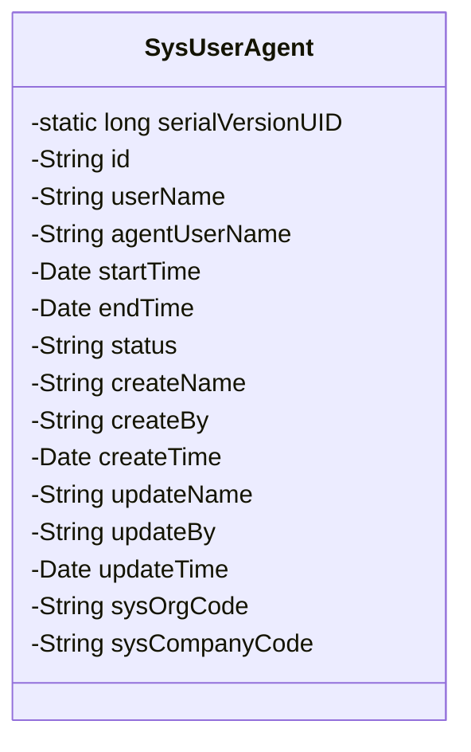

# 基础信息

|      |      |
|------|------|
| 名称 | SysUserAgent |
| 编码语言 | .java |
| 代码路径 | JeecgBoot/jeecg-boot/jeecg-module-system/jeecg-system-biz/src/main/java/org/jeecg/modules/system/entity/SysUserAgent.java |
| 包名 | org.jeecg.modules.system.entity |
| 依赖项 | ['java.io.Serializable', 'java.util.Date', 'com.baomidou.mybatisplus.annotation.IdType', 'com.baomidou.mybatisplus.annotation.TableId', 'com.baomidou.mybatisplus.annotation.TableName', 'lombok.Data', 'com.fasterxml.jackson.annotation.JsonFormat', 'org.springframework.format.annotation.DateTimeFormat', 'org.jeecgframework.poi.excel.annotation.Excel'] |
| 概述说明 | SysUserAgent类管理用户代理信息，包括用户名、代理人、时间、状态等字段。 |

# 说明

SysUserAgent类是一个用于管理用户代理信息的类，主要包含用户名、代理人、时间、状态等关键字段。该类用于记录和操作用户代理的相关数据，确保信息的完整性和可追溯性。通过该类，可以有效地管理和维护用户代理的各种属性，便于系统进行后续处理和分析。

# 类列表 Class Summary

| 名称   | 类型  | 说明 |
|-------|------|-------------|
| SysUserAgent | class | SysUserAgent类用于管理用户代理信息，包含用户名、代理人、时间、状态等字段。 |

## 类 SysUserAgent

|      |      |
|------|------|
| 访问范围 | @Data;@TableName("sys_user_agent");public |
| 类型 | class |
| 名称 | SysUserAgent |
| 说明 | SysUserAgent类用于管理用户代理信息，包含用户名、代理人、时间、状态等字段。 |

### UML类图

**描述：**  
`SysUserAgent` 类是一个用于表示系统用户代理信息的实体类，实现了 `Serializable` 接口以确保对象可以被序列化。类中包含多个私有属性，如用户ID、用户名、代理人用户名、代理时间范围、状态、创建和更新信息等。这些属性通过注解与数据库表 `sys_user_agent` 进行映射，并且部分属性通过 `@Excel` 注解标记了在Excel中的显示格式。该类主要用于管理用户代理的相关数据，适用于需要进行用户代理管理的系统场景。

### 内部方法调用关系图

```mermaid
graph TD
    A["类SysUserAgent"]
    B["属性: java.lang.String id"]
    C["属性: java.lang.String userName"]
    D["属性: java.lang.String agentUserName"]
    E["属性: java.util.Date startTime"]
    F["属性: java.util.Date endTime"]
    G["属性: java.lang.String status"]
    H["属性: java.lang.String createName"]
    I["属性: java.lang.String createBy"]
    J["属性: java.util.Date createTime"]
    K["属性: java.lang.String updateName"]
    L["属性: java.lang.String updateBy"]
    M["属性: java.util.Date updateTime"]
    N["属性: java.lang.String sysOrgCode"]
    O["属性: java.lang.String sysCompanyCode"]

    A --> B
    A --> C
    A --> D
    A --> E
    A --> F
    A --> G
    A --> H
    A --> I
    A --> J
    A --> K
    A --> L
    A --> M
    A --> N
    A --> O
```

这段代码定义了一个名为 `SysUserAgent` 的类，该类实现了 `Serializable` 接口，表明其实例可以被序列化。类中包含多个属性，分别用于存储用户代理的相关信息，如用户名、代理人用户名、代理开始时间、代理结束时间、状态、创建人信息、更新人信息、所属部门和所属公司等。每个属性都通过注解进行标记，用于指定其在数据库中的映射关系或Excel导出时的格式。

### 字段列表 Field List

| 名称  | 类型  | 说明 |
|-------|-------|------|
| id | java.lang.String | 表ID类型为ASSIGN_ID，私有字符串类型ID。 |
| updateTime | java.util.Date | 定义日期字段updateTime，支持Excel、JSON和日期格式。 |
| userName | java.lang.String | Excel列“用户名”宽度15，对应Java字符串变量userName。 |
| serialVersionUID = 1L | long | 定义了一个静态常量序列化版本号。 |
| status | java.lang.String | 字段status表示状态，0无效，1有效，类型为字符串。 |
| updateBy | java.lang.String | Excel列名为“更新人登录名称”，宽度15，对应Java字符串变量updateBy。 |
| endTime | java.util.Date | 代理结束时间字段，格式为yyyy-MM-dd HH:mm:ss，使用GMT+8时区。 |
| sysOrgCode | java.lang.String | Excel表字段：所属部门，宽度15，对应Java变量sysOrgCode。 |
| createName | java.lang.String | Excel列名“创建人名称”，宽度15，类型为字符串。 |
| startTime | java.util.Date | 代理开始时间字段，格式为yyyy-MM-dd HH:mm:ss，时区GMT+8。 |
| agentUserName | java.lang.String | Excel列“代理人用户名”对应Java字符串类型字段agentUserName。 |
| createTime | java.util.Date | 定义日期字段，格式为yyyy-MM-dd HH:mm:ss，时区GMT+8。 |
| createBy | java.lang.String | 创建人登录名称字段，类型为字符串，宽度15。 |
| updateName | java.lang.String | Excel列名为“更新人名称”，宽度15，对应Java字符串类型变量updateName。 |
| sysCompanyCode | java.lang.String | Excel表格中定义“所属公司”列，宽度15，对应Java字符串变量sysCompanyCode。 |

### 方法列表 Method List

| 名称  | 类型  | 说明 |
|-------|-------|------|

