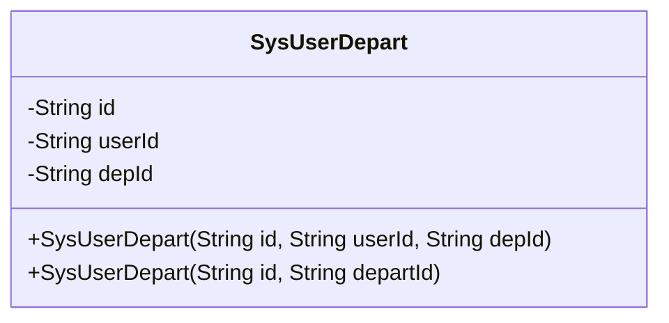
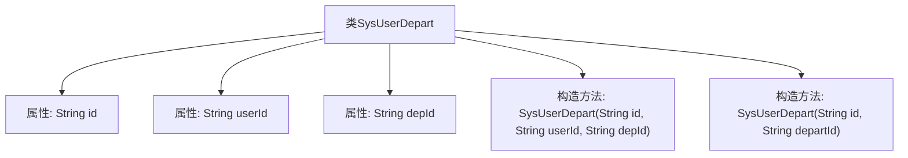

# 基础信息

|      |      |
|------|------|
| 名称 | SysUserDepart |
| 编码语言 | .java |
| 代码路径 | JeecgBoot/jeecg-boot/jeecg-module-system/jeecg-system-biz/src/main/java/org/jeecg/modules/system/entity/SysUserDepart.java |
| 包名 | org.jeecg.modules.system.entity |
| 依赖项 | ['java.io.Serializable', 'com.baomidou.mybatisplus.annotation.IdType', 'com.baomidou.mybatisplus.annotation.TableId', 'com.baomidou.mybatisplus.annotation.TableName', 'lombok.Data'] |
| 概述说明 | SysUserDepart类映射用户与部门关系，包含id、用户id和部门id字段。 |

# 说明

SysUserDepart类主要用于映射用户与部门之间的关系，包含三个关键字段：主键id用于唯一标识每条记录，用户id用于关联特定用户，部门id用于关联特定部门。通过这三个字段，该类能够有效管理用户与部门之间的对应关系。

# 类列表 Class Summary

| 名称   | 类型  | 说明 |
|-------|------|-------------|
| SysUserDepart | class | SysUserDepart类用于映射用户与部门关系，包含主键id、用户id和部门id字段。 |

## 类 SysUserDepart

|      |      |
|------|------|
| 访问范围 | @Data;@TableName("sys_user_depart");public |
| 类型 | class |
| 名称 | SysUserDepart |
| 说明 | SysUserDepart类用于映射用户与部门关系，包含主键id、用户id和部门id字段。 |

### UML类图

### 描述
`SysUserDepart`类用于表示用户与部门的关联关系。该类包含三个私有属性：`id`、`userId`和`depId`，分别表示主键、用户ID和部门ID。类中提供了两个构造函数，分别用于初始化不同的属性组合。该类实现了`Serializable`接口，以便支持序列化操作。

### 内部方法调用关系图

这段代码定义了一个名为 `SysUserDepart` 的类，该类包含三个属性：`id`、`userId` 和 `depId`，并提供了两个构造方法。第一个构造方法接受三个参数，用于初始化所有属性；第二个构造方法接受两个参数，仅初始化 `userId` 和 `depId`。该类用于表示用户与部门之间的关联关系，适用于需要管理用户与部门映射的场景。

### 字段列表 Field List

| 名称  | 类型  | 说明 |
|-------|-------|------|
| id | String | 表主键使用自定义ID生成策略。 |
| depId | String | 定义了一个私有字符串变量depId。 |
| userId | String | 定义用户ID的私有字符串变量。 |
| serialVersionUID = 1L | long | 声明一个私有的静态常量序列化版本UID。 |

### 方法列表 Method List

| 名称  | 类型  | 说明 |
|-------|-------|------|

