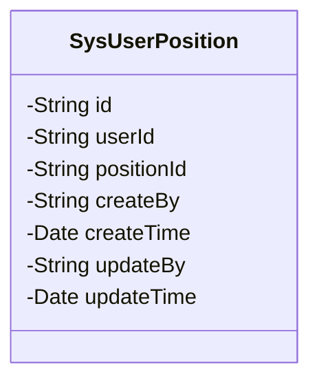
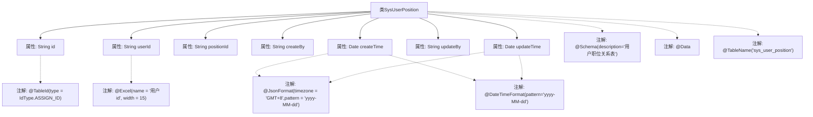

# 基础信息

|      |      |
|------|------|
| 名称 | SysUserPosition |
| 编码语言 | .java |
| 代码路径 | JeecgBoot/jeecg-boot/jeecg-module-system/jeecg-system-biz/src/main/java/org/jeecg/modules/system/entity/SysUserPosition.java |
| 包名 | org.jeecg.modules.system.entity |
| 依赖项 | ['java.io.Serializable', 'com.baomidou.mybatisplus.annotation.IdType', 'com.baomidou.mybatisplus.annotation.TableId', 'com.baomidou.mybatisplus.annotation.TableName', 'io.swagger.v3.oas.annotations.media.Schema', 'lombok.Data', 'com.fasterxml.jackson.annotation.JsonFormat', 'org.springframework.format.annotation.DateTimeFormat', 'org.jeecgframework.poi.excel.annotation.Excel', 'java.util.Date'] |
| 概述说明 | 用户职位关系表记录用户与职位关联信息，包含主键、用户ID、职位ID及操作日志。 |

# 说明

用户职位关系表用于记录用户与职位之间的关联信息，包含主键、用户ID、职位ID、创建人、创建时间、修改人和修改时间等字段。主键唯一标识每条记录，用户ID和职位ID分别表示用户和职位的唯一标识。创建人和修改人记录操作者信息，创建时间和修改时间则分别记录记录的创建和最后修改时间。该表通过详细的时间戳和操作者信息，确保数据的可追溯性和完整性。

# 类列表 Class Summary

| 名称   | 类型  | 说明 |
|-------|------|-------------|
| SysUserPosition | class | 用户职位关系表，包含主键、用户ID、职位ID、创建人、创建时间、修改人、修改时间。 |

## 类 SysUserPosition

|      |      |
|------|------|
| 访问范围 | @Schema(description="用户职位关系表");@Data;@TableName("sys_user_position");public |
| 类型 | class |
| 名称 | SysUserPosition |
| 说明 | 用户职位关系表，包含主键、用户ID、职位ID、创建人、创建时间、修改人、修改时间。 |

### UML类图

这段代码定义了一个名为 `SysUserPosition` 的类，用于表示用户与职位之间的关系。类中包含多个私有属性，如 `id`、`userId`、`positionId` 等，分别用于存储主键、用户ID、职位ID、创建人、创建时间、修改人和修改时间。这些属性通过注解（如 `@Schema`、`@TableId` 等）进行了进一步的描述和配置，以支持数据库映射和序列化操作。

### 内部方法调用关系图

这段代码定义了一个名为 `SysUserPosition` 的类，用于表示用户与职位之间的关系。该类包含了多个属性，如 `id`、`userId`、`positionId` 等，并使用了多种注解来定义这些属性的行为和描述。例如，`@Schema` 用于描述字段的含义，`@TableId` 用于标识主键，`@JsonFormat` 和 `@DateTimeFormat` 用于格式化日期字段。通过这些注解，代码实现了对数据库表的映射和字段的详细描述。

### 字段列表 Field List

| 名称  | 类型  | 说明 |
|-------|-------|------|
| serialVersionUID = 1L | long | 声明序列化版本号为1L。 |
| positionId | String | 职位ID字段，用于唯一标识职位。 |
| id | String | 表主键字段，使用ASSIGN_ID类型生成。 |
| userId | String | 用户ID字段，宽度15，类型字符串。 |
| updateBy | String | 修改人字段用于记录更新操作者。 |
| createBy | String | "创建人"字段，用于存储记录创建者的信息。 |
| updateTime | Date | updateTime字段表示修改时间，格式为yyyy-MM-dd，时区为GMT+8。 |
| createTime | Date | 创建时间字段，格式为yyyy-MM-dd，时区GMT+8。 |

### 方法列表 Method List

| 名称  | 类型  | 说明 |
|-------|-------|------|

