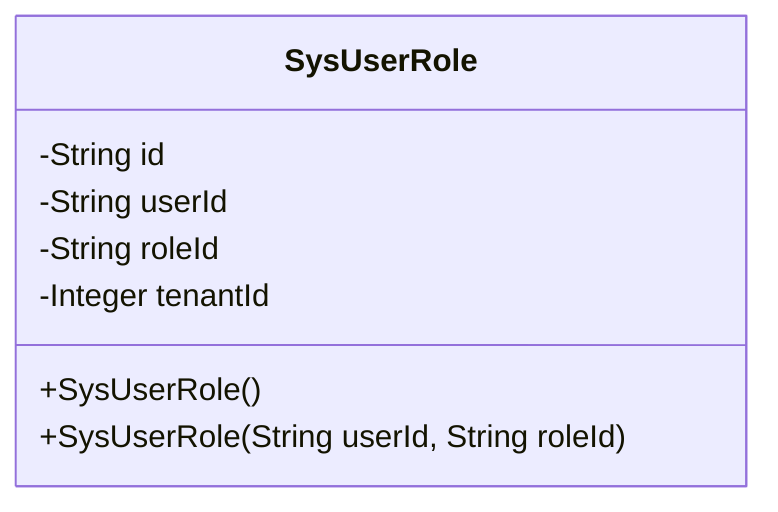
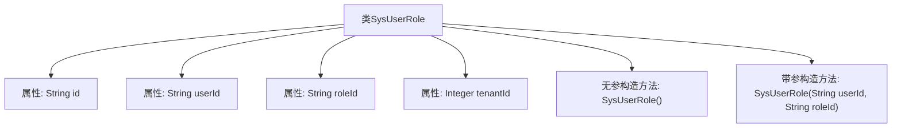

# 基础信息

|      |      |
|------|------|
| 名称 | SysUserRole |
| 编码语言 | .java |
| 代码路径 | JeecgBoot/jeecg-boot/jeecg-module-system/jeecg-system-biz/src/main/java/org/jeecg/modules/system/entity/SysUserRole.java |
| 包名 | org.jeecg.modules.system.entity |
| 依赖项 | ['java.io.Serializable', 'com.baomidou.mybatisplus.annotation.IdType', 'com.baomidou.mybatisplus.annotation.TableId', 'lombok.Data', 'lombok.EqualsAndHashCode', 'lombok.experimental.Accessors'] |
| 概述说明 | SysUserRole类含用户ID、角色ID、租户ID，支持链式调用和序列化。 |

# 说明

SysUserRole类是一个用于管理用户、角色和租户关系的类，包含三个主要属性：用户ID、角色ID和租户ID。该类支持链式调用，允许通过连续的方法调用来设置或获取这些属性。此外，SysUserRole类实现了序列化功能，使其能够被转换为可存储或传输的格式，便于在不同系统或网络之间进行数据交换。

# 类列表 Class Summary

| 名称   | 类型  | 说明 |
|-------|------|-------------|
| SysUserRole | class | SysUserRole类包含用户ID、角色ID和租户ID，支持链式调用，实现序列化。 |

## 类 SysUserRole

|      |      |
|------|------|
| 访问范围 | @Data;@EqualsAndHashCode(callSuper = false);@Accessors(chain = true);public |
| 类型 | class |
| 名称 | SysUserRole |
| 说明 | SysUserRole类包含用户ID、角色ID和租户ID，支持链式调用，实现序列化。 |

### UML类图

这段代码定义了一个名为 `SysUserRole` 的类，该类实现了 `Serializable` 接口，用于序列化对象。类中包含四个私有属性：`id`、`userId`、`roleId` 和 `tenantId`，分别表示用户角色关系的主键、用户ID、角色ID和租户ID。类提供了两个构造函数：一个无参构造函数和一个接受 `userId` 和 `roleId` 的构造函数。该类通常用于管理系统中用户与角色之间的关联关系。

### 内部方法调用关系图

该流程图展示了`SysUserRole`类的结构和内部方法。类包含四个属性：`id`、`userId`、`roleId`和`tenantId`，以及两个构造方法：一个无参构造方法和一个带参构造方法。带参构造方法用于初始化`userId`和`roleId`属性。流程图清晰地展示了类与属性和方法之间的关系，便于理解类的设计意图和功能。

### 字段列表 Field List

| 名称  | 类型  | 说明 |
|-------|-------|------|
| serialVersionUID = 1L | long | 声明一个私有静态常量serialVersionUID，值为1L。 |
| roleId | String | 角色ID字段定义。 |
| tenantId | java.lang.Integer | 私有整型变量tenantId。 |
| id | String | 使用ASSIGN_ID类型生成表主键ID。 |
| userId | String | 定义私有字符串变量userId。 |

### 方法列表 Method List

| 名称  | 类型  | 说明 |
|-------|-------|------|

