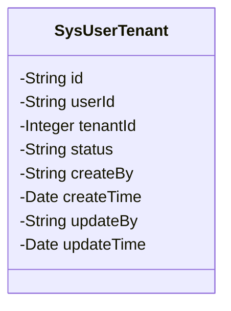

# 基础信息

|      |      |
|------|------|
| 名称 | SysUserTenant |
| 编码语言 | .java |
| 代码路径 | JeecgBoot/jeecg-boot/jeecg-module-system/jeecg-system-biz/src/main/java/org/jeecg/modules/system/entity/SysUserTenant.java |
| 包名 | org.jeecg.modules.system.entity |
| 依赖项 | ['java.io.Serializable', 'java.util.Date', 'com.baomidou.mybatisplus.annotation.IdType', 'com.baomidou.mybatisplus.annotation.TableId', 'com.baomidou.mybatisplus.annotation.TableName', 'io.swagger.v3.oas.annotations.media.Schema', 'lombok.Data', 'com.fasterxml.jackson.annotation.JsonFormat', 'org.springframework.format.annotation.DateTimeFormat', 'org.jeecgframework.poi.excel.annotation.Excel', 'lombok.EqualsAndHashCode', 'lombok.experimental.Accessors'] |
| 概述说明 | SysUserTenant类记录用户与租户关系，包含主键、用户ID、租户ID、状态及创建更新信息。 |

# 说明

SysUserTenant类用于存储用户与租户之间的关系信息，包含多个关键字段。主键用于唯一标识每条记录，用户ID和租户ID分别表示用户和租户的唯一标识。状态字段用于记录当前关系的状态，如激活或禁用。此外，类中还包含创建和更新的相关信息，用于追踪记录的生成和修改时间。这些字段共同构成了用户与租户关系的基础数据结构。

# 类列表 Class Summary

| 名称   | 类型  | 说明 |
|-------|------|-------------|
| SysUserTenant | class | SysUserTenant类包含用户与租户关系信息，含主键、用户ID、租户ID、状态、创建更新信息等字段。 |

## 类 SysUserTenant

|      |      |
|------|------|
| 访问范围 | @Data;@TableName("sys_user_tenant");@Accessors(chain = true);@EqualsAndHashCode(callSuper = false);@Schema(description="sys_user_tenant");public |
| 类型 | class |
| 名称 | SysUserTenant |
| 说明 | SysUserTenant类包含用户与租户关系信息，含主键、用户ID、租户ID、状态、创建更新信息等字段。 |

### UML类图

这段代码定义了一个名为 `SysUserTenant` 的类，该类实现了 `Serializable` 接口，表示该类可以被序列化。类中包含了多个私有字段，如 `id`、`userId`、`tenantId`、`status`、`createBy`、`createTime`、`updateBy` 和 `updateTime`，这些字段分别用于存储用户租户信息的不同属性。每个字段都通过注解进行了描述和配置，例如 `@TableId` 用于标识主键，`@Schema` 用于描述字段的含义。该类没有定义任何公有方法，仅通过注解进行数据映射和序列化配置。

### 内部方法调用关系图

```mermaid
graph TD
    A["类SysUserTenant"]
    B["属性: String id"]
    C["属性: String userId"]
    D["属性: Integer tenantId"]
    E["属性: String status"]
    F["属性: String createBy"]
    G["属性: Date createTime"]
    H["属性: String updateBy"]
    I["属性: Date updateTime"]
    J["注解: @Data"]
    K["注解: @TableName('sys_user_tenant')"]
    L["注解: @Accessors(chain = true)"]
    M["注解: @EqualsAndHashCode(callSuper = false)"]
    N["注解: @Schema(description='sys_user_tenant')"]
    O["注解: @TableId(type = IdType.ASSIGN_ID)"]
    P["注解: @Excel(name = '用户id', width = 15)"]
    Q["注解: @Excel(name = '租户id', width = 15)"]
    R["注解: @Excel(name = '状态(1 正常 2 冻结 3 待审核 4 拒绝)', width = 15)"]
    S["注解: @JsonFormat(timezone = 'GMT+8', pattern = 'yyyy-MM-dd')"]
    T["注解: @DateTimeFormat(pattern='yyyy-MM-dd')"]

    A --> B
    A --> C
    A --> D
    A --> E
    A --> F
    A --> G
    A --> H
    A --> I
    A --> J
    A --> K
    A --> L
    A --> M
    A --> N
    B --> O
    C --> P
    D --> Q
    E --> R
    G --> S
    G --> T
    I --> S
    I --> T
```

这段代码定义了一个名为`SysUserTenant`的Java类，该类用于表示用户与租户的关系。类中包含多个属性，如`id`、`userId`、`tenantId`等，并使用了多种注解来配置这些属性的行为。例如，`@TableId`用于标识主键，`@Excel`用于定义Excel导出的格式，`@JsonFormat`和`@DateTimeFormat`用于处理日期格式。这些注解和属性共同构成了一个用于数据持久化和业务逻辑处理的实体类。

### 字段列表 Field List

| 名称  | 类型  | 说明 |
|-------|-------|------|
| serialVersionUID = 1L | long | 声明序列化版本UID为1L的静态常量。 |
| status | String | 状态字段表示用户状态，1正常，2冻结，3待审核，4拒绝。 |
| createBy | String | 创建人登录名称字段。 |
| userId | String | 用户ID字段定义，长度为15，用于标识用户。 |
| tenantId | Integer | 租户ID字段，宽度15，用于标识租户。 |
| id | String | 表主键ID，类型为ASSIGN_ID，描述为主键id。 |
| createTime | Date | 创建日期字段，格式为yyyy-MM-dd，时区GMT+8。 |
| updateBy | String | 更新人登录名称字段定义。 |
| updateTime | Date | 更新日期字段，使用GMT+8时区，格式为yyyy-MM-dd。 |

### 方法列表 Method List

| 名称  | 类型  | 说明 |
|-------|-------|------|

