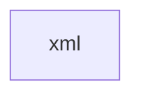

# 基础信息

|      |      |
|------|------|
| 名称 | xml |
| 编码语言 | .java |
| 代码路径 | JeecgBoot/jeecg-boot/jeecg-module-system/jeecg-system-biz/src/main/java/org/jeecg/modules/system/mapper/xml |
| 包名 | JeecgBoot.jeecg-boot.jeecg-module-system.jeecg-system-biz.src.main.java.org.jeecg.modules.system.mapper.xml |
| 概述说明 | None |

# 说明

None

### 包内部结构视图

该流程图展示了路径的层级关系，仅包含路径的最后一级元素。路径指向的是`xml`文件夹，没有进一步的子文件夹或文件。整个结构非常简单，仅包含一个节点，表示路径的最终目标。

# 文件列表 File List

| 名称   | 类型  | 说明 |
|-------|------|-------------|

