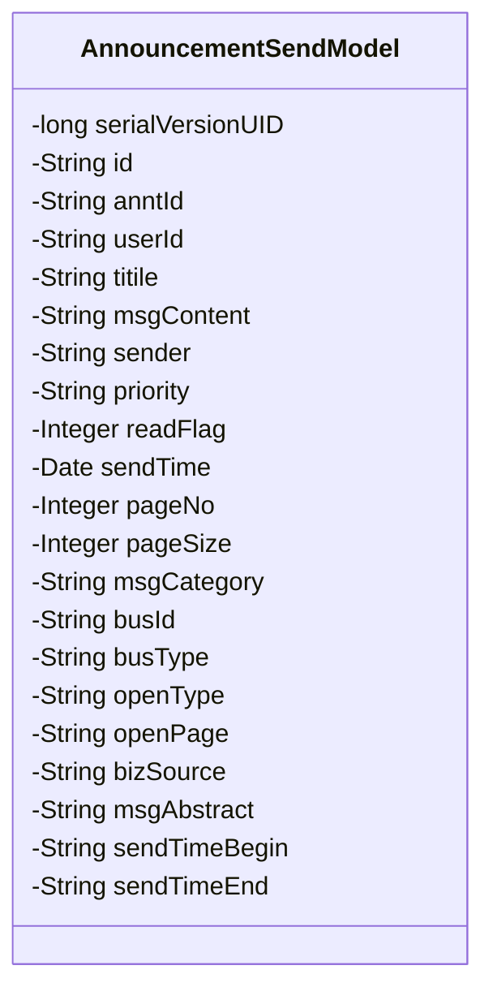

# 基础信息

|      |      |
|------|------|
| 名称 | AnnouncementSendModel |
| 编码语言 | .java |
| 代码路径 | JeecgBoot/jeecg-boot/jeecg-module-system/jeecg-system-biz/src/main/java/org/jeecg/modules/system/model/AnnouncementSendModel.java |
| 包名 | org.jeecg.modules.system.model |
| 依赖项 | ['com.baomidou.mybatisplus.annotation.IdType', 'com.baomidou.mybatisplus.annotation.TableId', 'com.fasterxml.jackson.annotation.JsonFormat', 'lombok.Data', 'org.springframework.format.annotation.DateTimeFormat', 'java.io.Serializable'] |
| 概述说明 | 公告发送模型涵盖ID、通告、用户、标题、内容、发布人、优先级、状态、时间、页数、大小、类型、业务、查询、摘要、日期等关键信息。 |

# 说明

公告发送模型包含多个关键字段，用于管理和展示公告信息。主要字段包括公告的唯一标识ID、通告ID、用户ID、标题、内容、发布人、优先级、阅读状态、发布时间、页数、大小、消息类型、业务ID、业务类型、打开方式、组件或路由地址、业务类型查询、摘要、以及公告的发布开始和结束日期。这些字段共同构成了公告发送模型的完整信息结构，确保公告的发布、管理和查询功能得以有效实现。

# 类列表 Class Summary

| 名称   | 类型  | 说明 |
|-------|------|-------------|
| AnnouncementSendModel | class | 公告发送模型包含ID、通告ID、用户ID、标题、内容、发布人、优先级、阅读状态、发布时间、页数、大小、消息类型、业务ID、业务类型、打开方式、组件/路由地址、业务类型查询、摘要、发布开始和结束日期。 |

## 类 AnnouncementSendModel

|      |      |
|------|------|
| 访问范围 | @Data;public |
| 类型 | class |
| 名称 | AnnouncementSendModel |
| 说明 | 公告发送模型包含ID、通告ID、用户ID、标题、内容、发布人、优先级、阅读状态、发布时间、页数、大小、消息类型、业务ID、业务类型、打开方式、组件/路由地址、业务类型查询、摘要、发布开始和结束日期。 |

### UML类图

这段代码定义了一个名为 `AnnouncementSendModel` 的类，该类实现了 `Serializable` 接口，用于表示公告发送模型。类中包含多个私有字段，分别用于存储公告的各种信息，如ID、用户ID、标题、内容、发布人、优先级、阅读状态、发布时间等。这些字段通过注解进行标记，例如 `@TableId` 用于标识主键，`@JsonFormat` 和 `@DateTimeFormat` 用于格式化日期字段。该类主要用于在系统中传递和处理公告相关的数据。

### 内部方法调用关系图

```mermaid
graph TD
    A["类AnnouncementSendModel"]
    B["属性: String id"]
    C["属性: String anntId"]
    D["属性: String userId"]
    E["属性: String titile"]
    F["属性: String msgContent"]
    G["属性: String sender"]
    H["属性: String priority"]
    I["属性: Integer readFlag"]
    J["属性: Date sendTime"]
    K["属性: Integer pageNo"]
    L["属性: Integer pageSize"]
    M["属性: String msgCategory"]
    N["属性: String busId"]
    O["属性: String busType"]
    P["属性: String openType"]
    Q["属性: String openPage"]
    R["属性: String bizSource"]
    S["属性: String msgAbstract"]
    T["属性: String sendTimeBegin"]
    U["属性: String sendTimeEnd"]

    A --> B
    A --> C
    A --> D
    A --> E
    A --> F
    A --> G
    A --> H
    A --> I
    A --> J
    A --> K
    A --> L
    A --> M
    A --> N
    A --> O
    A --> P
    A --> Q
    A --> R
    A --> S
    A --> T
    A --> U
```

这段代码定义了一个名为`AnnouncementSendModel`的类，该类实现了`Serializable`接口，表明其实例可以被序列化。类中包含多个属性，用于存储公告发送模型的相关信息，如公告ID、用户ID、标题、内容、发布人、优先级、阅读状态、发布时间等。每个属性都有相应的注释说明其用途。代码通过`@Data`注解自动生成getter、setter等方法，简化了代码的编写。

### 字段列表 Field List

| 名称  | 类型  | 说明 |
|-------|-------|------|
| serialVersionUID = 1L | long | 定义序列化版本号为1L的静态常量。 |
| msgAbstract | java.lang.String | 私有字符串变量msgAbstract。 |
| sender | java.lang.String | 私有字符串类型变量sender。 |
| msgContent | java.lang.String | 私有字符串变量msgContent。 |
| busId | java.lang.String | 私有字符串类型变量busId。 |
| anntId | java.lang.String | 私有字符串类型变量anntId。 |
| readFlag | java.lang.Integer | 私有整型变量readFlag。 |
| openType | java.lang.String | 私有字符串类型变量openType。 |
| priority | java.lang.String | Java中定义了一个私有字符串类型的变量priority。 |
| pageSize | java.lang.Integer | 定义了一个私有的整型变量pageSize。 |
| id | java.lang.String | 表主键使用自定义ID生成策略，类型为字符串。 |
| sendTimeEnd | java.lang.String | 发送时间结束字段，类型为私有字符串。 |
| openPage | java.lang.String | Java字符串变量openPage声明为私有。 |
| userId | java.lang.String | 私有字符串类型变量userId。 |
| sendTime | java.util.Date | 定义发送时间字段，格式为"yyyy-MM-dd HH:mm:ss"，时区为GMT+8。 |
| busType | java.lang.String | 私有字符串变量busType。 |
| pageNo | java.lang.Integer | Java类中定义了一个私有整型变量pageNo。 |
| titile | java.lang.String | 定义了一个私有的字符串类型变量titile。 |
| msgCategory | java.lang.String | 私有字符串变量msgCategory。 |
| bizSource | java.lang.String | 私有字符串类型变量bizSource。 |
| sendTimeBegin | java.lang.String | 私有字符串变量sendTimeBegin。 |

### 方法列表 Method List

| 名称  | 类型  | 说明 |
|-------|-------|------|

