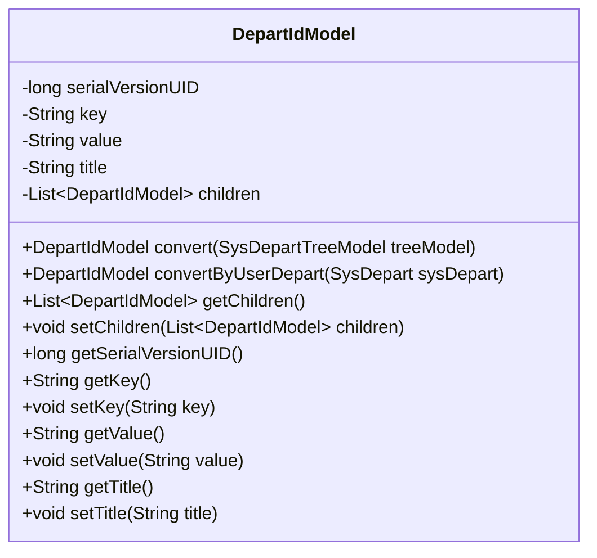

# 基础信息

|      |      |
|------|------|
| 名称 | DepartIdModel |
| 编码语言 | .java |
| 代码路径 | JeecgBoot/jeecg-boot/jeecg-module-system/jeecg-system-biz/src/main/java/org/jeecg/modules/system/model/DepartIdModel.java |
| 包名 | org.jeecg.modules.system.model |
| 依赖项 | ['java.io.Serializable', 'java.util.ArrayList', 'java.util.List', 'org.jeecg.modules.system.entity.SysDepart'] |
| 概述说明 | DepartIdModel类序列化，含ID、部门名及子部门列表，支持数据转换。 |

# 说明

DepartIdModel类实现了序列化功能，主要用于处理部门相关数据。该类包含三个关键属性：主键ID用于唯一标识部门，部门名称用于描述部门的名称，子部门列表用于存储该部门下的所有子部门。此外，该类还提供了数据转换方法，以便在不同数据格式之间进行转换，确保数据的灵活性和可操作性。通过这些功能，DepartIdModel类能够有效地管理和处理部门及其子部门的层级结构数据。

# 类列表 Class Summary

| 名称   | 类型  | 说明 |
|-------|------|-------------|
| DepartIdModel | class | DepartIdModel类实现序列化，包含主键ID、部门名称及子部门列表，提供数据转换方法。 |

## 类 DepartIdModel

|      |      |
|------|------|
| 访问范围 | public |
| 类型 | class |
| 名称 | DepartIdModel |
| 说明 | DepartIdModel类实现序列化，包含主键ID、部门名称及子部门列表，提供数据转换方法。 |

### UML类图

**描述：**  
`DepartIdModel` 类是一个用于表示部门ID的模型类，实现了 `Serializable` 接口以确保对象可序列化。该类包含主键ID (`key` 和 `value`)、部门名称 (`title`) 以及子部门列表 (`children`)。提供了两个转换方法 `convert` 和 `convertByUserDepart`，分别用于将 `SysDepartTreeModel` 和 `SysDepart` 对象的数据转换为 `DepartIdModel` 对象。此外，类中还提供了对各个属性的获取和设置方法，以及对子部门列表的操作方法。

### 内部方法调用关系图

```mermaid
graph TD
    A["类DepartIdModel"]
    B["属性: String key"]
    C["属性: String value"]
    D["属性: String title"]
    E["属性: List<DepartIdModel> children"]
    F["方法: DepartIdModel convert(SysDepartTreeModel treeModel)"]
    G["方法: DepartIdModel convertByUserDepart(SysDepart sysDepart)"]
    H["方法: List<DepartIdModel> getChildren()"]
    I["方法: void setChildren(List<DepartIdModel> children)"]
    J["方法: static long getSerialVersionUID()"]
    K["方法: String getKey()"]
    L["方法: void setKey(String key)"]
    M["方法: String getValue()"]
    N["方法: void setValue(String value)"]
    O["方法: String getTitle()"]
    P["方法: void setTitle(String title)"]

    A --> B
    A --> C
    A --> D
    A --> E
    A --> F
    A --> G
    A --> H
    A --> I
    A --> J
    A --> K
    A --> L
    A --> M
    A --> N
    A --> O
    A --> P
```

这段代码定义了一个名为 `DepartIdModel` 的类，该类实现了 `Serializable` 接口，主要用于存储部门相关的数据。类中包含多个属性，如 `key`、`value`、`title` 和 `children`，分别用于存储部门的主键、值、名称和子部门列表。类中还提供了多个方法，包括用于数据转换的 `convert` 和 `convertByUserDepart` 方法，以及用于获取和设置属性的 `get` 和 `set` 方法。这些方法使得 `DepartIdModel` 类能够灵活地处理部门数据的转换和操作。

### 字段列表 Field List

| 名称  | 类型  | 说明 |
|-------|-------|------|
| key | String | 定义了一个私有的字符串类型变量key。 |
| children = new ArrayList<>() | List<DepartIdModel> | 创建包含DepartIdModel对象的ArrayList实例。 |
| title | String | 定义了一个私有的字符串类型变量title。 |
| serialVersionUID = 1L | long | 定义静态长整型常量serialVersionUID，值为1L。 |
| value | String | 定义了一个私有字符串变量value。 |

### 方法列表 Method List

| 名称  | 类型  | 说明 |
|-------|-------|------|
| getChildren | List<DepartIdModel> | 获取子部门列表的方法。 |
| setChildren | void | 设置子部门列表的方法。 |
| setValue | void | 设置字符串值到当前对象。 |
| getTitle | String | 获取标题的公共方法。 |
| convertByUserDepart | DepartIdModel | 将SysDepart对象转换为DepartIdModel，赋值ID和部门名称后返回。 |
| getKey | String | 获取键值的方法。 |
| setTitle | void | 设置对象的标题属性。 |
| convert | DepartIdModel | 将SysDepartTreeModel转换为DepartIdModel，赋值key、value和title字段。 |
| getValue | String | 该方法返回字符串类型的值。 |
| setKey | void | 设置键值的方法，将传入的字符串赋值给成员变量key。 |
| getSerialVersionUID | long | 获取序列化版本标识符的方法。 |

