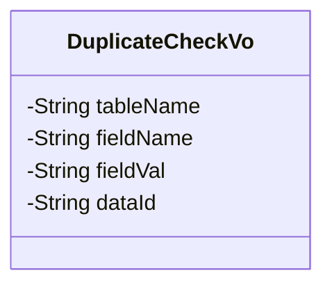
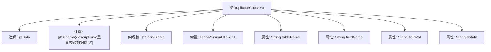

# 基础信息

|      |      |
|------|------|
| 名称 | DuplicateCheckVo |
| 编码语言 | .java |
| 代码路径 | JeecgBoot/jeecg-boot/jeecg-module-system/jeecg-system-biz/src/main/java/org/jeecg/modules/system/model/DuplicateCheckVo.java |
| 包名 | org.jeecg.modules.system.model |
| 依赖项 | ['java.io.Serializable', 'io.swagger.v3.oas.annotations.media.Schema', 'lombok.Data'] |
| 概述说明 | 重复校验数据模型含表名、字段名、字段值和数据ID。 |

# 说明

重复校验数据模型主要用于检测数据中的重复项，包含四个关键要素：表名、字段名、字段值和数据ID。表名标识数据所属的具体表格，字段名指定需要校验的特定字段，字段值表示该字段的具体内容，数据ID则用于唯一标识每条记录。通过这四个要素，模型能够有效识别并处理重复数据，确保数据的唯一性和准确性。

# 类列表 Class Summary

| 名称   | 类型  | 说明 |
|-------|------|-------------|
| DuplicateCheckVo | class | 重复校验数据模型包含表名、字段名、字段值和数据ID。 |

## 类 DuplicateCheckVo

|      |      |
|------|------|
| 访问范围 | @Data;@Schema(description="重复校验数据模型");public |
| 类型 | class |
| 名称 | DuplicateCheckVo |
| 说明 | 重复校验数据模型包含表名、字段名、字段值和数据ID。 |

### UML类图

类图描述：`DuplicateCheckVo` 类是一个用于重复校验的数据模型，包含四个私有属性：`tableName`（表名）、`fieldName`（字段名）、`fieldVal`（字段值）和 `dataId`（数据ID）。该类实现了 `Serializable` 接口，以确保对象可以被序列化。这些属性通过 `@Schema` 注解进行描述，用于生成API文档。

### 内部方法调用关系图

该流程图展示了`DuplicateCheckVo`类的结构，包括其属性、注解和实现的接口。类使用了`@Data`和`@Schema`注解，并实现了`Serializable`接口。类中包含四个属性：`tableName`、`fieldName`、`fieldVal`和`dataId`，每个属性都带有`@Schema`注解以描述其用途。此外，类中还定义了一个常量`serialVersionUID`，用于序列化版本控制。

### 字段列表 Field List

| 名称  | 类型  | 说明 |
|-------|-------|------|
| tableName | String | 表名字段，用于存储表名信息。 |
| dataId | String | 数据ID字段，示例值为2000。 |
| fieldName | String | 字段名为fieldName，示例值为id，类型为String。 |
| fieldVal | String | 字段名为fieldVal，类型为String，示例值为1000。 |
| serialVersionUID = 1L | long | 定义序列化版本号为1L的静态常量。 |

### 方法列表 Method List

| 名称  | 类型  | 说明 |
|-------|-------|------|

