# 基础信息

|      |      |
|------|------|
| 名称 | SysDepartTreeModel |
| 编码语言 | .java |
| 代码路径 | JeecgBoot/jeecg-boot/jeecg-module-system/jeecg-system-biz/src/main/java/org/jeecg/modules/system/model/SysDepartTreeModel.java |
| 包名 | org.jeecg.modules.system.model |
| 依赖项 | ['org.jeecg.modules.system.entity.SysDepart', 'java.io.Serializable', 'java.util.ArrayList', 'java.util.Date', 'java.util.List', 'java.util.Objects'] |
| 概述说明 | SysDepartTreeModel类将SysDepart对象转为树形结构，含部门信息、负责人ID，支持序列化和树节点操作。 |

# 说明

SysDepartTreeModel类用于将SysDepart对象转换为树形结构，包含部门信息和负责人ID等关键字段。该类支持序列化操作，能够将对象转换为可存储或传输的格式。此外，SysDepartTreeModel还提供了树节点操作功能，方便对树形结构进行管理和维护。

# 类列表 Class Summary

| 名称   | 类型  | 说明 |
|-------|------|-------------|
| SysDepartTreeModel | class | SysDepartTreeModel类用于将SysDepart对象转换为树形结构，包含部门信息、负责人ID等字段，支持序列化和树节点操作。 |

## 类 SysDepartTreeModel

|      |      |
|------|------|
| 访问范围 | public |
| 类型 | class |
| 名称 | SysDepartTreeModel |
| 说明 | SysDepartTreeModel类用于将SysDepart对象转换为树形结构，包含部门信息、负责人ID等字段，支持序列化和树节点操作。 |

### UML类图

```mermaid
classDiagram
    class SysDepartTreeModel {
        -String key
        -String value
        -String title
        -boolean isLeaf
        -String id
        -String parentId
        -String departName
        -String departNameEn
        -String departNameAbbr
        -Integer departOrder
        -String description
        -String orgCategory
        -String orgType
        -String orgCode
        -String mobile
        -String fax
        -String address
        -String memo
        -String status
        -String delFlag
        -String qywxIdentifier
        -String createBy
        -Date createTime
        -String updateBy
        -Date updateTime
        -String directorUserIds
        -List~SysDepartTreeModel~ children
        +SysDepartTreeModel(SysDepart sysDepart)
        +boolean getIsLeaf()
        +void setIsLeaf(boolean isleaf)
        +String getKey()
        +void setKey(String key)
        +String getValue()
        +void setValue(String value)
        +String getTitle()
        +void setTitle(String title)
        +String getId()
        +void setId(String id)
        +List~SysDepartTreeModel~ getChildren()
        +void setChildren(List~SysDepartTreeModel~ children)
        +String getParentId()
        +void setParentId(String parentId)
        +String getDepartName()
        +void setDepartName(String departName)
        +String getOrgCategory()
        +void setOrgCategory(String orgCategory)
        +String getOrgType()
        +void setOrgType(String orgType)
        +String getOrgCode()
        +void setOrgCode(String orgCode)
        +String getMobile()
        +void setMobile(String mobile)
        +String getFax()
        +void setFax(String fax)
        +String getAddress()
        +void setAddress(String address)
        +String getMemo()
        +void setMemo(String memo)
        +String getDepartNameEn()
        +void setDepartNameEn(String departNameEn)
        +String getDepartNameAbbr()
        +void setDepartNameAbbr(String departNameAbbr)
        +Integer getDepartOrder()
        +void setDepartOrder(Integer departOrder)
        +String getDescription()
        +void setDescription(String description)
        +String getStatus()
        +void setStatus(String status)
        +String getDelFlag()
        +void setDelFlag(String delFlag)
        +String getQywxIdentifier()
        +void setQywxIdentifier(String qywxIdentifier)
        +String getCreateBy()
        +void setCreateBy(String createBy)
        +Date getCreateTime()
        +void setCreateTime(Date createTime)
        +String getUpdateBy()
        +void setUpdateBy(String updateBy)
        +Date getUpdateTime()
        +void setUpdateTime(Date updateTime)
        +String getDirectorUserIds()
        +void setDirectorUserIds(String directorUserIds)
        +boolean equals(Object o)
        +int hashCode()
    }
```

### 描述
`SysDepartTreeModel` 类用于表示部门树的模型，包含部门的详细信息以及与前端数据树的映射关系。该类通过构造函数将 `SysDepart` 对象转换为 `SysDepartTreeModel` 对象，并提供了一系列的 `getter` 和 `setter` 方法来访问和修改其属性。此外，类还重写了 `equals` 和 `hashCode` 方法，以确保对象比较的正确性。

### 内部方法调用关系图

该流程图展示了`SysDepartTreeModel`类的结构，包括其属性和方法。`SysDepartTreeModel`类用于表示部门树模型，包含多个属性如`key`、`value`、`title`等，以及构造方法和多个getter和setter方法。该类还重写了`equals`和`hashCode`方法，用于比较两个`SysDepartTreeModel`对象是否相等。流程图清晰地展示了类内部各个组件之间的关系，便于理解类的整体设计。

### 字段列表 Field List

| 名称  | 类型  | 说明 |
|-------|-------|------|
| key | String | 定义了一个私有的字符串类型变量key。 |
| value | String | 定义了一个私有字符串变量value。 |
| directorUserIds | String | 私有字符串变量存储导演用户ID。 |
| orgCode | String | 定义了私有字符串变量orgCode。 |
| orgType | String | 定义私有字符串变量orgType。 |
| delFlag | String | 私有字符串变量delFlag。 |
| orgCategory | String | 定义私有字符串变量orgCategory。 |
| id | String | 定义了一个私有字符串类型的变量id。 |
| mobile | String | 声明一个私有的字符串类型变量mobile。 |
| updateTime | Date | 私有日期类型的更新时间变量。 |
| status | String | 声明了一个私有的字符串变量status。 |
| qywxIdentifier | String | 定义私有字符串变量qywxIdentifier。 |
| createTime | Date | 私有日期类型变量createTime。 |
| parentId | String | 定义了一个私有字符串变量parentId。 |
| description | String | 定义了一个私有字符串变量description。 |
| departOrder | Integer | 定义私有整型变量departOrder。 |
| updateBy | String | 更新者字段，用于记录最后修改信息的用户。 |
| memo | String | 定义了一个私有字符串类型的变量memo。 |
| createBy | String | 私有字符串变量createBy用于存储创建者信息。 |
| title | String | 定义了一个私有字符串类型的变量title。 |
| children = new ArrayList<>() | List<SysDepartTreeModel> | 定义了一个私有列表，用于存储子部门树模型。 |
| departNameEn | String | 私有英文部门名称变量。 |
| departName | String | 定义私有字符串变量departName。 |
| fax | String | 定义了一个私有的字符串类型变量fax。 |
| serialVersionUID = 1L | long | 定义序列化版本号的静态常量，值为1L。 |
| departNameAbbr | String | 私有字符串变量，存储部门名称缩写。 |
| isLeaf | boolean | 该代码定义了一个私有的布尔类型变量isLeaf。 |
| address | String | 声明一个私有字符串变量，用于存储地址信息。 |

### 方法列表 Method List

| 名称  | 类型  | 说明 |
|-------|-------|------|
| getSerialVersionUID | long | 获取序列化版本标识符的方法。 |
| getIsLeaf | boolean | 该方法返回布尔值，表示当前节点是否为叶子节点。 |
| setMemo | void | 设置备忘录内容的方法。 |
| getDepartName | String | 该方法返回部门名称的字符串值。 |
| setOrgType | void | 设置组织类型的Java方法。 |
| setDepartOrder | void | 设置部门顺序的方法。 |
| getDepartOrder | Integer | 获取部门顺序的整数值。 |
| setDepartNameEn | void | 设置部门英文名称的方法。 |
| setFax | void | 设置传真号码的方法。 |
| getCreateBy | String | 获取创建者信息的方法。 |
| setTitle | void | 设置对象标题的方法。 |
| setDepartNameAbbr | void | 设置部门名称缩写的方法。 |
| setQywxIdentifier | void | 设置企业微信标识符的方法。 |
| getId | String | 该方法返回字符串类型的id值。 |
| setUpdateBy | void | 设置更新者属性的方法。 |
| getDepartNameAbbr | String | 获取部门名称缩写的方法。 |
| getUpdateBy | String | 获取更新者信息的方法。 |
| getQywxIdentifier | String | 获取企业微信标识符的方法。 |
| setMobile | void | 该方法用于设置手机号属性。 |
| getOrgType | String | 获取组织类型的公共方法。 |
| getChildren | List<SysDepartTreeModel> | 获取子部门树模型列表的方法。 |
| getDelFlag | String | 获取删除标志的字符串值。 |
| getDescription | String | 获取描述信息的字符串方法。 |
| setOrgCode | void | 设置组织代码的方法。 |
| getCreateTime | Date | 该方法返回创建时间的日期对象。 |
| getDirectorUserIds | String | 获取导演用户ID的方法。 |
| getValue | String | 该方法返回名为value的字符串变量。 |
| setIsLeaf | void | 设置isLeaf属性的方法，接受布尔值参数。 |
| getOrgCode | String | 该方法返回orgCode的值。 |
| equals | boolean | 重写equals方法，比较SysDepartTreeModel对象的所有属性是否相等。 |
| setParentId | void | 设置父ID的方法，参数为字符串类型。 |
| getStatus | String | 获取状态的方法，返回状态字符串。 |
| getTitle | String | 该方法返回对象的标题属性。 |
| getFax | String | 获取传真号码的方法。 |
| setChildren | void | 该方法设置子节点列表，若为空则标记为叶节点。 |
| hashCode | int | 该方法使用Objects.hash生成包含多个字段的哈希码。 |
| getOrgCategory | String | 获取组织类别的方法，返回orgCategory变量。 |
| setDepartName | void | 设置部门名称的方法。 |
| setUpdateTime | void | 设置更新时间的方法，将传入的Date对象赋值给类成员变量updateTime。 |
| setCreateBy | void | 该方法用于设置创建者信息，将传入的字符串赋值给类的createBy属性。 |
| setValue | void | 设置对象的值属性。 |
| setDelFlag | void | 该方法用于设置删除标志的字符串值。 |
| getMobile | String | 获取手机号的方法。 |
| setAddress | void | 设置地址的方法，将传入的地址赋值给类成员变量。 |
| setOrgCategory | void | 设置组织类别的方法，接受字符串参数并赋值。 |
| setCreateTime | void | 设置创建时间的方法，接受Date类型参数。 |
| setId | void | 设置对象的ID属性。 |
| getAddress | String | 获取地址的公共方法。 |
| setDescription | void | 该方法用于设置描述信息，将传入的字符串赋值给类的描述变量。 |
| setStatus | void | 设置对象状态的方法，接受字符串参数。 |
| getUpdateTime | Date | 获取更新时间的方法，返回updateTime变量。 |
| setKey | void | 该方法用于设置对象的键值。 |
| getDepartNameEn | String | 获取部门英文名称的方法。 |
| getParentId | String | 获取父ID的公共方法。 |
| getKey | String | 该方法返回字符串类型的key值。 |
| setDirectorUserIds | void | 设置导演用户ID的方法。 |
| getMemo | String | 获取memo字符串的方法。 |

