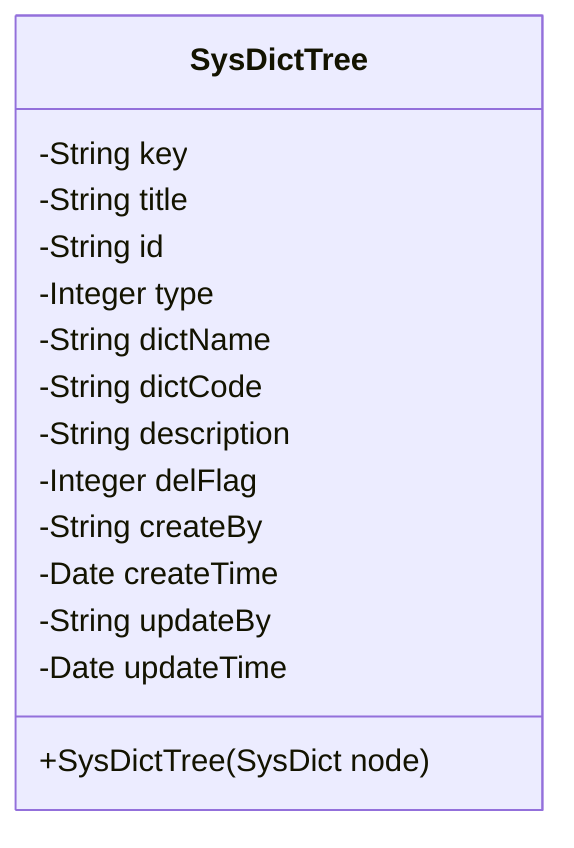
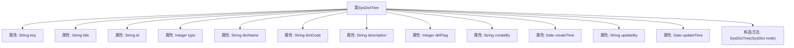

# 基础信息

|      |      |
|------|------|
| 名称 | SysDictTree |
| 编码语言 | .java |
| 代码路径 | JeecgBoot/jeecg-boot/jeecg-module-system/jeecg-system-biz/src/main/java/org/jeecg/modules/system/model/SysDictTree.java |
| 包名 | org.jeecg.modules.system.model |
| 依赖项 | ['java.io.Serializable', 'java.util.Date', 'org.jeecg.modules.system.entity.SysDict', 'com.baomidou.mybatisplus.annotation.IdType', 'com.baomidou.mybatisplus.annotation.TableId', 'lombok.Data', 'lombok.EqualsAndHashCode', 'lombok.experimental.Accessors'] |
| 概述说明 | SysDictTree类实现序列化，包含字典键、标题、ID、类型、名称、编码、描述、删除状态及创建更新信息。 |

# 说明

SysDictTree类实现了序列化功能，包含了多个关键属性：字典键、标题、ID、类型、名称、编码、描述以及删除状态。此外，该类还记录了创建和更新的相关信息，确保数据的完整性和可追溯性。通过这些属性，SysDictTree类能够有效地管理和维护字典树结构，支持数据的存储和检索操作。

# 类列表 Class Summary

| 名称   | 类型  | 说明 |
|-------|------|-------------|
| SysDictTree | class | SysDictTree类实现序列化，包含字典键、标题、ID、类型、名称、编码、描述、删除状态、创建和更新信息。 |

## 类 SysDictTree

|      |      |
|------|------|
| 访问范围 | @Data;@EqualsAndHashCode(callSuper = false);@Accessors(chain = true);public |
| 类型 | class |
| 名称 | SysDictTree |
| 说明 | SysDictTree类实现序列化，包含字典键、标题、ID、类型、名称、编码、描述、删除状态、创建和更新信息。 |

### UML类图

**描述：**  
`SysDictTree` 类是一个用于表示系统字典树的数据结构，包含了字典的各种属性，如键、标题、ID、类型、字典名称、字典编码、描述、删除状态、创建和更新时间等。该类通过构造函数从 `SysDict` 对象中初始化部分属性，提供了对字典数据的封装和管理。

### 内部方法调用关系图

这段代码定义了一个名为 `SysDictTree` 的类，该类实现了 `Serializable` 接口，表明其实例可以被序列化。类中包含多个属性，如 `key`、`title`、`id`、`type` 等，分别用于存储字典树的相关信息。类中还有一个构造方法 `SysDictTree(SysDict node)`，用于根据 `SysDict` 类型的对象初始化 `SysDictTree` 的实例。流程图展示了类的结构及其属性和构造方法之间的关系。

### 字段列表 Field List

| 名称  | 类型  | 说明 |
|-------|-------|------|
| serialVersionUID = 1L | long | 定义了一个静态常量serialVersionUID，值为1L。 |
| dictCode | String | 私有字符串变量dictCode。 |
| createBy | String | 私有字符串变量createBy用于存储创建者信息。 |
| key | String | 定义了一个私有的字符串类型变量key。 |
| updateBy | String | 更新操作用户标识符。 |
| createTime | Date | 私有日期类型变量createTime。 |
| type | Integer | 定义私有整型变量type。 |
| description | String | 描述字段为私有字符串类型。 |
| id | String | 表主键使用自定义ID生成策略，字段类型为字符串。 |
| title | String | 声明了一个私有的字符串类型变量title。 |
| dictName | String | 定义了一个私有字符串变量dictName。 |
| delFlag | Integer | 私有整型变量delFlag用于标记删除状态。 |
| updateTime | Date | 私有日期类型变量updateTime。 |

### 方法列表 Method List

| 名称  | 类型  | 说明 |
|-------|-------|------|

