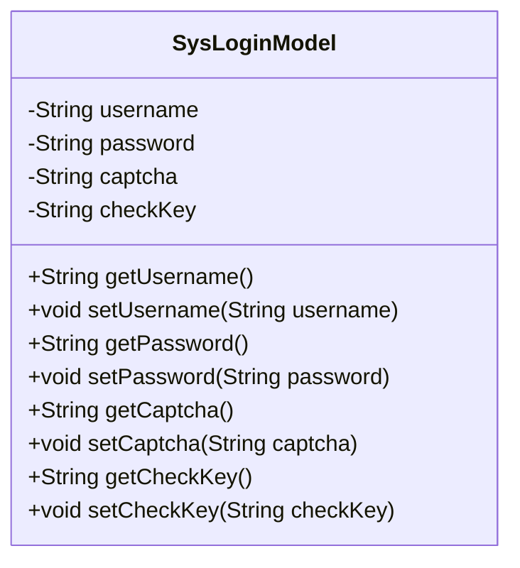
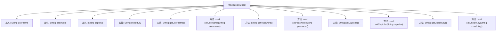

# 基础信息

|      |      |
|------|------|
| 名称 | SysLoginModel |
| 编码语言 | .java |
| 代码路径 | JeecgBoot/jeecg-boot/jeecg-module-system/jeecg-system-biz/src/main/java/org/jeecg/modules/system/model/SysLoginModel.java |
| 包名 | org.jeecg.modules.system.model |
| 依赖项 | ['io.swagger.v3.oas.annotations.media.Schema'] |
| 概述说明 | 登录需账号、密码、验证码及验证码key。 |

# 说明

登录对象包含四个关键字段：账号、密码、验证码和验证码key。账号用于标识用户身份，密码用于验证用户身份，验证码用于增加安全性，验证码key用于验证验证码的有效性。这些字段共同确保登录过程的安全性和准确性。

# 类列表 Class Summary

| 名称   | 类型  | 说明 |
|-------|------|-------------|
| SysLoginModel | class | 登录对象包含账号、密码、验证码和验证码key字段。 |

## 类 SysLoginModel

|      |      |
|------|------|
| 访问范围 | @Schema(description="登录对象");public |
| 类型 | class |
| 名称 | SysLoginModel |
| 说明 | 登录对象包含账号、密码、验证码和验证码key字段。 |

### UML类图

**描述：**  
`SysLoginModel` 类是一个用于封装登录信息的模型类，包含用户名、密码、验证码和验证码Key四个私有属性。每个属性都有对应的getter和setter方法，用于获取和设置这些属性的值。该类主要用于在登录过程中传递和存储用户输入的相关信息，确保数据的安全性和完整性。

### 内部方法调用关系图

这段代码定义了一个名为 `SysLoginModel` 的类，用于表示登录对象。该类包含四个私有属性：`username`（账号）、`password`（密码）、`captcha`（验证码）和 `checkKey`（验证码key）。每个属性都有对应的 `getter` 和 `setter` 方法，用于获取和设置这些属性的值。代码的结构清晰，属性通过注解 `@Schema` 进行描述，便于理解和维护。

### 字段列表 Field List

| 名称  | 类型  | 说明 |
|-------|-------|------|
| captcha | String | 验证码字段定义。 |
| checkKey | String | 验证码key字段定义。 |
| username | String | 账号的用户名字段定义。 |
| password | String | 密码字段用于存储用户密码信息。 |

### 方法列表 Method List

| 名称  | 类型  | 说明 |
|-------|-------|------|
| getCaptcha | String | 获取验证码的字符串方法。 |
| setCheckKey | void | 设置checkKey属性的方法。 |
| getUsername | String | 获取用户名的方法，返回存储的用户名字符串。 |
| getPassword | String | 获取密码的Java方法。 |
| setPassword | void | 设置密码方法，将传入字符串赋值给对象属性。 |
| getCheckKey | String | 获取checkKey的公共方法。 |
| setCaptcha | void | 设置验证码字符串的方法。 |
| setUsername | void | 设置用户名的Java方法。 |

