# 基础信息

|      |      |
|------|------|
| 名称 | SysPermissionTree |
| 编码语言 | .java |
| 代码路径 | JeecgBoot/jeecg-boot/jeecg-module-system/jeecg-system-biz/src/main/java/org/jeecg/modules/system/model/SysPermissionTree.java |
| 包名 | org.jeecg.modules.system.model |
| 依赖项 | ['java.io.Serializable', 'java.util.ArrayList', 'java.util.Date', 'java.util.List', 'org.jeecg.modules.system.entity.SysPermission'] |
| 概述说明 | SysPermissionTree类管理权限树，包含菜单、按钮权限，支持父子关系、排序和状态管理。 |

# 说明

SysPermissionTree类是一个用于管理权限树结构的工具，主要处理菜单和按钮权限等属性。该类支持父子关系的建立与维护，允许对权限节点进行排序，并提供状态管理功能，确保权限树的灵活性和可操作性。

# 类列表 Class Summary

| 名称   | 类型  | 说明 |
|-------|------|-------------|
| SysPermissionTree | class | SysPermissionTree类用于管理权限树结构，包含菜单、按钮权限等属性，支持父子关系、排序、状态管理等。 |

## 类 SysPermissionTree

|      |      |
|------|------|
| 访问范围 | public |
| 类型 | class |
| 名称 | SysPermissionTree |
| 说明 | SysPermissionTree类用于管理权限树结构，包含菜单、按钮权限等属性，支持父子关系、排序、状态管理等。 |

### UML类图

```mermaid
classDiagram
    class SysPermissionTree {
        -String id
        -String key
        -String title
        -String parentId
        -String name
        -String perms
        -String permsType
        -String icon
        -String component
        -String componentName
        -String url
        -String redirect
        -Double sortNo
        -Integer menuType
        -boolean isLeaf
        -boolean route
        -boolean keepAlive
        -String description
        -Integer delFlag
        -String createBy
        -Date createTime
        -String updateBy
        -Date updateTime
        -boolean alwaysShow
        -boolean hidden
        -String status
        -boolean internalOrExternal
        -boolean hideTab
        -List~SysPermissionTree~ children
        +SysPermissionTree()
        +SysPermissionTree(SysPermission permission)
        +String getTitle()
        +void setTitle(String title)
        +boolean isLeaf()
        +void setLeaf(boolean leaf)
        +boolean isKeepAlive()
        +void setKeepAlive(boolean keepAlive)
        +boolean isAlwaysShow()
        +void setAlwaysShow(boolean alwaysShow)
        +List~SysPermissionTree~ getChildren()
        +void setChildren(List~SysPermissionTree~ children)
        +String getRedirect()
        +void setRedirect(String redirect)
        +String getId()
        +void setId(String id)
        +String getParentId()
        +void setParentId(String parentId)
        +boolean isHidden()
        +void setHidden(boolean hidden)
        +String getName()
        +void setName(String name)
        +String getIcon()
        +void setIcon(String icon)
        +String getComponent()
        +void setComponent(String component)
        +String getComponentName()
        +void setComponentName(String componentName)
        +String getUrl()
        +void setUrl(String url)
        +Double getSortNo()
        +void setSortNo(Double sortNo)
        +Integer getMenuType()
        +void setMenuType(Integer menuType)
        +String getDescription()
        +void setDescription(String description)
        +boolean isRoute()
        +void setRoute(boolean route)
        +Integer getDelFlag()
        +void setDelFlag(Integer delFlag)
        +String getCreateBy()
        +void setCreateBy(String createBy)
        +Date getCreateTime()
        +void setCreateTime(Date createTime)
        +String getUpdateBy()
        +void setUpdateBy(String updateBy)
        +Date getUpdateTime()
        +void setUpdateTime(Date updateTime)
        +String getKey()
        +void setKey(String key)
        +String getPerms()
        +void setPerms(String perms)
        +boolean getIsLeaf()
        +void setIsLeaf(boolean isLeaf)
        +String getPermsType()
        +void setPermsType(String permsType)
        +String getStatus()
        +void setStatus(String status)
        +boolean isInternalOrExternal()
        +void setInternalOrExternal(boolean internalOrExternal)
        +boolean isHideTab()
        +void setHideTab(boolean hideTab)
    }
```

**描述**：`SysPermissionTree`类是一个用于表示系统权限树的数据结构，包含了权限的多个属性，如ID、名称、父ID、权限编码、菜单类型等。该类还提供了多个getter和setter方法用于访问和修改这些属性。此外，`SysPermissionTree`类还包含一个`children`属性，用于存储子权限树，形成一个树形结构。该类的主要作用是将系统权限信息组织成树状结构，便于权限管理和展示。

### 内部方法调用关系图

该流程图展示了`SysPermissionTree`类的结构，包括其属性和方法。`SysPermissionTree`类用于表示权限树，包含多个属性如`id`、`key`、`title`等，以及对应的getter和setter方法。构造方法`SysPermissionTree()`和`SysPermissionTree(SysPermission permission)`用于初始化对象。该类的设计主要用于管理和操作权限树的结构和属性，支持对权限节点的增删改查操作。

### 字段列表 Field List

| 名称  | 类型  | 说明 |
|-------|-------|------|
| serialVersionUID = 1L | long | 定义静态常量serialVersionUID，值为1L。 |
| perms | String | 私有字符串变量perms定义。 |
| isLeaf | boolean | 判断是否为叶子节点的布尔变量。 |
| id | String | 定义了一个私有字符串类型的变量id。 |
| menuType | Integer | 私有整型变量menuType。 |
| component | String | 定义了一个私有的字符串类型变量component。 |
| route | boolean | 定义了一个私有的布尔类型变量route。 |
| title | String | 定义了一个私有的字符串类型变量title。 |
| name | String | 声明一个私有的字符串类型变量name。 |
| parentId | String | 定义私有字符串类型变量parentId。 |
| hidden | boolean | 隐藏状态布尔变量。 |
| componentName | String | 定义了一个私有字符串变量componentName。 |
| internalOrExternal | boolean | 内部或外部布尔变量 |
| sortNo | Double | 私有双精度排序编号。 |
| url | String | 定义了一个私有的字符串变量url。 |
| key | String | 定义了一个私有的字符串类型变量key。 |
| status | java.lang.String | 私有字符串类型变量status定义。 |
| description | String | 定义了一个私有字符串变量description。 |
| hideTab | boolean | 隐藏标签页的布尔变量。 |
| icon | String | 定义了一个私有的字符串变量icon。 |
| createBy | String | 私有字符串类型变量createBy。 |
| createTime | Date | 定义了一个私有日期类型的变量createTime。 |
| updateTime | Date | 私有日期类型变量updateTime用于存储更新时间。 |
| permsType | String | 定义私有字符串变量permsType。 |
| redirect | String | 私有字符串变量redirect用于重定向操作。 |
| updateBy | String | 私有字符串变量updateBy用于存储更新者信息。 |
| delFlag | Integer | 私有整型变量delFlag用于标记删除状态。 |
| children | List<SysPermissionTree> | 包含子权限树列表的私有变量。 |
| keepAlive | boolean | 定义了一个私有布尔变量keepAlive。 |
| alwaysShow | boolean | 布尔变量alwaysShow用于控制显示状态。 |

### 方法列表 Method List

| 名称  | 类型  | 说明 |
|-------|-------|------|
| isLeaf | boolean | 判断是否为叶子节点的方法。 |
| getRedirect | String | 获取重定向路径的方法。 |
| setUrl | void | 设置URL属性的方法。 |
| setChildren | void | 设置子权限树列表的方法。 |
| setIcon | void | 设置图标属性的方法。 |
| getChildren | List<SysPermissionTree> | 获取系统权限树子节点列表的方法。 |
| getId | String | 该方法返回字符串类型的id值。 |
| setLeaf | void | 设置节点是否为叶子节点。 |
| getDescription | String | 该方法返回描述字符串。 |
| getParentId | String | 获取父ID的Java方法。 |
| setName | void | 该方法用于设置对象的名称属性。 |
| setCreateBy | void | 设置创建者属性的方法。 |
| getMenuType | Integer | 获取菜单类型的方法，返回整数类型。 |
| setComponent | void | 设置组件属性的公共方法。 |
| getPermsType | String | 该方法返回权限类型字符串。 |
| setKeepAlive | void | 设置keepAlive属性的方法。 |
| setParentId | void | 设置父ID属性值。 |
| isAlwaysShow | boolean | 方法isAlwaysShow返回布尔值alwaysShow。 |
| setAlwaysShow | void | 设置alwaysShow属性值的方法。 |
| getName | String | 方法`getName`返回变量`name`的值。 |
| setUpdateTime | void | 设置更新时间的方法。 |
| getSortNo | Double | 该方法返回一个Double类型的sortNo值。 |
| getUpdateBy | String | 获取更新者信息的字符串方法。 |
| getComponent | String | 该方法返回组件字符串。 |
| isRoute | boolean | 该方法返回布尔值，表示是否为路由。 |
| getUrl | String | 获取URL的公共方法。 |
| getUpdateTime | Date | 获取更新时间的方法。 |
| setComponentName | void | 设置组件名称的方法，将传入的字符串赋值给成员变量。 |
| setPerms | void | 该方法用于设置权限字符串。 |
| getTitle | String | 该方法返回对象的标题属性。 |
| getIsLeaf | boolean | 该方法返回布尔值，表示是否为叶子节点。 |
| setHideTab | void | 该方法用于设置隐藏标签页的状态。 |
| getDelFlag | Integer | 该方法返回整型变量delFlag的值。 |
| isHidden | boolean | 该方法返回布尔值，表示对象是否隐藏。 |
| getStatus | java.lang.String | Java方法返回状态字符串。 |
| setSortNo | void | 该方法用于设置排序编号，参数为Double类型的sortNo。 |
| isKeepAlive | boolean | 检查并返回keepAlive的布尔值状态。 |
| getCreateTime | Date | 方法getCreateTime返回createTime值。 |
| setUpdateBy | void | 设置更新者信息的方法。 |
| getPerms | String | 获取权限字符串的方法。 |
| getCreateBy | String | 返回创建者信息的方法。 |
| setPermsType | void | 设置权限类型的方法。 |
| setTitle | void | 设置对象标题的方法，将传入的标题赋值给当前对象。 |
| setRedirect | void | 设置重定向路径的Java方法。 |
| isHideTab | boolean | 方法isHideTab返回hideTab的布尔值。 |
| setDelFlag | void | 设置删除标志的方法，参数为整型delFlag。 |
| setIsLeaf | void | 设置节点是否为叶子节点的布尔值。 |
| setStatus | void | 设置状态值的方法，将传入的status赋值给当前对象的status属性。 |
| setMenuType | void | 设置菜单类型的方法，接受整型参数。 |
| getKey | String | 方法getKey返回字符串类型的key值。 |
| isInternalOrExternal | boolean | 该方法返回布尔值，表示内部或外部状态。 |
| setInternalOrExternal | void | 设置内部或外部状态的布尔值方法。 |
| setRoute | void | 设置路由状态的方法，参数为布尔类型。 |
| setKey | void | 设置类成员变量key的值为传入参数key。 |
| getIcon | String | 获取图标字符串的方法。 |
| setDescription | void | 设置描述信息的方法。 |
| getComponentName | String | 获取组件名称的方法。 |
| setHidden | void | 设置隐藏状态的方法，接受布尔值参数。 |
| setCreateTime | void | 设置创建时间的方法，将传入的日期赋值给内部变量。 |
| setId | void | 设置对象ID的方法，将传入的字符串赋值给对象的id属性。 |

