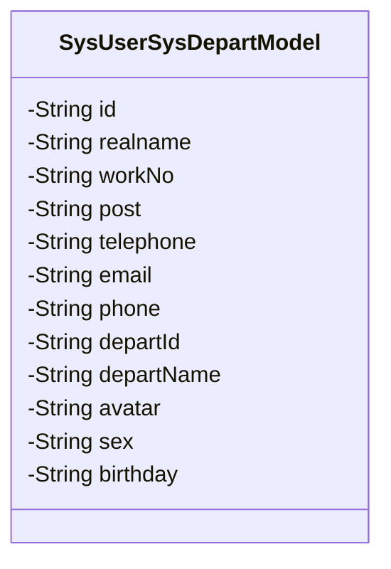
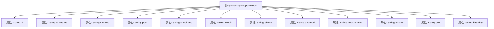

# 基础信息

|      |      |
|------|------|
| 名称 | SysUserSysDepartModel |
| 编码语言 | .java |
| 代码路径 | JeecgBoot/jeecg-boot/jeecg-module-system/jeecg-system-biz/src/main/java/org/jeecg/modules/system/model/SysUserSysDepartModel.java |
| 包名 | org.jeecg.modules.system.model |
| 依赖项 | ['lombok.Data', 'org.jeecg.modules.system.entity.SysDepart', 'org.jeecg.modules.system.entity.SysUser'] |
| 概述说明 | SysUserSysDepartModel类存储用户和部门信息，包括ID、姓名、工号、职位、电话、邮箱、部门ID及名称。 |

# 说明

SysUserSysDepartModel类用于存储用户及其所属部门的相关信息，包含用户ID、姓名、工号、职位、电话、邮箱、部门ID和部门名称等关键字段。该类旨在整合用户个人基本信息与部门相关数据，便于系统管理和查询。

# 类列表 Class Summary

| 名称   | 类型  | 说明 |
|-------|------|-------------|
| SysUserSysDepartModel | class | SysUserSysDepartModel类包含用户及部门信息，如ID、姓名、工号、职位、电话、邮箱、部门ID、部门名称等。 |

## 类 SysUserSysDepartModel

|      |      |
|------|------|
| 访问范围 | @Data;public |
| 类型 | class |
| 名称 | SysUserSysDepartModel |
| 说明 | SysUserSysDepartModel类包含用户及部门信息，如ID、姓名、工号、职位、电话、邮箱、部门ID、部门名称等。 |

### UML类图

这段代码定义了一个名为 `SysUserSysDepartModel` 的类，该类包含了多个私有属性，用于存储用户与部门相关的信息。这些属性包括用户的ID、真实姓名、工号、职位、电话、电子邮件、手机号码、部门ID、部门名称、头像、性别和生日。该类的设计主要用于封装用户与部门关联的详细信息，便于在系统中进行数据传递和处理。

### 内部方法调用关系图

这段代码定义了一个名为 `SysUserSysDepartModel` 的类，该类包含多个私有属性，分别用于存储用户的ID、真实姓名、工号、职位、电话、电子邮件、手机、部门ID、部门名称、头像、性别和生日等信息。这些属性都是字符串类型，用于描述用户的基本信息和所属部门的相关数据。代码使用了 `@Data` 注解，表明该类可能自动生成了 getter、setter、toString 等方法。

### 字段列表 Field List

| 名称  | 类型  | 说明 |
|-------|-------|------|
| avatar | String | 定义私有字符串变量avatar。 |
| post | String | 定义了一个私有的字符串类型变量post。 |
| workNo | String | 定义了一个私有字符串变量workNo。 |
| phone | String | 定义私有字符串变量phone。 |
| birthday | String | 定义了一个私有字符串变量用于存储生日信息。 |
| sex | String | 定义了一个私有的字符串类型变量sex。 |
| departName | String | 定义私有字符串变量departName。 |
| email | String | 声明了一个私有的字符串类型变量email。 |
| telephone | String | 定义了一个私有的字符串类型变量telephone。 |
| realname | String | 定义了一个私有字符串变量realname。 |
| departId | String | 定义私有字符串类型变量departId。 |
| id | String | 定义了一个私有字符串类型的变量id。 |

### 方法列表 Method List

| 名称  | 类型  | 说明 |
|-------|-------|------|

