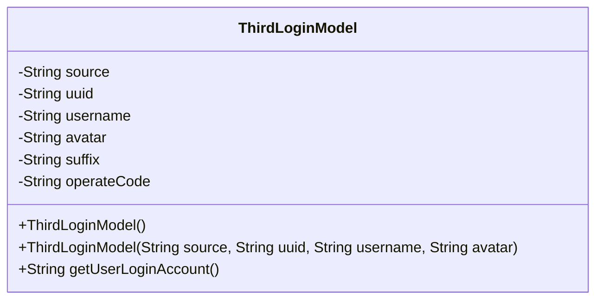
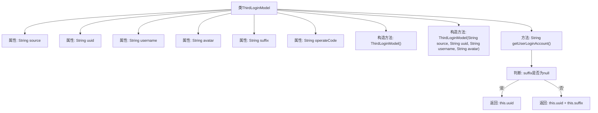

# 基础信息

|      |      |
|------|------|
| 名称 | ThirdLoginModel |
| 编码语言 | .java |
| 代码路径 | JeecgBoot/jeecg-boot/jeecg-module-system/jeecg-system-biz/src/main/java/org/jeecg/modules/system/model/ThirdLoginModel.java |
| 包名 | org.jeecg.modules.system.model |
| 依赖项 | ['lombok.Data', 'java.io.Serializable'] |
| 概述说明 | 第三方登录模型类，含来源、UUID等字段，提供构造器和获取账号名方法。 |

# 说明

第三方登录模型类用于管理和存储第三方登录的相关信息，包含来源、UUID、用户名、头像、后缀和操作码等字段。该模型类提供了构造器用于初始化这些字段，并包含一个方法用于获取登录账号名，确保能够方便地访问和管理第三方登录数据。

# 类列表 Class Summary

| 名称   | 类型  | 说明 |
|-------|------|-------------|
| ThirdLoginModel | class | 第三方登录模型类，包含来源、UUID、用户名、头像、后缀和操作码字段，提供构造器和获取登录账号名方法。 |

## 类 ThirdLoginModel

|      |      |
|------|------|
| 访问范围 | @Data;public |
| 类型 | class |
| 名称 | ThirdLoginModel |
| 说明 | 第三方登录模型类，包含来源、UUID、用户名、头像、后缀和操作码字段，提供构造器和获取登录账号名方法。 |

### UML类图

**描述：**  
`ThirdLoginModel` 类用于表示第三方登录的模型，包含第三方登录的来源、唯一标识符、用户名、头像等信息。该类提供了两个构造函数，一个无参构造函数和一个带参构造函数，用于初始化模型的基本信息。此外，`getUserLoginAccount` 方法用于获取登录账号名，如果存在后缀则拼接唯一标识符和后缀，否则仅返回唯一标识符。该类实现了 `Serializable` 接口，支持序列化操作。

### 内部方法调用关系图

这段代码定义了一个名为 `ThirdLoginModel` 的类，用于处理第三方登录的相关信息。类中包含多个属性，如 `source`、`uuid`、`username` 等，用于存储第三方登录的详细信息。类提供了两个构造方法，一个无参构造方法和一个带参构造方法，用于初始化对象。此外，类中还包含一个 `getUserLoginAccount` 方法，用于根据 `suffix` 是否存在返回不同的登录账号名。流程图展示了类的属性、构造方法以及 `getUserLoginAccount` 方法的逻辑流程。

### 字段列表 Field List

| 名称  | 类型  | 说明 |
|-------|-------|------|
| avatar | String | 定义私有字符串变量avatar。 |
| operateCode | String | 私有字符串变量operateCode。 |
| source | String | 定义了一个私有的字符串变量source。 |
| uuid | String | 定义了一个私有的字符串类型变量uuid。 |
| suffix | String | 定义了一个私有字符串变量suffix。 |
| serialVersionUID = 4098628709290780891L | long | 定义静态长整型常量serialVersionUID，值为4098628709290780891。 |
| username | String | 定义私有字符串变量username。 |

### 方法列表 Method List

| 名称  | 类型  | 说明 |
|-------|-------|------|
| getUserLoginAccount | String | 根据后缀返回用户登录账号，若无后缀则返回UUID。 |

