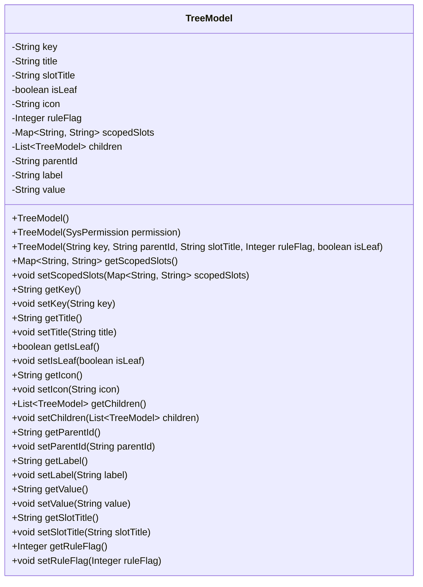

# 基础信息

|      |      |
|------|------|
| 名称 | TreeModel |
| 编码语言 | .java |
| 代码路径 | JeecgBoot/jeecg-boot/jeecg-module-system/jeecg-system-biz/src/main/java/org/jeecg/modules/system/model/TreeModel.java |
| 包名 | org.jeecg.modules.system.model |
| 依赖项 | ['java.io.Serializable', 'java.util.ArrayList', 'java.util.HashMap', 'java.util.List', 'java.util.Map', 'org.jeecg.modules.system.entity.SysPermission'] |
| 概述说明 | TreeModel类实现序列化，包含树节点属性和操作方法。 |

# 说明

TreeModel类实现了序列化功能，主要用于处理树结构数据。该类包含树节点的属性，如节点名称、父节点、子节点等，以及一系列操作方法，用于对树结构进行增删改查等操作。通过序列化，TreeModel类能够将树结构数据转换为可存储或传输的格式，便于在不同系统或应用之间进行数据交换和持久化存储。

# 类列表 Class Summary

| 名称   | 类型  | 说明 |
|-------|------|-------------|
| TreeModel | class | TreeModel类实现序列化，包含树节点属性和操作方法。 |

## 类 TreeModel

|      |      |
|------|------|
| 访问范围 | public |
| 类型 | class |
| 名称 | TreeModel |
| 说明 | TreeModel类实现序列化，包含树节点属性和操作方法。 |

### UML类图

这段代码定义了一个名为 `TreeModel` 的类，该类实现了 `Serializable` 接口，用于表示树形结构中的节点。类中包含多个私有字段，如 `key`、`title`、`isLeaf` 等，分别表示节点的唯一标识、显示标题、是否为叶子节点等属性。类提供了多个构造方法，允许通过不同的方式初始化对象。此外，类中还提供了对这些字段的 getter 和 setter 方法，以便外部代码可以访问和修改这些属性。`TreeModel` 类的主要作用是管理和操作树形结构中的数据节点。

### 内部方法调用关系图

```mermaid
graph TD
    A["类TreeModel"]
    B["属性: String key"]
    C["属性: String title"]
    D["属性: String slotTitle"]
    E["属性: boolean isLeaf"]
    F["属性: String icon"]
    G["属性: Integer ruleFlag"]
    H["属性: Map<String,String> scopedSlots"]
    I["属性: List<TreeModel> children"]
    J["属性: String parentId"]
    K["属性: String label"]
    L["属性: String value"]
    M["方法: Map<String, String> getScopedSlots()"]
    N["方法: void setScopedSlots(Map<String, String> scopedSlots)"]
    O["方法: String getKey()"]
    P["方法: void setKey(String key)"]
    Q["方法: String getTitle()"]
    R["方法: void setTitle(String title)"]
    S["方法: boolean getIsLeaf()"]
    T["方法: void setIsLeaf(boolean isLeaf)"]
    U["方法: String getIcon()"]
    V["方法: void setIcon(String icon)"]
    W["方法: List<TreeModel> getChildren()"]
    X["方法: void setChildren(List<TreeModel> children)"]
    Y["构造方法: TreeModel()"]
    Z["构造方法: TreeModel(SysPermission permission)"]
    AA["构造方法: TreeModel(String key,String parentId,String slotTitle,Integer ruleFlag,boolean isLeaf)"]
    AB["方法: String getParentId()"]
    AC["方法: void setParentId(String parentId)"]
    AD["方法: String getLabel()"]
    AE["方法: void setLabel(String label)"]
    AF["方法: String getValue()"]
    AG["方法: void setValue(String value)"]
    AH["方法: String getSlotTitle()"]
    AI["方法: void setSlotTitle(String slotTitle)"]
    AJ["方法: Integer getRuleFlag()"]
    AK["方法: void setRuleFlag(Integer ruleFlag)"]

    A --> B
    A --> C
    A --> D
    A --> E
    A --> F
    A --> G
    A --> H
    A --> I
    A --> J
    A --> K
    A --> L
    A --> M
    A --> N
    A --> O
    A --> P
    A --> Q
    A --> R
    A --> S
    A --> T
    A --> U
    A --> V
    A --> W
    A --> X
    A --> Y
    A --> Z
    A --> AA
    A --> AB
    A --> AC
    A --> AD
    A --> AE
    A --> AF
    A --> AG
    A --> AH
    A --> AI
    A --> AJ
    A --> AK
```

这段代码定义了一个名为`TreeModel`的类，该类实现了`Serializable`接口，用于表示树形结构中的节点。类中包含多个属性，如`key`、`title`、`isLeaf`等，以及对应的getter和setter方法。此外，类还提供了三个构造方法，分别用于不同的初始化场景。`TreeModel`类的主要功能是管理树节点的属性及其子节点，适用于树形数据的存储和操作。

### 字段列表 Field List

| 名称  | 类型  | 说明 |
|-------|-------|------|
| scopedSlots | Map<String,String> | 私有Map类型变量scopedSlots，键值对为字符串。 |
| parentId | String | 定义私有字符串变量parentId。 |
| title | String | 定义一个私有的字符串类型变量title。 |
| children | List<TreeModel> | 私有子节点列表。 |
| ruleFlag | Integer | 私有整型变量ruleFlag定义。 |
| value | String | 声明一个私有的字符串变量value。 |
| key | String | 定义了一个私有字符串变量key。 |
| serialVersionUID = 4013193970046502756L | long | 定义静态长整型序列化版本UID。 |
| slotTitle | String | 定义了一个私有字符串变量slotTitle。 |
| icon | String | 定义了一个私有的字符串类型变量icon。 |
| label | String | 定义了一个私有字符串变量`label`。 |
| isLeaf | boolean | 该代码定义了一个私有的布尔类型变量isLeaf。 |

### 方法列表 Method List

| 名称  | 类型  | 说明 |
|-------|-------|------|
| setIsLeaf | void | 设置叶子节点状态的方法。 |
| setChildren | void | 设置子节点列表的方法。 |
| getValue | String | 该方法返回字符串类型的值。 |
| getKey | String | 该方法返回字符串类型的key值。 |
| setKey | void | 设置对象键值的方法。 |
| getIcon | String | 获取图标字符串的方法。 |
| getSlotTitle | String | 方法返回slotTitle字符串值。 |
| getRuleFlag | Integer | 获取规则标志的整数方法。 |
| setScopedSlots | void | 设置作用域插槽的映射关系。 |
| getIsLeaf | boolean | 该方法返回布尔值isLeaf，表示是否为叶子节点。 |
| setRuleFlag | void | 设置规则标志的公共方法。 |
| getTitle | String | 获取并返回标题字符串的方法。 |
| setTitle | void | 设置标题的方法，将传入的title赋值给当前对象的title属性。 |
| setIcon | void | 设置图标的方法，将传入的字符串赋值给类的图标变量。 |
| getChildren | List<TreeModel> | 该方法返回子节点列表。 |
| setValue | void | 设置字符串类型变量值的方法。 |
| getLabel | String | 获取标签值的方法。 |
| setLabel | void | 设置对象标签的方法，参数为字符串类型。 |
| setSlotTitle | void | 设置插槽标题的方法，将传入的字符串赋值给成员变量slotTitle。 |
| getParentId | String | 获取父ID的方法，返回父ID值。 |
| getScopedSlots | Map<String, String> | 获取作用域插槽的映射方法。 |
| setParentId | void | 设置父ID方法，将传入的parentId赋值给当前对象的parentId。 |

