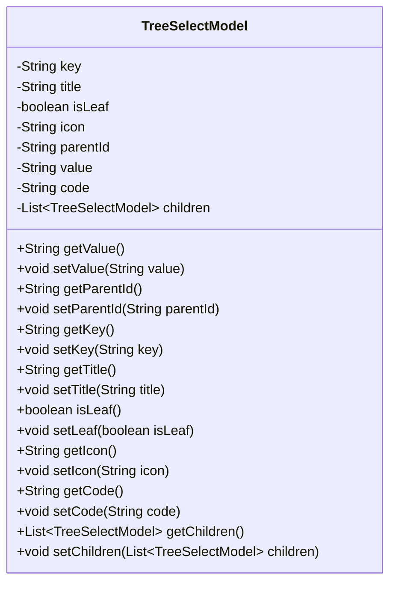

# 基础信息

|      |      |
|------|------|
| 名称 | TreeSelectModel |
| 编码语言 | .java |
| 代码路径 | JeecgBoot/jeecg-boot/jeecg-module-system/jeecg-system-biz/src/main/java/org/jeecg/modules/system/model/TreeSelectModel.java |
| 包名 | org.jeecg.modules.system.model |
| 依赖项 | ['java.io.Serializable', 'java.util.List'] |
| 概述说明 | TreeSelectModel类实现Serializable，含key、title、isLeaf属性及getter、setter方法。 |

# 说明

TreeSelectModel类实现了Serializable接口，具备序列化能力。该类包含三个主要属性：key、title和isLeaf，分别用于存储节点的唯一标识、显示标题以及是否为叶子节点的状态。每个属性都有对应的getter和setter方法，用于获取和设置这些属性的值。通过这些属性和方法，TreeSelectModel类能够有效地管理和操作树形结构中的节点信息。

# 类列表 Class Summary

| 名称   | 类型  | 说明 |
|-------|------|-------------|
| TreeSelectModel | class | TreeSelectModel类实现Serializable，包含key、title、isLeaf等属性及对应getter和setter方法。 |

## 类 TreeSelectModel

|      |      |
|------|------|
| 访问范围 | public |
| 类型 | class |
| 名称 | TreeSelectModel |
| 说明 | TreeSelectModel类实现Serializable，包含key、title、isLeaf等属性及对应getter和setter方法。 |

### UML类图

**描述：**
`TreeSelectModel` 类是一个用于表示树形选择结构的模型类，实现了 `Serializable` 接口以支持序列化。该类包含多个属性，如 `key`、`title`、`isLeaf`、`icon`、`parentId`、`value`、`code` 和 `children`，分别用于存储节点的唯一标识、显示标题、是否为叶子节点、图标、父节点ID、值、代码和子节点列表。类中提供了这些属性的 getter 和 setter 方法，便于外部访问和修改。`children` 属性是一个 `TreeSelectModel` 类型的列表，用于存储当前节点的子节点，从而构建树形结构。

### 内部方法调用关系图

```mermaid
graph TD
    A["类TreeSelectModel"]
    B["属性: String key"]
    C["属性: String title"]
    D["属性: boolean isLeaf"]
    E["属性: String icon"]
    F["属性: String parentId"]
    G["属性: String value"]
    H["属性: String code"]
    I["属性: List<TreeSelectModel> children"]
    J["方法: String getValue()"]
    K["方法: void setValue(String value)"]
    L["方法: String getParentId()"]
    M["方法: void setParentId(String parentId)"]
    N["方法: String getKey()"]
    O["方法: void setKey(String key)"]
    P["方法: String getTitle()"]
    Q["方法: void setTitle(String title)"]
    R["方法: boolean isLeaf()"]
    S["方法: void setLeaf(boolean isLeaf)"]
    T["方法: String getIcon()"]
    U["方法: void setIcon(String icon)"]
    V["方法: String getCode()"]
    W["方法: void setCode(String code)"]
    X["方法: List<TreeSelectModel> getChildren()"]
    Y["方法: void setChildren(List<TreeSelectModel> children)"]

    A --> B
    A --> C
    A --> D
    A --> E
    A --> F
    A --> G
    A --> H
    A --> I
    A --> J
    A --> K
    A --> L
    A --> M
    A --> N
    A --> O
    A --> P
    A --> Q
    A --> R
    A --> S
    A --> T
    A --> U
    A --> V
    A --> W
    A --> X
    A --> Y
```

这段代码定义了一个名为 `TreeSelectModel` 的类，该类实现了 `Serializable` 接口，主要用于表示树形结构中的节点。类中包含多个属性，如 `key`、`title`、`isLeaf`、`icon`、`parentId`、`value`、`code` 和 `children`，分别用于存储节点的唯一标识、显示文本、是否为叶子节点、图标、父节点ID、节点值、编码以及子节点列表。类中还定义了这些属性的 `getter` 和 `setter` 方法，用于获取和设置属性的值。

### 字段列表 Field List

| 名称  | 类型  | 说明 |
|-------|-------|------|
| serialVersionUID = 9016390975325574747L | long | 定义了一个私有静态常量序列化版本UID。 |
| parentId | String | 私有字符串变量parentId。 |
| icon | String | 定义了一个私有字符串变量icon。 |
| value | String | 定义私有字符串变量value。 |
| isLeaf | boolean | 判断是否为叶子节点的布尔变量。 |
| key | String | 定义了一个私有字符串变量key。 |
| code | String | 定义了一个私有的字符串类型变量code。 |
| children | List<TreeSelectModel> | 私有子节点列表，类型为TreeSelectModel。 |
| title | String | 定义了一个私有的字符串类型变量title。 |

### 方法列表 Method List

| 名称  | 类型  | 说明 |
|-------|-------|------|
| getChildren | List<TreeSelectModel> | 获取子节点列表的方法。 |
| setParentId | void | 设置父ID的公共方法。 |
| setChildren | void | 设置子节点列表。 |
| getParentId | String | 获取父ID的Java方法。 |
| setKey | void | 该方法用于设置类中的key属性值。 |
| getTitle | String | 方法返回对象的标题属性。 |
| setIcon | void | 设置图标属性的方法。 |
| getKey | String | 该方法返回字符串类型的变量key。 |
| getIcon | String | 获取图标字符串的方法。 |
| setTitle | void | 设置对象标题的方法。 |
| setLeaf | void | 设置节点是否为叶子节点的方法。 |
| getCode | String | 获取代码值的公共方法。 |
| setCode | void | 该方法用于设置字符串类型的code属性值。 |
| setValue | void | 方法 `setValue` 用于设置字符串 `value` 的值。 |
| getValue | String | 方法getValue返回变量value的值。 |
| isLeaf | boolean | 该方法用于判断当前节点是否为叶子节点。 |

