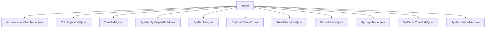

# 基础信息

|      |      |
|------|------|
| 名称 | model |
| 编码语言 | .java |
| 代码路径 | JeecgBoot/jeecg-boot/jeecg-module-system/jeecg-system-biz/src/main/java/org/jeecg/modules/system/model |
| 包名 | JeecgBoot.jeecg-boot.jeecg-module-system.jeecg-system-biz.src.main.java.org.jeecg.modules.system.model |
| 概述说明 | 公告、登录、树结构、部门、权限等模型类，用于管理和操作各类系统数据。 |

# 说明

## 概述
该代码模块主要涉及多个模型类的实现，用于管理和处理系统中的公告、用户、部门、权限、登录、字典树等数据。这些模型类通过序列化、树形结构管理、数据校验等功能，支持数据的存储、传输、查询和管理操作。模块的核心功能包括公告的发布与管理、用户与部门信息的整合、权限树的构建与维护、登录验证、字典树的管理以及重复数据的检测等。

## 主要业务场景
1. **公告管理**：通过`AnnouncementSendModel`类，系统能够发布、管理和查询公告信息，支持公告的优先级、阅读状态、发布时间等字段的管理，确保公告的有效发布和展示。
2. **第三方登录管理**：`ThirdLoginModel`类用于存储和管理第三方登录的相关信息，支持用户通过第三方平台登录系统，并提供了获取登录账号名的功能。
3. **树形结构管理**：`TreeModel`、`TreeSelectModel`、`SysDepartTreeModel`等类用于处理树形结构数据，支持节点的增删改查操作，适用于部门、权限等层级结构的管理。
4. **用户与部门信息管理**：`SysUserSysDepartModel`类整合了用户个人基本信息与部门相关数据，便于系统对用户及其所属部门进行管理和查询。
5. **字典树管理**：`SysDictTree`类用于管理和维护字典树结构，支持字典数据的存储和检索，确保数据的完整性和可追溯性。
6. **重复数据校验**：`DuplicateCheckVo`类用于检测数据中的重复项，确保数据的唯一性和准确性。
7. **登录验证**：`SysLoginModel`类包含账号、密码、验证码等字段，用于验证用户登录信息，确保登录过程的安全性和准确性。
8. **权限管理**：`SysPermissionTree`类用于管理权限树结构，支持菜单和按钮权限的排序、状态管理等功能，确保权限树的灵活性和可操作性。

该模块通过多个模型类的协同工作，支持系统在公告发布、用户管理、权限控制、登录验证等核心业务场景中的数据处理和操作需求。

### 包内部结构视图

该流程图展示了`model`目录下的多个Java文件，这些文件涵盖了不同的系统模块和功能模型，如公告发送模型、第三方登录模型、树形结构模型等。每个文件都直接隶属于`model`目录，体现了这些文件在同一层级下的组织关系。

# 文件列表 File List

| 名称   | 类型  | 说明 |
|-------|------|-------------|
| [SysDepartTreeModel.java](SysDepartTreeModel.md) | file | SysDepartTreeModel类将SysDepart对象转为树形结构，含部门信息、负责人ID，支持序列化和树节点操作。 |
| [DuplicateCheckVo.java](DuplicateCheckVo.md) | file | 重复校验数据模型含表名、字段名、字段值和数据ID。 |
| [TreeModel.java](TreeModel.md) | file | TreeModel类实现序列化，包含树节点属性和操作方法。 |
| [SysPermissionTree.java](SysPermissionTree.md) | file | SysPermissionTree类管理权限树，包含菜单、按钮权限，支持父子关系、排序和状态管理。 |
| [SysLoginModel.java](SysLoginModel.md) | file | 登录需账号、密码、验证码及验证码key。 |
| [DepartIdModel.java](DepartIdModel.md) | file | DepartIdModel类序列化，含ID、部门名及子部门列表，支持数据转换。 |
| [TreeSelectModel.java](TreeSelectModel.md) | file | TreeSelectModel类实现Serializable，含key、title、isLeaf属性及getter、setter方法。 |
| [SysDictTree.java](SysDictTree.md) | file | SysDictTree类实现序列化，包含字典键、标题、ID、类型、名称、编码、描述、删除状态及创建更新信息。 |
| [SysUserSysDepartModel.java](SysUserSysDepartModel.md) | file | SysUserSysDepartModel类存储用户和部门信息，包括ID、姓名、工号、职位、电话、邮箱、部门ID及名称。 |
| [ThirdLoginModel.java](ThirdLoginModel.md) | file | 第三方登录模型类，含来源、UUID等字段，提供构造器和获取账号名方法。 |
| [AnnouncementSendModel.java](AnnouncementSendModel.md) | file | 公告发送模型涵盖ID、通告、用户、标题、内容、发布人、优先级、状态、时间、页数、大小、类型、业务、查询、摘要、日期等关键信息。 |

