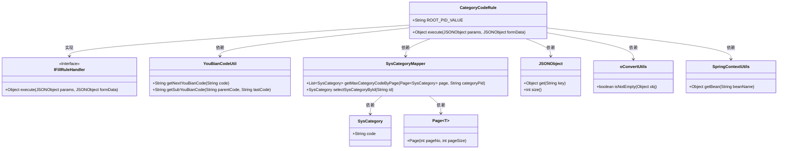
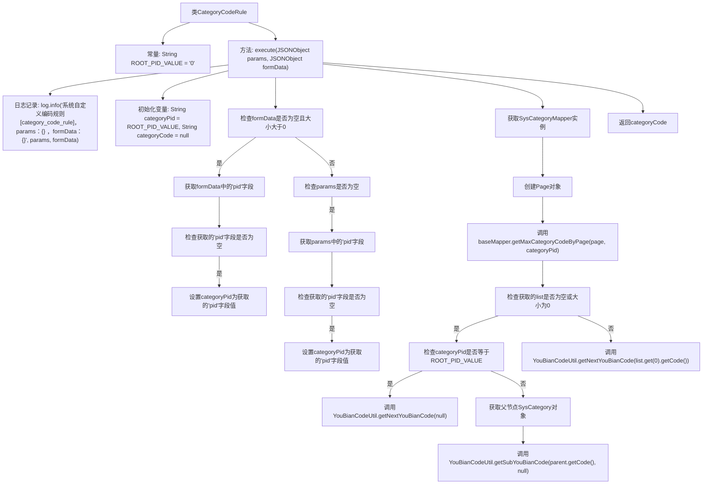

# 基础信息

|      |      |
|------|------|
| 名称 | CategoryCodeRule |
| 编码语言 | .java |
| 代码路径 | JeecgBoot/jeecg-boot/jeecg-module-system/jeecg-system-biz/src/main/java/org/jeecg/modules/system/rule/CategoryCodeRule.java |
| 包名 | org.jeecg.modules.system.rule |
| 依赖项 | ['com.alibaba.fastjson.JSONObject', 'com.baomidou.mybatisplus.core.conditions.query.LambdaQueryWrapper', 'com.baomidou.mybatisplus.extension.plugins.pagination.Page', 'lombok.extern.slf4j.Slf4j', 'org.jeecg.common.handler.IFillRuleHandler', 'org.jeecg.common.util.SpringContextUtils', 'org.jeecg.common.util.YouBianCodeUtil', 'org.jeecg.common.util.oConvertUtils', 'org.jeecg.modules.system.entity.SysCategory', 'org.jeecg.modules.system.mapper.SysCategoryMapper', 'java.util.List'] |
| 概述说明 | 根据父节点自动生成子节点编码，实现分类编码规则。 |

# 说明

该功能旨在实现一种分类编码规则，通过父节点的编码自动生成其子节点的编码。具体而言，系统会根据父节点的编码结构和规则，动态生成子节点的编码，确保编码的层次性和一致性。这种机制有助于在分类体系中保持编码的逻辑性和可追溯性，适用于需要层级化编码管理的场景，如组织结构、产品分类等。通过自动化生成子节点编码，减少了手动操作的错误风险，并提高了编码管理的效率。

# 类列表 Class Summary

| 名称   | 类型  | 说明 |
|-------|------|-------------|
| CategoryCodeRule | class | 实现分类编码规则，根据父节点生成子节点编码。 |

## 类 CategoryCodeRule

|      |      |
|------|------|
| 访问范围 | @Slf4j;public |
| 类型 | class |
| 名称 | CategoryCodeRule |
| 说明 | 实现分类编码规则，根据父节点生成子节点编码。 |

### UML类图

**描述：**  
`CategoryCodeRule`类实现了`IFillRuleHandler`接口，用于处理分类编码规则。它依赖于`YouBianCodeUtil`生成编码，通过`SysCategoryMapper`从数据库中获取分类信息，并使用`JSONObject`和`oConvertUtils`处理传入的参数。`SpringContextUtils`用于获取`SysCategoryMapper`的实例。类图展示了这些类之间的依赖关系和实现关系，清晰地描述了代码的结构和功能。

### 内部方法调用关系图

这段代码实现了一个自定义编码规则处理器，主要用于生成分类字典的编码。代码首先检查传入的`formData`和`params`对象，获取`pid`字段值，然后根据不同的情况调用`YouBianCodeUtil`类中的方法来生成编码。最后返回生成的编码。代码中包含了日志记录、条件判断、数据库查询等操作，确保在不同情况下都能正确生成编码。

### 字段列表 Field List

| 名称  | 类型  | 说明 |
|-------|-------|------|
| ROOT_PID_VALUE = "0" | String | 定义静态常量ROOT_PID_VALUE，值为"0"。 |

### 方法列表 Method List

| 名称  | 类型  | 说明 |
|-------|-------|------|
| execute | Object | 方法根据参数生成分类编码，处理无数据、无兄弟节点和有兄弟节点三种情况。 |

