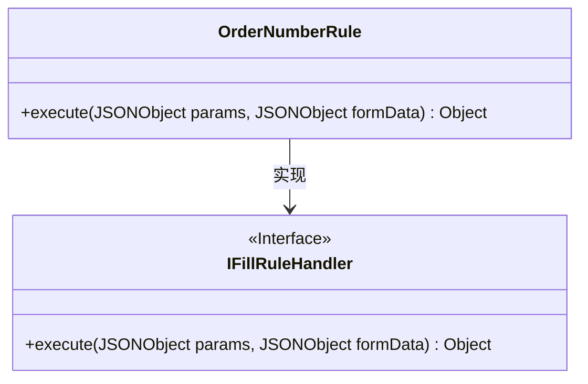
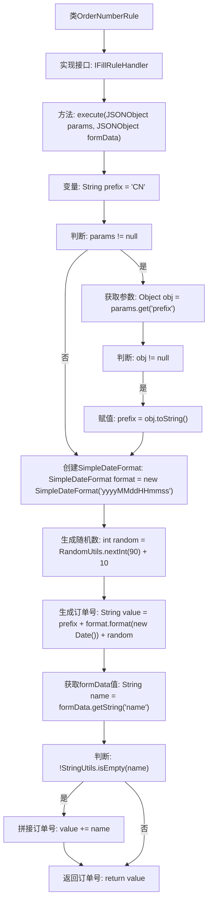

# 基础信息

|      |      |
|------|------|
| 名称 | OrderNumberRule |
| 编码语言 | .java |
| 代码路径 | JeecgBoot/jeecg-boot/jeecg-module-system/jeecg-system-biz/src/main/java/org/jeecg/modules/system/rule/OrderNumberRule.java |
| 包名 | org.jeecg.modules.system.rule |
| 依赖项 | ['com.alibaba.fastjson.JSONObject', 'org.apache.commons.lang.StringUtils', 'org.apache.commons.lang.math.RandomUtils', 'org.jeecg.common.handler.IFillRuleHandler', 'java.text.SimpleDateFormat', 'java.util.Date'] |
| 概述说明 | OrderNumberRule类生成订单号，默认前缀CN，可自定义，含日期、随机数及名称后缀。 |

# 说明

OrderNumberRule类用于生成订单号，其默认前缀为CN，但允许用户自定义前缀。生成的订单号包含三个主要部分：当前日期、随机数以及名称后缀。日期部分确保订单号具有时间标识，随机数增加唯一性，名称后缀则用于进一步区分或标识特定订单。这种设计使得生成的订单号既具有唯一性，又便于识别和管理。

# 类列表 Class Summary

| 名称   | 类型  | 说明 |
|-------|------|-------------|
| OrderNumberRule | class | OrderNumberRule类生成订单号，前缀默认为CN，可自定义，包含日期、随机数和名称后缀。 |

## 类 OrderNumberRule

|      |      |
|------|------|
| 访问范围 | public |
| 类型 | class |
| 名称 | OrderNumberRule |
| 说明 | OrderNumberRule类生成订单号，前缀默认为CN，可自定义，包含日期、随机数和名称后缀。 |

### UML类图

类图描述：
`OrderNumberRule` 类实现了 `IFillRuleHandler` 接口，并重写了 `execute` 方法。该方法根据传入的 `params` 和 `formData` 参数生成订单号。首先从 `params` 中获取前缀，默认为 "CN"，然后结合当前日期和随机数生成订单号。如果 `formData` 中包含 `name` 字段，则将其附加到订单号末尾。最终返回生成的订单号。

### 内部方法调用关系图

这段代码定义了一个`OrderNumberRule`类，实现了`IFillRuleHandler`接口，用于生成订单号。代码首先检查传入的`params`参数是否包含自定义前缀，若存在则使用自定义前缀，否则使用默认前缀"CN"。然后，代码生成当前日期时间格式和随机数，拼接成订单号。如果`formData`中包含"name"字段且不为空，则将其拼接到订单号末尾。最终返回生成的订单号。

### 字段列表 Field List

| 名称  | 类型  | 说明 |
|-------|-------|------|

### 方法列表 Method List

| 名称  | 类型  | 说明 |
|-------|-------|------|
| execute | Object | 方法生成订单号，默认前缀CN，可自定义前缀，含日期时间及随机数，可附加名称。 |

