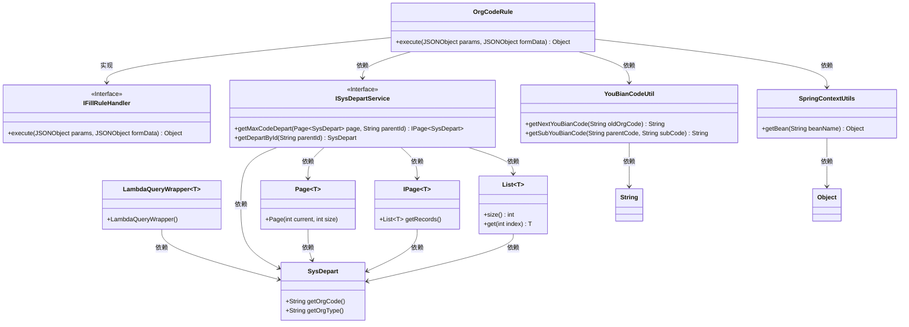

# 基础信息

|      |      |
|------|------|
| 名称 | OrgCodeRule |
| 编码语言 | .java |
| 代码路径 | JeecgBoot/jeecg-boot/jeecg-module-system/jeecg-system-biz/src/main/java/org/jeecg/modules/system/rule/OrgCodeRule.java |
| 包名 | org.jeecg.modules.system.rule |
| 依赖项 | ['com.alibaba.fastjson.JSONObject', 'com.baomidou.mybatisplus.core.conditions.query.LambdaQueryWrapper', 'com.baomidou.mybatisplus.core.metadata.IPage', 'com.baomidou.mybatisplus.extension.plugins.pagination.Page', 'io.netty.util.internal.StringUtil', 'org.jeecg.common.handler.IFillRuleHandler', 'org.jeecg.common.util.SpringContextUtils', 'org.jeecg.common.util.YouBianCodeUtil', 'org.jeecg.modules.system.entity.SysDepart', 'org.jeecg.modules.system.service.ISysDepartService', 'java.util.ArrayList', 'java.util.List'] |
| 概述说明 | OrgCodeRule类实现IFillRuleHandler接口，用于生成部门编码和类型。 |

# 说明

OrgCodeRule类实现了IFillRuleHandler接口，负责生成部门编码和类型。该类的主要功能是通过实现接口中的方法，确保能够按照特定规则生成符合要求的部门编码和类型信息。这一实现确保了编码生成的规范性和一致性，适用于需要自动生成部门编码的场景。

# 类列表 Class Summary

| 名称   | 类型  | 说明 |
|-------|------|-------------|
| OrgCodeRule | class | OrgCodeRule类实现IFillRuleHandler，生成部门编码和类型。 |

## 类 OrgCodeRule

|      |      |
|------|------|
| 访问范围 | public |
| 类型 | class |
| 名称 | OrgCodeRule |
| 说明 | OrgCodeRule类实现IFillRuleHandler，生成部门编码和类型。 |

### UML类图

这段代码定义了一个 `OrgCodeRule` 类，实现了 `IFillRuleHandler` 接口，用于生成部门编码。`OrgCodeRule` 类通过 `ISysDepartService` 接口与 `SysDepart` 类交互，获取部门信息，并使用 `YouBianCodeUtil` 工具类生成新的部门编码。`SpringContextUtils` 类用于从 Spring 上下文中获取 `ISysDepartService` 的实例。代码中使用了 `LambdaQueryWrapper`、`Page`、`IPage` 和 `List` 等泛型类来处理查询和分页逻辑。整体流程包括获取父级部门信息、生成新编码，并返回包含新编码和部门类型的数组。

### 内部方法调用关系图

**描述：**  
该流程图描述了`OrgCodeRule`类中`execute`方法的执行流程。方法首先初始化变量并检查`formData`和`params`中是否包含`parentId`。根据`parentId`是否为空，分别查询最大编码的部门信息或父级部门信息。根据查询结果生成新的部门编码，并返回包含编码和部门类型的数组。流程图中详细展示了各个判断和生成编码的步骤，确保逻辑清晰且易于理解。

### 字段列表 Field List

| 名称  | 类型  | 说明 |
|-------|-------|------|

### 方法列表 Method List

| 名称  | 类型  | 说明 |
|-------|-------|------|
| execute | Object | 根据父部门ID生成新部门编码，返回编码和部门类型。 |

