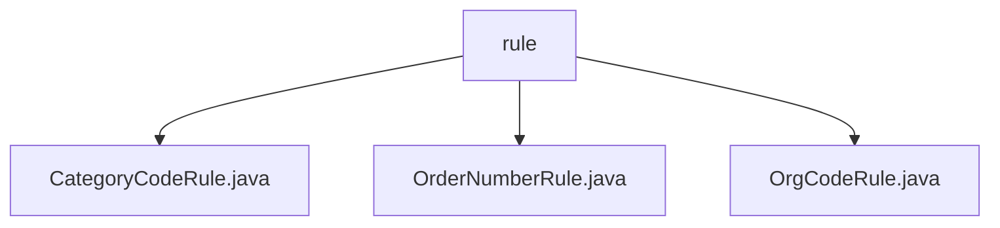

# 基础信息

|      |      |
|------|------|
| 名称 | rule |
| 编码语言 | .java |
| 代码路径 | JeecgBoot/jeecg-boot/jeecg-module-system/jeecg-system-biz/src/main/java/org/jeecg/modules/system/rule |
| 包名 | JeecgBoot.jeecg-boot.jeecg-module-system.jeecg-system-biz.src.main.java.org.jeecg.modules.system.rule |
| 概述说明 | 分类编码规则自动生成子节点编码，订单号规则生成唯一订单号，部门编码规则确保编码规范性。 |

# 说明

## 概述  
该代码模块主要实现了多种编码生成规则，旨在通过自动化机制生成具有层次性、唯一性和可追溯性的编码。模块中的各个类分别负责不同的编码生成任务，包括分类编码、订单号生成以及部门编码生成。这些规则的设计确保了编码的逻辑性、唯一性和规范性，适用于需要层级化编码管理、订单管理以及部门管理的业务场景。

## 主要业务场景  
1. **分类编码管理**：通过`CategoryCodeRule`类实现，系统能够根据父节点的编码结构和规则，自动生成子节点的编码。这种机制适用于需要层级化编码管理的场景，如组织结构、产品分类等，确保编码的层次性和一致性，减少手动操作的错误风险。
2. **订单号生成**：通过`OrderNumberRule`类实现，生成的订单号包含日期、随机数和名称后缀，确保订单号的唯一性和可识别性。该功能适用于订单管理系统，便于订单的识别、跟踪和管理。
3. **部门编码生成**：通过`OrgCodeRule`类实现，系统能够按照特定规则自动生成部门编码和类型信息。该功能适用于需要自动生成部门编码的场景，确保部门编码的规范性和一致性。

### 包内部结构视图

该流程图展示了JeecgBoot项目中`rule`目录下的三个Java文件：`CategoryCodeRule.java`、`OrderNumberRule.java`和`OrgCodeRule.java`。这些文件均位于`rule`目录下，表明它们属于同一层级，且都是该目录中的具体实现文件。

# 文件列表 File List

| 名称   | 类型  | 说明 |
|-------|------|-------------|
| [OrgCodeRule.java](OrgCodeRule.md) | file | OrgCodeRule类实现IFillRuleHandler接口，用于生成部门编码和类型。 |
| [OrderNumberRule.java](OrderNumberRule.md) | file | OrderNumberRule类生成订单号，默认前缀CN，可自定义，含日期、随机数及名称后缀。 |
| [CategoryCodeRule.java](CategoryCodeRule.md) | file | 根据父节点自动生成子节点编码，实现分类编码规则。 |

