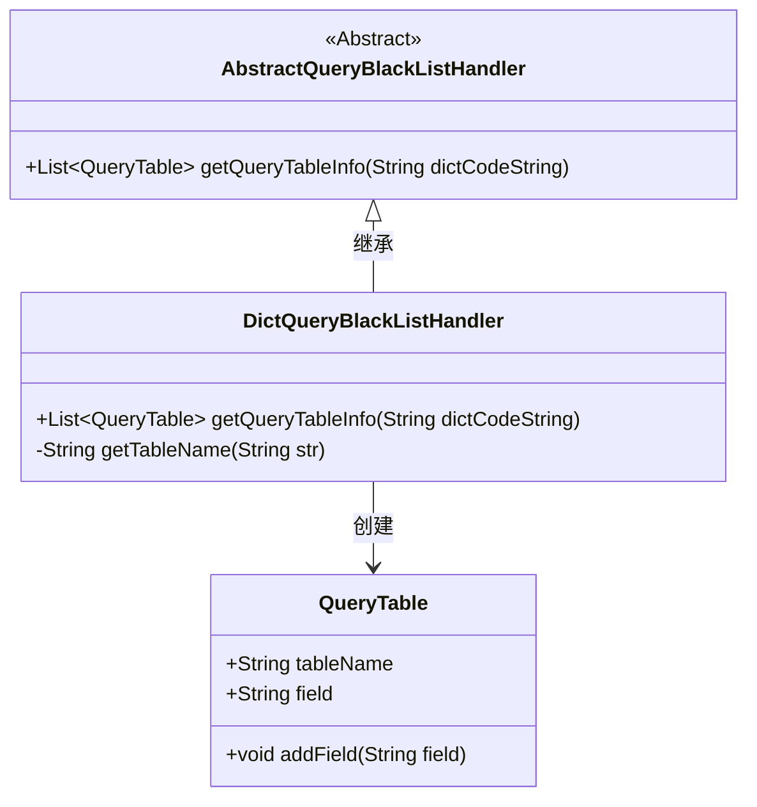
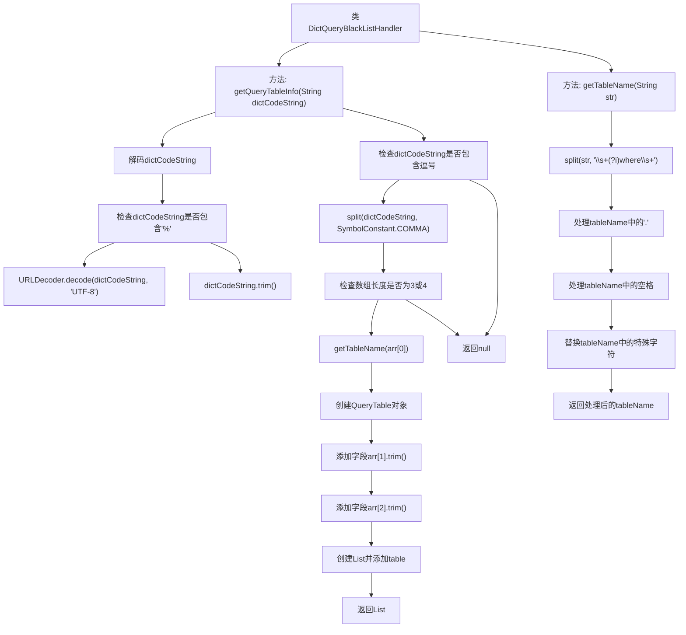

# 基础信息

|      |      |
|------|------|
| 名称 | DictQueryBlackListHandler |
| 编码语言 | .java |
| 代码路径 | JeecgBoot/jeecg-boot/jeecg-module-system/jeecg-system-biz/src/main/java/org/jeecg/modules/system/security/DictQueryBlackListHandler.java |
| 包名 | org.jeecg.modules.system.security |
| 依赖项 | ['org.jeecg.common.constant.SymbolConstant', 'org.jeecg.common.util.oConvertUtils', 'org.jeecg.common.util.security.AbstractQueryBlackListHandler', 'org.springframework.stereotype.Component', 'java.net.URLDecoder', 'java.util.ArrayList', 'java.util.List'] |
| 概述说明 | DictQueryBlackListHandler类解码处理字典查询黑名单，提取表名和字段信息。 |

# 说明

DictQueryBlackListHandler类的主要功能是解码并处理字典查询黑名单，具体操作包括提取表名和字段信息。该类通过解析黑名单数据，确保能够准确识别和处理与表名及字段相关的查询限制，从而有效管理字典查询操作。

# 类列表 Class Summary

| 名称   | 类型  | 说明 |
|-------|------|-------------|
| DictQueryBlackListHandler | class | DictQueryBlackListHandler类解码并处理字典查询黑名单，提取表名和字段信息。 |

## 类 DictQueryBlackListHandler

|      |      |
|------|------|
| 访问范围 | @Component("dictQueryBlackListHandler");public |
| 类型 | class |
| 名称 | DictQueryBlackListHandler |
| 说明 | DictQueryBlackListHandler类解码并处理字典查询黑名单，提取表名和字段信息。 |

### UML类图

**描述：**  
`DictQueryBlackListHandler` 类继承自 `AbstractQueryBlackListHandler`，并实现了 `getQueryTableInfo` 方法，用于根据字典代码字符串获取查询表信息。该方法首先对字符串进行解码和清理，然后根据逗号分隔符提取表名和字段信息，最终生成 `QueryTable` 对象并返回。`getTableName` 方法用于从字符串中提取表名，并处理特殊字符和空格。`QueryTable` 类用于存储表名和字段信息，并提供添加字段的方法。

### 内部方法调用关系图

这段代码展示了`DictQueryBlackListHandler`类的两个主要方法：`getQueryTableInfo`和`getTableName`。`getQueryTableInfo`方法首先对输入的`dictCodeString`进行解码和清理，然后根据逗号分隔符将其拆分为数组，并检查数组长度是否符合要求。如果符合，则创建`QueryTable`对象并添加字段，最后返回包含该对象的列表。`getTableName`方法则用于从输入字符串中提取表名，并处理其中的特殊字符和空格，最终返回处理后的表名。

### 字段列表 Field List

| 名称  | 类型  | 说明 |
|-------|-------|------|

### 方法列表 Method List

| 名称  | 类型  | 说明 |
|-------|-------|------|
| getTableName | String | 提取SQL表名，处理含特殊字符和空格的情况。 |
| getQueryTableInfo | List<QueryTable> | 方法解码字符串并提取表名和字段，返回查询表列表。 |

