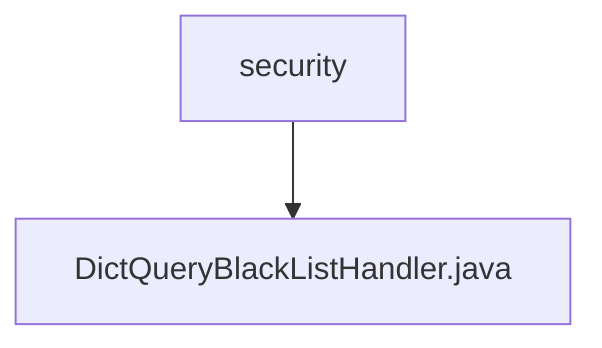

# 基础信息

|      |      |
|------|------|
| 名称 | security |
| 编码语言 | .java |
| 代码路径 | JeecgBoot/jeecg-boot/jeecg-module-system/jeecg-system-biz/src/main/java/org/jeecg/modules/system/security |
| 包名 | JeecgBoot.jeecg-boot.jeecg-module-system.jeecg-system-biz.src.main.java.org.jeecg.modules.system.security |
| 概述说明 | DictQueryBlackListHandler类解码处理字典查询黑名单，提取表名和字段信息。 |

# 说明

DictQueryBlackListHandler类的主要功能是解码并处理字典查询黑名单，具体操作包括提取表名和字段信息。该类通过解析黑名单数据，确保能够准确识别和处理与表名及字段相关的查询限制，从而有效管理字典查询操作。

### 包内部结构视图

这段流程图展示了一个简单的层级关系，`security` 文件夹包含一个文件 `DictQueryBlackListHandler.java`。该图清晰地表示了路径的从属关系，帮助开发者快速理解项目结构。

# 文件列表 File List

| 名称   | 类型  | 说明 |
|-------|------|-------------|
| [DictQueryBlackListHandler.java](DictQueryBlackListHandler.md) | file | DictQueryBlackListHandler类解码处理字典查询黑名单，提取表名和字段信息。 |

