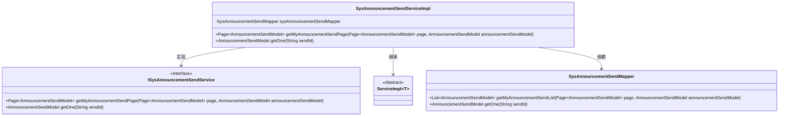
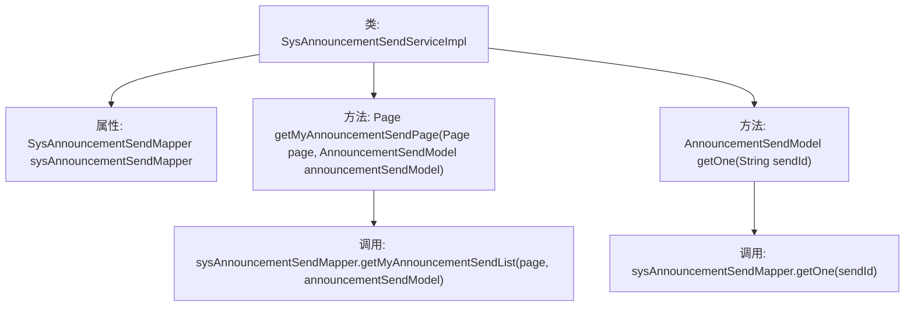

# 基础信息

|      |      |
|------|------|
| 名称 | SysAnnouncementSendServiceImpl |
| 编码语言 | .java |
| 代码路径 | JeecgBoot/jeecg-boot/jeecg-module-system/jeecg-system-biz/src/main/java/org/jeecg/modules/system/service/impl/SysAnnouncementSendServiceImpl.java |
| 包名 | org.jeecg.modules.system.service.impl |
| 依赖项 | ['java.util.List', 'javax.annotation.Resource', 'org.jeecg.modules.system.entity.SysAnnouncementSend', 'org.jeecg.modules.system.mapper.SysAnnouncementSendMapper', 'org.jeecg.modules.system.model.AnnouncementSendModel', 'org.jeecg.modules.system.service.ISysAnnouncementSendService', 'org.springframework.stereotype.Service', 'com.baomidou.mybatisplus.extension.plugins.pagination.Page', 'com.baomidou.mybatisplus.extension.service.impl.ServiceImpl'] |
| 概述说明 | SysAnnouncementSendServiceImpl类实现分页查询和单条记录获取。 |

# 说明

SysAnnouncementSendServiceImpl类主要负责实现分页查询和单条记录获取功能。该类的核心功能包括通过分页查询方式获取多条记录，以及通过特定条件获取单条记录。这些功能使得系统能够高效地管理和展示公告信息，满足不同场景下的数据查询需求。通过实现这些功能，SysAnnouncementSendServiceImpl类增强了系统的灵活性和用户体验。

# 类列表 Class Summary

| 名称   | 类型  | 说明 |
|-------|------|-------------|
| SysAnnouncementSendServiceImpl | class | SysAnnouncementSendServiceImpl类实现分页查询和单条记录获取功能。 |

## 类 SysAnnouncementSendServiceImpl

|      |      |
|------|------|
| 访问范围 | @Service;public |
| 类型 | class |
| 名称 | SysAnnouncementSendServiceImpl |
| 说明 | SysAnnouncementSendServiceImpl类实现分页查询和单条记录获取功能。 |

### UML类图

**描述**：  
`SysAnnouncementSendServiceImpl` 是一个服务实现类，继承自 `ServiceImpl` 并实现了 `ISysAnnouncementSendService` 接口。该类依赖于 `SysAnnouncementSendMapper` 来执行数据库操作。它提供了两个主要方法：`getMyAnnouncementSendPage` 用于分页获取公告发送列表，`getOne` 用于根据 `sendId` 获取单个公告发送记录。`SysAnnouncementSendMapper` 是数据访问层接口，负责与数据库交互。

### 内部方法调用关系图

**描述：**  
`SysAnnouncementSendServiceImpl` 类是一个服务实现类，依赖于 `SysAnnouncementSendMapper` 进行数据库操作。它提供了两个主要方法：`getMyAnnouncementSendPage` 用于分页获取公告发送列表，`getOne` 用于根据 `sendId` 获取单个公告发送记录。这两个方法分别调用了 `sysAnnouncementSendMapper` 的 `getMyAnnouncementSendList` 和 `getOne` 方法来实现具体的数据查询功能。

### 字段列表 Field List

| 名称  | 类型  | 说明 |
|-------|-------|------|
| sysAnnouncementSendMapper | SysAnnouncementSendMapper | 私有变量sysAnnouncementSendMapper注入SysAnnouncementSendMapper类。 |

### 方法列表 Method List

| 名称  | 类型  | 说明 |
|-------|-------|------|
| getMyAnnouncementSendPage | Page<AnnouncementSendModel> | 方法重写，返回分页公告发送记录。 |
| getOne | AnnouncementSendModel | 重写方法getOne，通过sendId查询并返回AnnouncementSendModel对象。 |

