# 基础信息

|      |      |
|------|------|
| 名称 | SysAnnouncementServiceImpl |
| 编码语言 | .java |
| 代码路径 | JeecgBoot/jeecg-boot/jeecg-module-system/jeecg-system-biz/src/main/java/org/jeecg/modules/system/service/impl/SysAnnouncementServiceImpl.java |
| 包名 | org.jeecg.modules.system.service.impl |
| 依赖项 | ['com.baomidou.mybatisplus.core.conditions.query.LambdaQueryWrapper', 'com.baomidou.mybatisplus.extension.plugins.pagination.Page', 'com.baomidou.mybatisplus.extension.service.impl.ServiceImpl', 'lombok.extern.slf4j.Slf4j', 'org.apache.commons.lang3.StringUtils', 'org.apache.shiro.SecurityUtils', 'org.jeecg.common.constant.CommonConstant', 'org.jeecg.common.system.vo.LoginUser', 'org.jeecg.common.util.DateRangeUtils', 'org.jeecg.common.util.oConvertUtils', 'org.jeecg.config.mybatis.MybatisPlusSaasConfig', 'org.jeecg.modules.system.entity.SysAnnouncement', 'org.jeecg.modules.system.entity.SysAnnouncementSend', 'org.jeecg.modules.system.mapper.SysAnnouncementMapper', 'org.jeecg.modules.system.mapper.SysAnnouncementSendMapper', 'org.jeecg.modules.system.mapper.SysUserMapper', 'org.jeecg.modules.system.service.ISysAnnouncementSendService', 'org.jeecg.modules.system.service.ISysAnnouncementService', 'org.springframework.beans.factory.annotation.Autowired', 'org.springframework.stereotype.Service', 'org.springframework.transaction.annotation.Transactional', 'org.springframework.util.CollectionUtils', 'javax.annotation.Resource', 'java.util', 'java.util.concurrent.ExecutorService', 'java.util.concurrent.SynchronousQueue', 'java.util.concurrent.ThreadPoolExecutor', 'java.util.concurrent.TimeUnit'] |
| 概述说明 | 系统公告服务类实现保存、编辑、查询及用户阅读状态管理功能。 |

# 说明

系统公告服务实现类是一个功能全面的模块，主要用于处理公告的保存、编辑和查询操作，同时还包括用户阅读状态的管理功能。该类通过集成多个关键功能，确保公告信息的有效管理和用户交互的跟踪，从而提升系统的公告管理效率和用户体验。

# 类列表 Class Summary

| 名称   | 类型  | 说明 |
|-------|------|-------------|
| SysAnnouncementServiceImpl | class | 系统公告服务实现类，包含保存、编辑、查询公告及用户阅读状态管理功能。 |

## 类 SysAnnouncementServiceImpl

|      |      |
|------|------|
| 访问范围 | @Service;@Slf4j;public |
| 类型 | class |
| 名称 | SysAnnouncementServiceImpl |
| 说明 | 系统公告服务实现类，包含保存、编辑、查询公告及用户阅读状态管理功能。 |

### UML类图

```mermaid
classDiagram
    class SysAnnouncementServiceImpl {
        <<Service>>
        +ExecutorService completeNoteThreadPool
        -SysAnnouncementMapper sysAnnouncementMapper
        -SysUserMapper sysUserMapper
        -SysAnnouncementSendMapper sysAnnouncementSendMapper
        -ISysAnnouncementSendService sysAnnouncementSendService
        +void saveAnnouncement(SysAnnouncement sysAnnouncement)
        +boolean upDateAnnouncement(SysAnnouncement sysAnnouncement)
        +void saveSysAnnouncement(String title, String msgContent)
        +Page~SysAnnouncement~ querySysCementPageByUserId(Page~SysAnnouncement~ page, String userId, String msgCategory, Integer tenantId, Date beginDate)
        +Integer getUnreadMessageCountByUserId(String userId, Date beginDate)
        +void completeAnnouncementSendInfo()
        +void batchInsertSysAnnouncementSend(String commentId, Integer tenantId)
        +List~SysAnnouncement~ querySysMessageList(int pageSize, int pageNo, String fromUser, String starFlag, Date beginDate, Date endDate)
        +void updateReaded(List~String~ annoceIdList)
        +void clearAllUnReadMessage()
        +List~String~ getNotSendedAnnouncementlist(String userId)
    }

    class SysAnnouncementMapper {
        <<Mapper>>
        +void insert(SysAnnouncement sysAnnouncement)
        +void updateById(SysAnnouncement sysAnnouncement)
        +List~SysAnnouncement~ querySysCementListByUserId(Page~SysAnnouncement~ page, String userId, String msgCategory, Integer tenantId, Date beginDate)
        +Integer getUnreadMessageCountByUserId(String userId, Date beginDate)
        +List~String~ getNotSendedAnnouncementlist(Date date, String userId)
    }

    class SysUserMapper {
        <<Mapper>>
        +List~String~ getTenantUserIdList(Integer tenantId)
    }

    class SysAnnouncementSendMapper {
        <<Mapper>>
        +void insert(SysAnnouncementSend sysAnnouncementSend)
        +List~SysAnnouncementSend~ selectList(LambdaQueryWrapper~SysAnnouncementSend~ queryWrapper)
        +void delete(LambdaQueryWrapper~SysAnnouncementSend~ queryWrapper)
        +void updateReaded(String userId, List~String~ annoceIdList)
        +void clearAllUnReadMessage(String userId)
    }

    class ISysAnnouncementSendService {
        <<Interface>>
        +void saveBatch(List~SysAnnouncementSend~ sysAnnouncementSendList)
    }

    class SysAnnouncement {
        -String id
        -String titile
        -String msgContent
        -String sender
        -String priority
        -String msgType
        -String sendStatus
        -Date sendTime
        -String delFlag
        -String userIds
    }

    class SysAnnouncementSend {
        -String anntId
        -String userId
        -String readFlag
        -Date readTime
    }

    class LambdaQueryWrapper~T~ {
        +LambdaQueryWrapper~T~ eq(Function~T, Object~ function, Object value)
        +LambdaQueryWrapper~T~ notIn(Function~T, Object~ function, Collection~Object~ collection)
    }

    class Page~T~ {
        -int size
        -int pageNo
        +List~T~ setRecords(List~T~ records)
    }

    SysAnnouncementServiceImpl --> SysAnnouncementMapper : 依赖
    SysAnnouncementServiceImpl --> SysUserMapper : 依赖
    SysAnnouncementServiceImpl --> SysAnnouncementSendMapper : 依赖
    SysAnnouncementServiceImpl --> ISysAnnouncementSendService : 依赖
    SysAnnouncementServiceImpl --> SysAnnouncement : 依赖
    SysAnnouncementServiceImpl --> SysAnnouncementSend : 依赖
    SysAnnouncementServiceImpl --> LambdaQueryWrapper~SysAnnouncementSend~ : 依赖
    SysAnnouncementServiceImpl --> Page~SysAnnouncement~ : 依赖
```

该代码实现了一个系统公告服务类 `SysAnnouncementServiceImpl`，主要负责公告的保存、更新、查询以及用户未读消息的处理。类图中展示了该类与多个Mapper和服务接口的依赖关系，以及公告和公告发送记录的数据结构。通过事务管理确保数据一致性，并通过线程池处理后台任务。

### 内部方法调用关系图

该流程图展示了 `SysAnnouncementServiceImpl` 类的结构和内部方法调用关系。该类是一个服务实现类，主要用于处理系统公告的相关操作，包括保存、更新、查询公告信息等。每个方法都有明确的功能，如 `saveAnnouncement` 用于保存公告，`upDateAnnouncement` 用于更新公告，`querySysCementPageByUserId` 用于根据用户ID查询公告列表等。通过这些方法，系统能够有效地管理和处理公告信息，确保公告的及时发布和更新。

### 字段列表 Field List

| 名称  | 类型  | 说明 |
|-------|-------|------|
| sysAnnouncementSendService | ISysAnnouncementSendService | 自动注入公告发送服务实例。 |
| completeNoteThreadPool = new ThreadPoolExecutor(0, 1024, 60L, TimeUnit.SECONDS, new SynchronousQueue<Runnable>()) | ExecutorService | 创建线程池，最大1024线程，60秒空闲超时，使用同步队列。 |
| sysAnnouncementMapper | SysAnnouncementMapper | 私有变量sysAnnouncementMapper引用SysAnnouncementMapper类。 |
| sysAnnouncementSendMapper | SysAnnouncementSendMapper | 私有属性sysAnnouncementSendMapper为SysAnnouncementSendMapper类型。 |
| sysUserMapper | SysUserMapper | 私有属性sysUserMapper，类型为SysUserMapper。 |

### 方法列表 Method List

| 名称  | 类型  | 说明 |
|-------|-------|------|
| clearAllUnReadMessage | void | 清除当前用户所有未读消息。 |
| completeAnnouncementSendInfo | void | 获取未发送公告，生成发送列表并批量保存。 |
| batchInsertSysAnnouncementSend | void | 根据租户ID补全公告与用户关系数据，并批量插入数据库。 |
| saveAnnouncement | void | 保存公告信息，根据类型插入公告表及用户阅读标记表。 |
| querySysCementPageByUserId | Page<SysAnnouncement> | 根据用户ID查询系统公告分页，支持消息分类、租户ID和开始日期筛选。 |
| getNotSendedAnnouncementlist | List<String> | 该方法获取用户未发送的公告列表。 |
| getUnreadMessageCountByUserId | Integer | 根据用户ID和起始日期查询未读消息数量。 |
| querySysMessageList | List<SysAnnouncement> | 方法查询系统消息列表，包含分页、用户、标记和日期参数。 |
| upDateAnnouncement | boolean | 更新公告信息并管理用户通知数据。 |
| saveSysAnnouncement | void | 保存系统公告，设置标题、内容、发送者、优先级、类型、状态、时间和删除标志。 |
| updateReaded | void | 更新用户已读公告列表。 |

