# 基础信息

|      |      |
|------|------|
| 名称 | SysBaseApiImpl |
| 编码语言 | .java |
| 代码路径 | JeecgBoot/jeecg-boot/jeecg-module-system/jeecg-system-biz/src/main/java/org/jeecg/modules/system/service/impl/SysBaseApiImpl.java |
| 包名 | org.jeecg.modules.system.service.impl |
| 依赖项 | ['com.alibaba.fastjson.JSON', 'com.alibaba.fastjson.JSONArray', 'com.alibaba.fastjson.JSONObject', 'com.baomidou.mybatisplus.core.conditions.query.LambdaQueryWrapper', 'com.baomidou.mybatisplus.core.conditions.query.QueryWrapper', 'com.baomidou.mybatisplus.core.conditions.update.LambdaUpdateWrapper', 'com.baomidou.mybatisplus.core.conditions.update.UpdateWrapper', 'com.baomidou.mybatisplus.core.metadata.IPage', 'com.baomidou.mybatisplus.extension.plugins.pagination.Page', 'com.google.common.base.Joiner', 'freemarker.core.TemplateClassResolver', 'freemarker.template.Configuration', 'freemarker.template.Template', 'freemarker.template.TemplateException', 'lombok.extern.slf4j.Slf4j', 'org.apache.commons.lang.StringUtils', 'org.apache.commons.lang3.ObjectUtils', 'org.apache.shiro.SecurityUtils', 'org.jeecg.common.api.dto.DataLogDTO', 'org.jeecg.common.api.dto.OnlineAuthDTO', 'org.jeecg.common.api.dto.message', 'org.jeecg.common.aspect.UrlMatchEnum', 'org.jeecg.common.constant', 'org.jeecg.common.constant.enums.EmailTemplateEnum', 'org.jeecg.common.constant.enums.MessageTypeEnum', 'org.jeecg.common.constant.enums.SysAnnmentTypeEnum', 'org.jeecg.common.desensitization.util.SensitiveInfoUtil', 'org.jeecg.common.exception.JeecgBootException', 'org.jeecg.common.system.api.ISysBaseAPI', 'org.jeecg.common.system.query.QueryCondition', 'org.jeecg.common.system.query.QueryGenerator', 'org.jeecg.common.system.query.QueryRuleEnum', 'org.jeecg.common.system.vo', 'org.jeecg.common.util.HTMLUtils', 'org.jeecg.common.util.YouBianCodeUtil', 'org.jeecg.common.util.dynamic.db.FreemarkerParseFactory', 'org.jeecg.common.util.oConvertUtils', 'org.jeecg.config.firewall.SqlInjection.IDictTableWhiteListHandler', 'org.jeecg.config.mybatis.MybatisPlusSaasConfig', 'org.jeecg.modules.message.entity.SysMessageTemplate', 'org.jeecg.modules.message.handle.impl.DdSendMsgHandle', 'org.jeecg.modules.message.handle.impl.EmailSendMsgHandle', 'org.jeecg.modules.message.handle.impl.QywxSendMsgHandle', 'org.jeecg.modules.message.handle.impl.SystemSendMsgHandle', 'org.jeecg.modules.message.service.ISysMessageTemplateService', 'org.jeecg.modules.message.websocket.WebSocket', 'org.jeecg.modules.system.entity', 'org.jeecg.modules.system.mapper', 'org.jeecg.modules.system.service', 'org.jeecg.modules.system.util.SecurityUtil', 'org.jeecg.modules.system.vo.lowapp.SysDictVo', 'org.springframework.beans.BeanUtils', 'org.springframework.beans.factory.annotation.Autowired', 'org.springframework.cache.annotation.Cacheable', 'org.springframework.stereotype.Service', 'org.springframework.ui.freemarker.FreeMarkerTemplateUtils', 'org.springframework.util.AntPathMatcher', 'org.springframework.util.CollectionUtils', 'org.springframework.util.PathMatcher', 'javax.annotation.Resource', 'javax.sql.DataSource', 'java.io.IOException', 'java.io.UnsupportedEncodingException', 'java.net.URLDecoder', 'java.sql.Connection', 'java.sql.DatabaseMetaData', 'java.sql.SQLException', 'java.util', 'java.util.stream.Collectors'] |
| 概述说明 | SysBaseApiImpl实现ISysBaseAPI，涵盖用户、角色、部门、字典等基础功能。 |

# 说明

SysBaseApiImpl是一个实现了ISysBaseAPI接口的类，主要负责提供系统基础功能。它涵盖了用户管理、角色管理、部门管理和字典管理等核心功能模块，确保系统的基础操作和数据处理得以高效执行。通过实现该接口，SysBaseApiImpl能够统一管理和调用这些基础功能，为系统的稳定运行和扩展提供了坚实的支持。

# 类列表 Class Summary

| 名称   | 类型  | 说明 |
|-------|------|-------------|
| SysBaseApiImpl | class | SysBaseApiImpl实现ISysBaseAPI接口，包含用户、角色、部门、字典等系统基础功能。 |

## 类 SysBaseApiImpl

|      |      |
|------|------|
| 访问范围 | @Slf4j;@Service;public |
| 类型 | class |
| 名称 | SysBaseApiImpl |
| 说明 | SysBaseApiImpl实现ISysBaseAPI接口，包含用户、角色、部门、字典等系统基础功能。 |

### UML类图

```mermaid
classDiagram
    class SysBaseApiImpl {
        -String DB_TYPE
        +SysBaseApiImpl()
        +LoginUser getUserByName(String username)
        +String getUserIdByName(String username)
        +String translateDictFromTable(String table, String text, String code, String key)
        +String translateDict(String code, String key)
        +List~SysPermissionDataRuleModel~ queryPermissionDataRule(String component, String requestPath, String username)
        +SysUserCacheInfo getCacheUser(String username)
        +LoginUser getUserById(String id)
        +List~String~ getRolesByUsername(String username)
        +List~String~ getRolesByUserId(String userId)
        +List~String~ getDepartIdsByUsername(String username)
        +List~String~ getDepartIdsByUserId(String userId)
        +Set~String~ getDepartParentIdsByUsername(String username)
        +Set~String~ getDepartParentIdsByDepIds(Set~String~ depIds)
        +List~String~ getDepartNamesByUsername(String username)
        +DictModel getParentDepartId(String departId)
        +List~DictModel~ queryDictItemsByCode(String code)
        +List~DictModel~ queryEnableDictItemsByCode(String code)
        +List~DictModel~ queryTableDictItemsByCode(String tableFilterSql, String text, String code)
        +List~DictModel~ queryAllDepartBackDictModel()
        +void sendSysAnnouncement(MessageDTO message)
        +void sendBusAnnouncement(BusMessageDTO message)
        +void sendTemplateAnnouncement(TemplateMessageDTO message)
        +void sendBusTemplateAnnouncement(BusTemplateMessageDTO message)
        +String parseTemplateByCode(TemplateDTO templateDTO)
        +void updateSysAnnounReadFlag(String busType, String busId)
        +String getDatabaseTypeByDataSource(DataSource dataSource)
        +List~DictModel~ queryAllDict()
        +List~SysCategoryModel~ queryAllSysCategory()
        +List~DictModel~ queryFilterTableDictInfo(String table, String text, String code, String filterSql)
        +List~String~ queryTableDictByKeys(String table, String text, String code, String[] keyArray)
        +List~ComboModel~ queryAllUserBackCombo()
        +JSONObject queryAllUser(String userIds, Integer pageNo, Integer pageSize)
        +List~ComboModel~ queryAllRole()
        +List~ComboModel~ queryAllRole(String[] roleIds)
        +List~String~ getRoleIdsByUsername(String username)
        +String getDepartIdsByOrgCode(String orgCode)
        +List~SysDepartModel~ getAllSysDepart()
        +DynamicDataSourceModel getDynamicDbSourceById(String dbSourceId)
        +DynamicDataSourceModel getDynamicDbSourceByCode(String dbSourceCode)
        +List~String~ getDeptHeadByDepId(String deptId)
        +void sendWebSocketMsg(String[] userIds, String cmd)
        +List~UserAccountInfo~ queryAllUserByIds(String[] userIds)
        +void meetingSignWebsocket(String userId)
        +List~UserAccountInfo~ queryUserByNames(String[] userNames)
        +List~JSONObject~ queryUserBySuperQuery(String superQuery, String matchType)
        +JSONObject queryUserById(String id)
        +List~JSONObject~ queryDeptBySuperQuery(String superQuery, String matchType)
        +List~JSONObject~ queryRoleBySuperQuery(String superQuery, String matchType)
        +List~String~ selectUserIdByTenantId(String tenantId)
        +SysDepartModel selectAllById(String id)
        +List~String~ queryDeptUsersByUserId(String userId)
        +Set~String~ getUserRoleSet(String username)
        +Set~String~ getUserRoleSetById(String useId)
        +Set~String~ getUserPermissionSet(String userId)
        +boolean hasOnlineAuth(OnlineAuthDTO onlineAuthDTO)
        +Set~String~ queryUserRoles(String username)
        +Set~String~ queryUserRolesById(String userId)
        +Set~String~ queryUserAuths(String userId)
        +List~JSONObject~ queryUsersByUsernames(String usernames)
        +List~JSONObject~ queryUsersByIds(String ids)
        +List~JSONObject~ queryDepartsByOrgcodes(String orgCodes)
        +List~JSONObject~ queryDepartsByIds(String ids)
        +void sendEmailMsg(String email, String title, String content)
        +void sendHtmlTemplateEmail(String email, String title, EmailTemplateEnum emailTemplateEnum, JSONObject params)
        +List~Map~ getDeptUserByOrgCode(String orgCode)
        +List~String~ loadCategoryDictItem(String ids)
        +List~String~ loadCategoryDictItemByNames(String names, boolean delNotExist)
        +List~String~ loadDictItem(String dictCode, String keys)
        +Map~String, String~ copyLowAppDict(String originalAppId, String appId, String tenantId)
        +List~DictModel~ getDictItems(String dictCode)
        +Map~String, List~DictModel~~ getManyDictItems(List~String~ dictCodeList)
        +List~DictModel~ loadDictItemByKeyword(String dictCode, String keyword, Integer pageNo, Integer pageSize)
        +Map~String, List~DictModel~~ translateManyDict(String dictCodes, String keys)
        +List~DictModel~ translateDictFromTableByKeys(String table, String text, String code, String keys, String dataSource)
        +void sendTemplateMessage(MessageDTO message)
        +String getTemplateContent(String code)
        +SysMessageTemplate getTemplateEntity(String code)
        +void saveDataLog(DataLogDTO dataLogDto)
        +void updateAvatar(LoginUser loginUser)
        +void sendAppChatSocket(String userId)
        +String getRoleCodeById(String id)
        +List~DictModel~ queryRoleDictByCode(String roleCodes)
        +List~String~ queryUserIdsByDeptIds(List~String~ deptIds)
        +List~String~ queryUserAccountsByDeptIds(List~String~ deptIds)
        +List~String~ queryUserIdsByRoleds(List~String~ roleCodes)
        +List~String~ queryUserIdsByPositionIds(List~String~ positionIds)
        +List~String~ getOnlinePossiblePaths(String path)
        +List~String~ getUserAccountsByDepCode(String orgCode)
        +boolean dictTableWhiteListCheckBySql(String selectSql)
        +boolean dictTableWhiteListCheckByDict(String tableOrDictCode, String... fields)
    }

    class ISysBaseAPI {
        <<Interface>>
        +LoginUser getUserByName(String username)
        +String getUserIdByName(String username)
        +String translateDictFromTable(String table, String text, String code, String key)
        +String translateDict(String code, String key)
        +List~SysPermissionDataRuleModel~ queryPermissionDataRule(String component, String requestPath, String username)
        +SysUserCacheInfo getCacheUser(String username)
        +LoginUser getUserById(String id)
        +List~String~ getRolesByUsername(String username)
        +List~String~ getRolesByUserId(String userId)
        +List~String~ getDepartIdsByUsername(String username)
        +List~String~ getDepartIdsByUserId(String userId)
        +Set~String~ getDepartParentIdsByUsername(String username)
        +Set~String~ getDepartParentIdsByDepIds(Set~String~ depIds)
        +List~String~ getDepartNamesByUsername(String username)
        +DictModel getParentDepartId(String departId)
        +List~DictModel~ queryDictItemsByCode(String code)
        +List~DictModel~ queryEnableDictItemsByCode(String code)
        +List~DictModel~ queryTableDictItemsByCode(String tableFilterSql, String text, String code)
        +List~DictModel~ queryAllDepartBackDictModel()
        +void sendSysAnnouncement(MessageDTO message)
        +void sendBusAnnouncement(BusMessageDTO message)
        +void sendTemplateAnnouncement(TemplateMessageDTO message)
        +void sendBusTemplateAnnouncement(BusTemplateMessageDTO message)
        +String parseTemplateByCode(TemplateDTO templateDTO)
        +void updateSysAnnounReadFlag(String busType, String busId)
        +String getDatabaseTypeByDataSource(DataSource dataSource)
        +List~DictModel~ queryAllDict()
        +List~SysCategoryModel~ queryAllSysCategory()
        +List~DictModel~ queryFilterTableDictInfo(String table, String text, String code, String filterSql)
        +List~String~ queryTableDictByKeys(String table, String text, String code, String[] keyArray)
        +List~ComboModel~ queryAllUserBackCombo()
        +JSONObject queryAllUser(String userIds, Integer pageNo, Integer pageSize)
        +List~ComboModel~ queryAllRole()
        +List~ComboModel~ queryAllRole(String[] roleIds)
        +List~String~ getRoleIdsByUsername(String username)
        +String getDepartIdsByOrgCode(String orgCode)
        +List~SysDepartModel~ getAllSysDepart()
        +DynamicDataSourceModel getDynamicDbSourceById(String dbSourceId)
        +DynamicDataSourceModel getDynamicDbSourceByCode(String dbSourceCode)
        +List~String~ getDeptHeadByDepId(String deptId)
        +void sendWebSocketMsg(String[] userIds, String cmd)
        +List~UserAccountInfo~ queryAllUserByIds(String[] userIds)
        +void meetingSignWebsocket(String userId)
        +List~UserAccountInfo~ queryUserByNames(String[] userNames)
        +List~JSONObject~ queryUserBySuperQuery(String superQuery, String matchType)
        +JSONObject queryUserById(String id)
        +List~JSONObject~ queryDeptBySuperQuery(String superQuery, String matchType)
        +List~JSONObject~ queryRoleBySuperQuery(String superQuery, String matchType)
        +List~String~ selectUserIdByTenantId(String tenantId)
        +SysDepartModel selectAllById(String id)
        +List~String~ queryDeptUsersByUserId(String userId)
        +Set~String~ getUserRoleSet(String username)
        +Set~String~ getUserRoleSetById(String useId)
        +Set~String~ getUserPermissionSet(String userId)
        +boolean hasOnlineAuth(OnlineAuthDTO onlineAuthDTO)
        +Set~String~ queryUserRoles(String username)
        +Set~String~ queryUserRolesById(String userId)
        +Set~String~ queryUserAuths(String userId)
        +List~JSONObject~ queryUsersByUsernames(String usernames)
        +List~JSONObject~ queryUsersByIds(String ids)
        +List~JSONObject~ queryDepartsByOrgcodes(String orgCodes)
        +List~JSONObject~ queryDepartsByIds(String ids)
        +void sendEmailMsg(String email, String title, String content)
        +void sendHtmlTemplateEmail(String email, String title, EmailTemplateEnum emailTemplateEnum, JSONObject params)
        +List~Map~ getDeptUserByOrgCode(String orgCode)
        +List~String~ loadCategoryDictItem(String ids)
        +List~String~ loadCategoryDictItemByNames(String names, boolean delNotExist)
        +List~String~ loadDictItem(String dictCode, String keys)
        +Map~String, String~ copyLowAppDict(String originalAppId, String appId, String tenantId)
        +List~DictModel~ getDictItems(String dictCode)
        +Map~String, List~DictModel~~ getManyDictItems(List~String~ dictCodeList)
        +List~DictModel~ loadDictItemByKeyword(String dictCode, String keyword, Integer pageNo, Integer pageSize)
        +Map~String, List~DictModel~~ translateManyDict(String dictCodes, String keys)
        +List~DictModel~ translateDictFromTableByKeys(String table, String text, String code, String keys, String dataSource)
        +void sendTemplateMessage(MessageDTO message)
        +String getTemplateContent(String code)
        +SysMessageTemplate getTemplateEntity(String code)
        +void saveDataLog(DataLogDTO dataLogDto)
        +void updateAvatar(LoginUser loginUser)
        +void sendAppChatSocket(String userId)
        +String getRoleCodeById(String id)
        +List~DictModel~ queryRoleDictByCode(String roleCodes)
        +List~String~ queryUserIdsByDeptIds(List~String~ deptIds)
        +List~String~ queryUserAccountsByDeptIds(List~String~ deptIds)
        +List~String~ queryUserIdsByRoleds(List~String~ roleCodes)
        +List~String~ queryUserIdsByPositionIds(List~String~ positionIds)
        +List~String~ getOnlinePossiblePaths(String path)
        +List~String~ getUserAccountsByDepCode(String orgCode)
        +boolean dictTableWhiteListCheckBySql(String selectSql)
        +boolean dictTableWhiteListCheckByDict(String tableOrDictCode, String... fields)
    }

    SysBaseApiImpl ..|> ISysBaseAPI : 实现
```

这段代码定义了一个名为 `SysBaseApiImpl` 的类，它实现了 `ISysBaseAPI` 接口。`SysBaseApiImpl` 类包含了许多与系统基础功能相关的方法，如用户管理、角色管理、部门管理、字典查询、消息发送等。类中通过依赖注入的方式使用了多个服务类（如 `ISysMessageTemplateService`、`SysUserMapper` 等）来完成具体的业务逻辑。代码结构清晰，功能模块化，便于维护和扩展。

### 内部方法调用关系图

```mermaid
graph TD
    A["类SysBaseApiImpl"]
    B["属性: String DB_TYPE"]
    C["属性: ISysMessageTemplateService sysMessageTemplateService"]
    D["属性: SysUserMapper userMapper"]
    E["属性: SysUserRoleMapper sysUserRoleMapper"]
    F["属性: ISysDepartService sysDepartService"]
    G["属性: ISysDictService sysDictService"]
    H["属性: SysAnnouncementMapper sysAnnouncementMapper"]
    I["属性: SysAnnouncementSendMapper sysAnnouncementSendMapper"]
    J["属性: WebSocket webSocket"]
    K["属性: SysRoleMapper roleMapper"]
    L["属性: SysDepartMapper departMapper"]
    M["属性: SysCategoryMapper categoryMapper"]
    N["属性: ISysDataSourceService dataSourceService"]
    O["属性: ISysUserDepartService sysUserDepartService"]
    P["属性: SysPermissionMapper sysPermissionMapper"]
    Q["属性: ISysPermissionDataRuleService sysPermissionDataRuleService"]
    R["属性: ThirdAppWechatEnterpriseServiceImpl wechatEnterpriseService"]
    S["属性: ThirdAppDingtalkServiceImpl dingtalkService"]
    T["属性: ISysCategoryService sysCategoryService"]
    U["属性: ISysUserService sysUserService"]
    V["属性: ISysDataLogService sysDataLogService"]
    W["属性: ISysRoleService sysRoleService"]
    X["属性: ISysUserTenantService sysUserTenantService"]
    Y["属性: ISysUserRoleService sysUserRoleService"]
    Z["属性: ISysUserPositionService sysUserPositionService"]
    AA["属性: IDictTableWhiteListHandler dictTableWhiteListHandler"]

    A --> B
    A --> C
    A --> D
    A --> E
    A --> F
    A --> G
    A --> H
    A --> I
    A --> J
    A --> K
    A --> L
    A --> M
    A --> N
    A --> O
    A --> P
    A --> Q
    A --> R
    A --> S
    A --> T
    A --> U
    A --> V
    A --> W
    A --> X
    A --> Y
    A --> Z
    A --> AA
```

这段代码定义了一个名为 `SysBaseApiImpl` 的类，实现了 `ISysBaseAPI` 接口。该类主要负责处理系统基础功能，如用户管理、角色管理、部门管理、字典管理、消息发送等。类中包含了多个依赖注入的属性，如 `sysMessageTemplateService`、`userMapper`、`sysDepartService` 等，这些属性用于处理具体的业务逻辑。代码中还包含了许多方法，如 `getUserByName`、`getUserIdByName`、`translateDict` 等，这些方法分别用于获取用户信息、用户ID、字典翻译等操作。代码中还涉及到缓存、日志记录、WebSocket消息发送等功能，整体结构较为复杂，涵盖了系统基础功能的多个方面。

### 字段列表 Field List

| 名称  | 类型  | 说明 |
|-------|-------|------|
| DB_TYPE = "" | String | 私有静态字符串变量DB_TYPE初始化为空。 |
| sysMessageTemplateService | ISysMessageTemplateService | 自动注入消息模板服务实例。 |
| sysUserPositionService | ISysUserPositionService | 自动注入系统用户职位服务实例。 |
| webSocket | WebSocket | 注入WebSocket资源实例。 |
| ddSendMsgHandle | DdSendMsgHandle | 自动注入DdSendMsgHandle实例。 |
| sysUserDepartService | ISysUserDepartService | 自动注入用户部门服务接口实例。 |
| dictTableWhiteListHandler | IDictTableWhiteListHandler | 自动注入字典表白名单处理类实例。 |
| wechatEnterpriseService | ThirdAppWechatEnterpriseServiceImpl | 自动注入微信企业服务实现类实例。 |
| sysUserService | ISysUserService | 自动注入系统用户服务接口实例。 |
| systemSendMsgHandle | SystemSendMsgHandle | 自动注入系统消息处理类实例。 |
| sysUserRoleMapper | SysUserRoleMapper | 私有成员变量sysUserRoleMapper，类型为SysUserRoleMapper。 |
| dingtalkService | ThirdAppDingtalkServiceImpl | 自动注入Dingtalk服务实现类实例。 |
| sysUserTenantService | ISysUserTenantService | 自动注入系统用户租户服务实例。 |
| sysDepartService | ISysDepartService | 自动注入系统部门服务接口实例。 |
| emailSendMsgHandle | EmailSendMsgHandle | 自动注入EmailSendMsgHandle实例。 |
| dataSourceService | ISysDataSourceService | 自动注入数据源服务实例。 |
| sysUserRoleService | ISysUserRoleService | 自动注入系统用户角色服务实例。 |
| sysPermissionMapper | SysPermissionMapper | 私有属性sysPermissionMapper通过SysPermissionMapper注入。 |
| userMapper | SysUserMapper | 私有变量userMapper，类型为SysUserMapper。 |
| sysPermissionDataRuleService | ISysPermissionDataRuleService | 自动注入权限数据规则服务实例。 |
| sysRoleService | ISysRoleService | 自动注入系统角色服务实例。 |
| sysCategoryService | ISysCategoryService | 自动注入系统分类服务实例。 |
| sysAnnouncementMapper | SysAnnouncementMapper | 私有成员变量sysAnnouncementMapper，类型为SysAnnouncementMapper。 |
| roleMapper | SysRoleMapper | 私有SysRoleMapper类型变量roleMapper。 |
| categoryMapper | SysCategoryMapper | 私有变量`categoryMapper`为`SysCategoryMapper`类型。 |
| sysAnnouncementSendMapper | SysAnnouncementSendMapper | 声明了一个私有变量sysAnnouncementSendMapper。 |
| qywxSendMsgHandle | QywxSendMsgHandle | 自动注入QywxSendMsgHandle实例。 |
| sysDictService | ISysDictService | 自动注入系统字典服务实例。 |
| sysDataLogService | ISysDataLogService | 自动注入系统数据日志服务实例。 |
| departMapper | SysDepartMapper | 类中私有注入SysDepartMapper对象departMapper。 |

### 方法列表 Method List

| 名称  | 类型  | 说明 |
|-------|-------|------|
| getDepartIdsByUsername | List<String> | 根据用户名获取部门ID列表。 |
| queryDictItemsByCode | List<DictModel> | 方法`queryDictItemsByCode`通过`@Cacheable`注解缓存字典项，若结果非空则缓存。 |
| queryAllDepartBackDictModel | List<DictModel> | 重写方法查询所有部门字典模型并返回列表。 |
| queryFilterTableDictInfo | List<DictModel> | 重写方法，通过服务查询过滤表字典信息。 |
| queryUserAccountsByDeptIds | List<String> | 根据部门ID列表查询用户账户信息。 |
| sendAppChatSocket | void | 该方法通过WebSocket向指定用户发送聊天消息。 |
| dictTableWhiteListCheckByDict | boolean | 检查字典表白名单，根据字段决定是否通过。 |
| loadDictItem | List<String> | 重写方法加载字典项，通过分割字典码查询系统字典服务。 |
| getUserRoleSetById | Set<String> | 通过用户ID查询并返回其角色集合。 |
| queryAllSysCategory | List<SysCategoryModel> | 该方法查询所有系统分类，并转换为模型列表返回。 |
| queryUsersByUsernames | List<JSONObject> | 方法通过用户名查询用户列表并返回JSON格式结果。 |
| selectUserIdByTenantId | List<String> | 方法根据租户ID查询用户ID列表。 |
| getUserIdByName | String | 根据用户名获取用户ID并缓存结果。 |
| getDepartIdsByUserId | List<String> | 根据用户ID获取部门ID列表。 |
| getDepartNamesByUsername | List<String> | 根据用户名获取部门名称列表。 |
| getRolesByUserId | List<String> | 根据用户ID获取角色列表的方法实现。 |
| queryDepartsByIds | List<JSONObject> | 根据ID查询部门信息并返回JSON对象列表。 |
| getRolesByUsername | List<String> | 方法`getRolesByUsername`根据用户名获取角色列表。 |
| translateDict | String | 重写translateDict方法，调用sysDictService查询字典文本。 |
| getUserByName | LoginUser | 通过用户名获取用户信息，处理空值并解密敏感数据。 |
| queryAllRole | List<ComboModel> | 查询所有角色并返回组合模型列表。 |
| getRegexpUrl | String | 方法通过匹配URL与权限列表，返回符合的权限路径。 |
| queryPermissionDataRule | List<SysPermissionDataRuleModel> | 通过组件或请求路径查询权限数据规则，支持多种匹配方式。 |
| getRoleIdsByUsername | List<String> | 该方法通过用户名查询并返回用户角色ID列表。 |
| queryUserById | JSONObject | 根据用户ID查询用户信息并返回JSON对象。 |
| getAllSysDepart | List<SysDepartModel> | 获取所有未删除的系统部门列表并转换为模型。 |
| queryAllUserBackCombo | List<ComboModel> | 查询所有有效用户并返回组合模型列表。 |
| getDepartParentIdsByUsername | Set<String> | 根据用户名获取部门父ID集合。 |
| sendBusTemplateAnnouncement | void | 发送公告消息，处理模板参数，插入公告记录，通知用户。 |
| getDeptHeadByDepId | List<String> | 根据部门ID查询部门负责人用户名列表。 |
| queryUsersByIds | List<JSONObject> | 通过ID列表查询用户信息并返回JSON对象列表。 |
| getUserRoleSet | Set<String> | 通过用户名查询用户角色集合并转换为HashSet返回。 |
| getDepartParentIdsByDepIds | Set<String> | 根据部门ID集合查询并返回其父部门ID集合。 |
| queryUserByNames | List<UserAccountInfo> | 根据用户名查询用户信息并返回账户列表。 |
| getUserById | LoginUser | 通过ID获取用户信息，去除敏感数据后返回。 |
| sendWebSocketMsg | void | 该方法通过WebSocket向指定用户发送JSON格式的消息。 |
| getDynamicDbSourceByCode | DynamicDataSourceModel | 根据数据库编码获取动态数据源并解密密码。 |
| queryUserRolesById | Set<String> | 重写方法，根据用户ID查询角色集。 |
| queryTableDictByKeys | List<String> | 重写方法queryTableDictByKeys，调用sysDictService查询表字典数据。 |
| getDepartConditionResult | boolean | 根据部门条件与ID列表判断是否满足查询规则，返回布尔值。 |
| getDynamicDbSourceById | DynamicDataSourceModel | 根据ID获取动态数据源并解密密码。 |
| queryUserAuths | Set<String> | 重写方法queryUserAuths，调用getUserPermissionSet获取用户权限集。 |
| getCacheUser | SysUserCacheInfo | 该方法根据用户名获取用户缓存信息，包括用户ID、用户名、部门代码等，并支持多部门查询。 |
| getDeptUserByOrgCode | List<Map> | 根据组织编码获取公司及部门用户信息。 |
| queryTableDictItemsByCode | List<DictModel> | 重写方法，加入权限控制逻辑，处理SQL变量前缀，调用字典服务查询。 |
| queryUserBySuperQuery | List<JSONObject> | 根据超级查询条件筛选用户，并处理部门筛选逻辑，返回符合条件的用户JSON列表。 |
| getUserPermissionSet | Set<String> | 根据用户ID获取权限集，若开启租户控制则默认加入test角色。 |
| queryDeptBySuperQuery | List<JSONObject> | 方法queryDeptBySuperQuery根据参数查询部门信息并返回JSON列表。 |
| queryAllRole | List<ComboModel> | 查询所有角色并生成ComboModel列表，根据角色ID设置选中状态。 |
| sendSysAnnouncement | void | 发送系统公告并同步推送至微信和钉钉，失败时记录日志。 |
| getDatabaseTypeByDataSource | String | 根据数据源获取数据库类型，支持MySQL、Oracle、SQLServer、PostgreSQL和MariaDB。 |
| queryRoleBySuperQuery | List<JSONObject> | 方法通过查询条件获取角色列表并返回JSON格式结果。 |
| sendHtmlTemplateEmail | void | 发送HTML模板邮件，处理模板文件并解析，最终发送邮件。 |
| getManyDictItems | Map<String, List<DictModel>> | 重写方法获取多个字典项列表。 |
| queryAllUser | JSONObject | 查询用户信息并返回JSON格式结果，包含用户名、真实姓名、ID和邮箱，支持分页和状态筛选。 |
| loadCategoryDictItem | List<String> | 重写方法，加载分类字典项，调用服务并返回列表。 |
| updateAvatar | void | 更新用户头像，根据ID匹配并设置新头像。 |
| loadCategoryDictItemByNames | List<String> | 重写方法，调用服务加载字典项，支持删除不存在项。 |
| getTemplateContent | String | 根据代码获取模板内容，若不存在则返回空。 |
| translateDictFromTable | String | 重写方法，通过查询字典表返回指定键的文本。 |
| dictTableWhiteListCheckBySql | boolean | 方法检查SQL是否通过白名单验证。 |
| queryDeptUsersByUserId | List<String> | 根据用户ID查询部门用户列表并返回用户ID集合。 |
| queryUserIdsByDeptIds | List<String> | 根据部门ID查询用户ID列表的方法。 |
| saveDataLog | void | 将DataLogDTO数据转换为SysDataLog实体并保存。 |
| sendBusAnnouncement | void | 方法发送公交公告并同步至微信和钉钉，失败时记录错误。 |
| sendSysAnnouncement | void | 创建系统公告并发送给指定用户，标记未读状态。 |
| getDepartIdsByOrgCode | String | 重写方法，通过组织代码查询部门ID并返回结果。 |
| sendTemplateAnnouncement | void | 发送模板公告，验证模板，替换参数，插入公告及用户阅读记录，同步企业微信和钉钉消息。 |
| queryRoleDictByCode | List<DictModel> | 根据角色代码查询角色字典并转换为模型列表。 |
| hasOnlineAuth | boolean | 检查用户是否具有指定URL的在线权限，若无则验证工单URL权限。 |
| anm | List<String> | 方法生成基于URL和列表的所有可能参数组合。 |
| getDictItems | List<DictModel> | 重写方法，获取字典项列表，若为空则返回空列表。 |
| sendTemplateMessage | void | 发送消息方法，根据消息类型处理模板内容并发送。 |
| queryEnableDictItemsByCode | List<DictModel> | 方法queryEnableDictItemsByCode缓存启用字典项，结果非空时缓存。 |
| getRoleCodeById | String | 根据ID查询角色代码，若存在则返回，否则返回null。 |
| copyLowAppDict | Map<String, String> | 复制应用字典至新租户，返回新旧字典代码映射。 |
| queryUserIdsByPositionIds | List<String> | 通过职位ID查询用户ID列表的方法。 |
| getOnlinePossiblePaths | List<String> | 方法提取在线路径，处理含参路径并返回结果列表。 |
| queryAllUserByIds | List<UserAccountInfo> | 通过用户ID查询有效用户信息并返回。 |
| updateSysAnnounReadFlag | void | 根据业务类型和ID更新系统公告的已读状态和时间。 |
| sendEmailMsg | void | 重写sendEmailMsg方法，调用EmailSendMsgHandle发送邮件。 |
| queryUserRoles | Set<String> | 重写方法queryUserRoles，调用getUserRoleSet获取用户角色集。 |
| meetingSignWebsocket | void | 会议签到WebSocket方法，发送用户ID和签到命令。 |
| getTemplateEntity | SysMessageTemplate | 根据代码获取系统消息模板实体，若不存在则返回空。 |
| selectAllById | SysDepartModel | 通过ID查询部门信息并转换为模型对象返回。 |
| translateDictFromTableByKeys | List<DictModel> | 重写方法，通过表名、文本、代码、键和数据源查询字典数据。 |
| translateManyDict | Map<String, List<DictModel>> | 方法`translateManyDict`通过分割参数调用`queryManyDictByKeys`，解决分布式字典跨库查询问题。 |
| loadDictItemByKeyword | List<DictModel> | 重写方法加载字典项，根据字典代码、关键词、页码和页大小调用服务。 |
| getUserAccountsByDepCode | List<String> | 重写方法，通过部门代码获取用户账号列表。 |
| queryDepartsByOrgcodes | List<JSONObject> | 根据组织代码查询部门列表，返回JSON对象集合。 |
| sendBusAnnouncement | void | 创建并发送系统公告，插入用户阅读标记并推送WebSocket消息。 |
| queryUserIdsByRoleds | List<String> | 根据角色代码查询用户ID列表，返回符合条件的用户ID。 |
| getParentDepartId | DictModel | 方法getParentDepartId通过departId获取父部门信息并返回DictModel对象。 |
| parseTemplateByCode | String | 根据模板编码解析内容，替换参数后返回最终模板。 |
| queryAllDict | List<DictModel> | 该方法查询所有字典数据，按创建时间排序并封装为DictModel列表返回。 |

