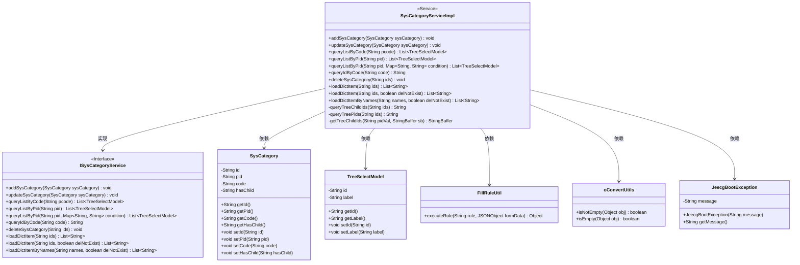
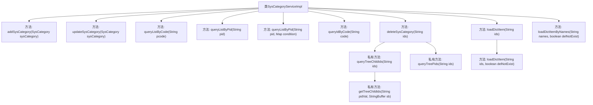

# 基础信息

|      |      |
|------|------|
| 名称 | SysCategoryServiceImpl |
| 编码语言 | .java |
| 代码路径 | JeecgBoot/jeecg-boot/jeecg-module-system/jeecg-system-biz/src/main/java/org/jeecg/modules/system/service/impl/SysCategoryServiceImpl.java |
| 包名 | org.jeecg.modules.system.service.impl |
| 依赖项 | ['com.alibaba.fastjson.JSONObject', 'com.baomidou.mybatisplus.core.conditions.query.LambdaQueryWrapper', 'com.baomidou.mybatisplus.core.conditions.update.LambdaUpdateWrapper', 'com.baomidou.mybatisplus.core.conditions.update.UpdateWrapper', 'com.baomidou.mybatisplus.extension.service.impl.ServiceImpl', 'org.jeecg.common.constant.FillRuleConstant', 'org.jeecg.common.constant.SymbolConstant', 'org.jeecg.common.exception.JeecgBootException', 'org.jeecg.common.util.FillRuleUtil', 'org.jeecg.common.util.oConvertUtils', 'org.jeecg.modules.system.entity.SysCategory', 'org.jeecg.modules.system.mapper.SysCategoryMapper', 'org.jeecg.modules.system.model.TreeSelectModel', 'org.jeecg.modules.system.service.ISysCategoryService', 'org.springframework.stereotype.Service', 'org.springframework.transaction.annotation.Transactional', 'java.util', 'java.util.stream.Collectors'] |
| 概述说明 | SysCategoryServiceImpl实现分类字典的增删改查，支持树形操作和编码生成。 |

# 说明

SysCategoryServiceImpl类实现了ISysCategoryService接口，主要负责分类字典的管理功能，包括增加、删除、修改和查询操作。该类支持树形结构的操作，能够处理复杂的层级关系，同时还提供了编码规则的生成功能，确保分类字典的唯一性和规范性。

# 类列表 Class Summary

| 名称   | 类型  | 说明 |
|-------|------|-------------|
| SysCategoryServiceImpl | class | SysCategoryServiceImpl类实现ISysCategoryService接口，提供分类字典的增删改查功能，支持树形结构操作和编码规则生成。 |

## 类 SysCategoryServiceImpl

|      |      |
|------|------|
| 访问范围 | @Service;public |
| 类型 | class |
| 名称 | SysCategoryServiceImpl |
| 说明 | SysCategoryServiceImpl类实现ISysCategoryService接口，提供分类字典的增删改查功能，支持树形结构操作和编码规则生成。 |

### UML类图

这段代码展示了 `SysCategoryServiceImpl` 类的实现，该类实现了 `ISysCategoryService` 接口，并提供了对 `SysCategory` 实体的增删改查操作。代码中使用了 `FillRuleUtil` 来生成分类字典编码，并通过 `oConvertUtils` 进行空值检查。此外，代码还处理了树形结构的父子节点关系，并在删除操作时递归删除子节点。

### 内部方法调用关系图

这段代码定义了一个名为 `SysCategoryServiceImpl` 的类，该类实现了 `ISysCategoryService` 接口，并继承了 `ServiceImpl` 类。该类主要负责系统分类的管理，包括添加、更新、查询和删除分类等操作。代码中使用了多个方法来处理不同的业务逻辑，如 `addSysCategory` 用于添加分类，`updateSysCategory` 用于更新分类，`queryListByCode` 和 `queryListByPid` 用于查询分类列表，`deleteSysCategory` 用于删除分类，`loadDictItem` 和 `loadDictItemByNames` 用于加载字典项。私有方法 `queryTreeChildIds`、`queryTreePids` 和 `getTreeChildIds` 用于递归查询子节点和父节点信息。整体代码结构清晰，功能明确，适合用于系统分类的管理和维护。

### 字段列表 Field List

| 名称  | 类型  | 说明 |
|-------|-------|------|

### 方法列表 Method List

| 名称  | 类型  | 说明 |
|-------|-------|------|
| loadDictItemByNames | List<String> | 方法根据名称列表查询并返回对应的ID，可选删除不存在的项。 |
| deleteSysCategory | void | 删除系统分类及其子节点，并更新父节点状态。 |
| loadDictItem | List<String> | 重写loadDictItem方法，调用带布尔参数的版本。 |
| queryIdByCode | String | 方法queryIdByCode通过code查询并返回ID。 |
| addSysCategory | void | 添加系统分类，处理父节点并生成分类编码后插入数据库。 |
| updateSysCategory | void | 更新系统分类时，若父ID为空则设为根，否则更新父节点的子节点标记。 |
| queryTreePids | String | 方法查询树节点父ID，更新无子节点状态。 |
| queryListByCode | List<TreeSelectModel> | 根据编码查询树形列表，验证编码唯一性并返回结果。 |
| queryTreeChildIds | String | 方法拆分ID数组，去重并递归获取子ID，最终返回拼接字符串。 |
| queryListByPid | List<TreeSelectModel> | 根据父ID查询树形选择列表，若父ID为空则使用根值。 |
| loadDictItem | List<String> | 根据ID加载字典项，支持是否删除不存在的键。 |
| getTreeChildIds | StringBuffer | 递归获取子节点ID并拼接至字符串缓冲区。 |
| queryListByPid | List<TreeSelectModel> | 根据父ID查询树形选择列表，若父ID为空则使用根值。 |

