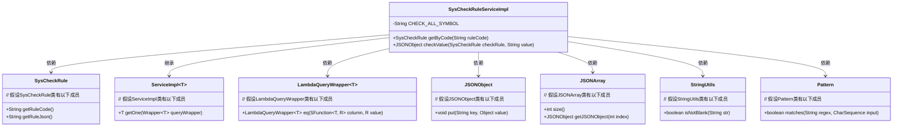
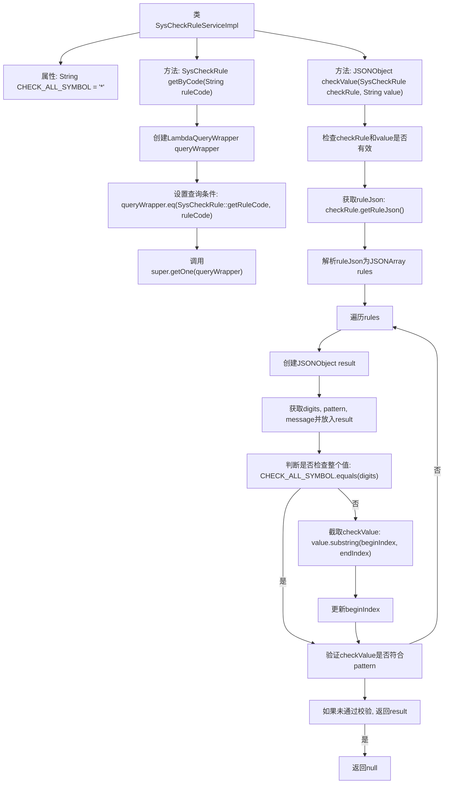

# 基础信息

|      |      |
|------|------|
| 名称 | SysCheckRuleServiceImpl |
| 编码语言 | .java |
| 代码路径 | JeecgBoot/jeecg-boot/jeecg-module-system/jeecg-system-biz/src/main/java/org/jeecg/modules/system/service/impl/SysCheckRuleServiceImpl.java |
| 包名 | org.jeecg.modules.system.service.impl |
| 依赖项 | ['com.alibaba.fastjson.JSON', 'com.alibaba.fastjson.JSONArray', 'com.alibaba.fastjson.JSONObject', 'com.baomidou.mybatisplus.core.conditions.query.LambdaQueryWrapper', 'com.baomidou.mybatisplus.extension.service.impl.ServiceImpl', 'org.apache.commons.lang.StringUtils', 'org.jeecg.modules.system.entity.SysCheckRule', 'org.jeecg.modules.system.mapper.SysCheckRuleMapper', 'org.jeecg.modules.system.service.ISysCheckRuleService', 'org.springframework.stereotype.Service', 'java.util.regex.Pattern'] |
| 概述说明 | SysCheckRuleServiceImpl类提供校验规则查询与值校验功能。 |

# 说明

SysCheckRuleServiceImpl类主要负责实现校验规则的查询与值校验功能。该类通过查询相关规则，对输入的值进行校验，确保其符合预设的规则要求。这一过程涵盖了规则的获取、值的验证以及结果的反馈，确保系统在处理数据时能够遵循既定的校验标准，从而保证数据的准确性和一致性。

# 类列表 Class Summary

| 名称   | 类型  | 说明 |
|-------|------|-------------|
| SysCheckRuleServiceImpl | class | SysCheckRuleServiceImpl类实现校验规则查询与值校验功能。 |

## 类 SysCheckRuleServiceImpl

|      |      |
|------|------|
| 访问范围 | @Service;public |
| 类型 | class |
| 名称 | SysCheckRuleServiceImpl |
| 说明 | SysCheckRuleServiceImpl类实现校验规则查询与值校验功能。 |

### UML类图

### 描述
`SysCheckRuleServiceImpl` 是一个服务类，继承自 `ServiceImpl` 并实现了 `ISysCheckRuleService` 接口。该类主要用于处理系统校验规则，提供了根据规则代码获取规则对象的方法 `getByCode`，以及根据用户设定的自定义校验规则校验传入值的方法 `checkValue`。`checkValue` 方法通过解析规则 JSON 字符串，对输入值进行分段校验，并返回校验结果。类中使用了 `LambdaQueryWrapper` 进行数据库查询，`JSONObject` 和 `JSONArray` 用于处理 JSON 数据，`StringUtils` 用于字符串操作，`Pattern` 用于正则表达式匹配。

### 内部方法调用关系图

这段代码是一个服务类 `SysCheckRuleServiceImpl`，用于处理系统校验规则的相关操作。它包含两个主要方法：`getByCode` 用于根据规则代码获取校验规则，`checkValue` 用于根据用户设定的校验规则对传入的值进行校验。`checkValue` 方法会解析规则 JSON，遍历规则数组，并根据规则截取字符串进行验证，如果未通过校验则返回错误信息，否则返回 `null` 表示通过校验。

### 字段列表 Field List

| 名称  | 类型  | 说明 |
|-------|-------|------|
| CHECK_ALL_SYMBOL = "*" | String | 定义私有常量CHECK_ALL_SYMBOL，值为"*"。 |

### 方法列表 Method List

| 名称  | 类型  | 说明 |
|-------|-------|------|
| getByCode | SysCheckRule | 通过规则代码查询系统检查规则。 |
| checkValue | JSONObject | 方法检查值是否符合规则，根据规则截取字符串并验证，返回验证结果或错误信息。 |

