# 基础信息

|      |      |
|------|------|
| 名称 | SysCommentServiceImpl |
| 编码语言 | .java |
| 代码路径 | JeecgBoot/jeecg-boot/jeecg-module-system/jeecg-system-biz/src/main/java/org/jeecg/modules/system/service/impl/SysCommentServiceImpl.java |
| 包名 | org.jeecg.modules.system.service.impl |
| 依赖项 | ['com.alibaba.fastjson.JSONObject', 'com.baomidou.mybatisplus.core.conditions.query.LambdaQueryWrapper', 'com.baomidou.mybatisplus.core.toolkit.IdWorker', 'com.baomidou.mybatisplus.extension.service.impl.ServiceImpl', 'org.jeecg.common.api.dto.message.MessageDTO', 'org.jeecg.common.config.TenantContext', 'org.jeecg.common.constant.CommonConstant', 'org.jeecg.common.constant.SymbolConstant', 'org.jeecg.common.constant.enums.FileTypeEnum', 'org.jeecg.common.constant.enums.MessageTypeEnum', 'org.jeecg.common.exception.JeecgBootException', 'org.jeecg.common.system.api.ISysBaseAPI', 'org.jeecg.common.system.vo.SysFilesModel', 'org.jeecg.common.util.CommonUtils', 'org.jeecg.common.util.RedisUtil', 'org.jeecg.common.util.oConvertUtils', 'org.jeecg.modules.system.entity.SysComment', 'org.jeecg.modules.system.entity.SysFormFile', 'org.jeecg.modules.system.mapper.SysCommentMapper', 'org.jeecg.modules.system.mapper.SysFormFileMapper', 'org.jeecg.modules.system.service.ISysCommentService', 'org.jeecg.modules.system.vo.SysCommentFileVo', 'org.jeecg.modules.system.vo.SysCommentVO', 'org.jeecg.modules.system.vo.UserAvatar', 'org.springframework.beans.factory.annotation.Autowired', 'org.springframework.beans.factory.annotation.Value', 'org.springframework.context.annotation.Lazy', 'org.springframework.stereotype.Service', 'org.springframework.transaction.annotation.Transactional', 'org.springframework.util.FileCopyUtils', 'org.springframework.web.multipart.MultipartFile', 'org.springframework.web.multipart.MultipartHttpServletRequest', 'javax.servlet.http.HttpServletRequest', 'java.io.File', 'java.io.IOException', 'java.util', 'java.util.regex.Matcher', 'java.util.regex.Pattern'] |
| 概述说明 | SysCommentServiceImpl类实现评论查询、保存、删除和文件上传功能。 |

# 说明

SysCommentServiceImpl类负责实现评论相关的核心功能，包括评论的查询、保存和删除操作。此外，该类还支持文件上传功能，确保用户能够附加文件与评论内容一同提交。通过集成这些功能，SysCommentServiceImpl类为系统提供了完整的评论管理解决方案，满足用户对评论操作的多样化需求。

# 类列表 Class Summary

| 名称   | 类型  | 说明 |
|-------|------|-------------|
| SysCommentServiceImpl | class | SysCommentServiceImpl类实现评论查询、保存、删除及文件上传功能。 |

## 类 SysCommentServiceImpl

|      |      |
|------|------|
| 访问范围 | @Service;public |
| 类型 | class |
| 名称 | SysCommentServiceImpl |
| 说明 | SysCommentServiceImpl类实现评论查询、保存、删除及文件上传功能。 |

### UML类图

```mermaid
classDiagram
    class SysCommentServiceImpl {
        -ISysBaseAPI sysBaseApi
        -SysFormFileMapper sysFormFileMapper
        -RedisUtil redisUtil
        -String uploadpath
        -String uploadType
        -String SYS_FORM_FILE_TABLE_NAME
        +List~SysCommentVO~ queryFormCommentInfo(SysComment sysComment)
        +void saveOneFileComment(HttpServletRequest request)
        +void appSaveOneFileComment(HttpServletRequest request)
        +List~SysCommentFileVo~ queryFormFileList(String tableName, String formDataId)
        +String saveOne(SysComment sysComment)
        +void deleteOne(String id)
        -Set~String~ getCommentUsername(String content)
        -String uploadLocal(MultipartFile mf, String bizPath)
        -Map~String, UserAvatar~ queryUserAvatar(Set~String~ idSet)
    }

    class ISysBaseAPI {
        <<Interface>>
        +void sendTemplateMessage(MessageDTO md)
    }

    class SysFormFileMapper {
        +void insert(SysFormFile sysFormFile)
        +void delete(LambdaQueryWrapper~SysFormFile~ query)
    }

    class RedisUtil {
        +void set(String key, Object value)
        +Object get(String key)
    }

    class SysComment {
        +String getTableName()
        +String getTableDataId()
        +String getCommentContent()
        +String getTableId()
    }

    class SysCommentVO {
        +String getFromUserId()
        +String getToUserId()
        +void setFromUserId_dictText(String text)
        +void setFromUserAvatar(String avatar)
        +void setToUserId_dictText(String text)
        +void setToUserAvatar(String avatar)
    }

    class UserAvatar {
        +String getId()
        +String getRealname()
        +String getAvatar()
    }

    class SysFilesModel {
        +void setFileName(String name)
        +void setUrl(String url)
        +void setFileType(String type)
        +void setStoreType(String type)
        +void setFileSize(Double size)
        +void setId(String id)
        +void setTenantId(String tenantId)
    }

    class SysFormFile {
        +void setTableName(String name)
        +void setFileType(String type)
        +void setTableDataId(String id)
        +void setFileId(String id)
    }

    class MessageDTO {
        +void setTitle(String title)
        +void setContent(String content)
        +void setToAll(Boolean toAll)
        +void setToUser(String users)
        +void setFromUser(String user)
        +void setType(String type)
        +void setData(Map~String, Object~ data)
    }

    SysCommentServiceImpl --> ISysBaseAPI : 依赖
    SysCommentServiceImpl --> SysFormFileMapper : 依赖
    SysCommentServiceImpl --> RedisUtil : 依赖
    SysCommentServiceImpl --> SysComment : 依赖
    SysCommentServiceImpl --> SysCommentVO : 依赖
    SysCommentServiceImpl --> UserAvatar : 依赖
    SysCommentServiceImpl --> SysFilesModel : 依赖
    SysCommentServiceImpl --> SysFormFile : 依赖
    SysCommentServiceImpl --> MessageDTO : 依赖
```

### 描述
`SysCommentServiceImpl` 是一个服务实现类，主要负责处理系统评论相关的业务逻辑。它依赖于 `ISysBaseAPI` 接口进行消息发送，依赖于 `SysFormFileMapper` 进行文件操作，依赖于 `RedisUtil` 进行缓存管理。类中包含多个方法，如查询评论信息、保存文件评论、删除评论等，还包含一些私有方法用于处理文件上传、获取用户信息等。通过类图可以清晰地看到各个类之间的关系和依赖。

### 内部方法调用关系图

```mermaid
graph TD
    A["类SysCommentServiceImpl"]
    B["属性: ISysBaseAPI sysBaseApi"]
    C["属性: SysFormFileMapper sysFormFileMapper"]
    D["属性: RedisUtil redisUtil"]
    E["属性: String uploadpath"]
    F["属性: String uploadType"]
    G["常量: String SYS_FORM_FILE_TABLE_NAME"]
    H["方法: List<SysCommentVO> queryFormCommentInfo(SysComment sysComment)"]
    I["方法: void saveOneFileComment(HttpServletRequest request)"]
    J["方法: void appSaveOneFileComment(HttpServletRequest request)"]
    K["方法: List<SysCommentFileVo> queryFormFileList(String tableName, String formDataId)"]
    L["方法: String saveOne(SysComment sysComment)"]
    M["方法: void deleteOne(String id)"]
    N["方法: Set<String> getCommentUsername(String content)"]
    O["方法: String uploadLocal(MultipartFile mf, String bizPath)"]
    P["方法: Map<String, UserAvatar> queryUserAvatar(Set<String> idSet)"]

    A --> B
    A --> C
    A --> D
    A --> E
    A --> F
    A --> G
    A --> H
    A --> I
    A --> J
    A --> K
    A --> L
    A --> M
    A --> N
    A --> O
    A --> P
```

这段代码定义了一个名为`SysCommentServiceImpl`的服务类，该类继承自`ServiceImpl`并实现了`ISysCommentService`接口。类中包含了多个属性和方法，用于处理系统评论相关的业务逻辑，如查询评论信息、保存文件评论、删除评论等。流程图展示了类中各个属性与方法之间的关系，帮助理解代码的结构与功能。

### 字段列表 Field List

| 名称  | 类型  | 说明 |
|-------|-------|------|
| sysBaseApi | ISysBaseAPI | 自动注入系统基础API接口实例。 |
| SYS_FORM_FILE_TABLE_NAME = "sys_comment" | String | 定义私有静态常量SYS_FORM_FILE_TABLE_NAME为"sys_comment"。 |
| uploadpath | String | 代码定义上传路径变量，从配置中获取值。 |
| redisUtil | RedisUtil | 使用@Autowired自动注入RedisUtil工具类。 |
| uploadType | String | 代码定义了一个私有字符串变量uploadType，通过注解从配置文件中获取值。 |
| sysFormFileMapper | SysFormFileMapper | 自动注入SysFormFileMapper实例。 |

### 方法列表 Method List

| 名称  | 类型  | 说明 |
|-------|-------|------|
| deleteOne | void | 删除指定ID记录及其关联文件。 |
| getCommentUsername | Set<String> | 提取评论内容中的用户名并返回集合。 |
| queryUserAvatar | Map<String, UserAvatar> | 通过ID集合查询用户头像并返回映射关系。 |
| saveOneFileComment | void | 处理文件上传并保存至系统，检查路径合法性，支持本地和云存储。 |
| queryFormCommentInfo | List<SysCommentVO> | 查询评论信息并获取相关用户头像和用户名。 |
| appSaveOneFileComment | void | 方法`appSaveOneFileComment`保存文件信息至`SysFiles`和`SysFormFile`表。 |
| queryFormFileList | List<SysCommentFileVo> | 重写方法查询表单文件列表，返回结果。 |
| uploadLocal | String | 方法uploadLocal检查bizPath合法性，创建目录并保存上传文件，返回文件路径。 |
| saveOne | String | 保存评论并发送系统通知，若评论包含@用户，则通知被提及用户并附加表单信息。 |

