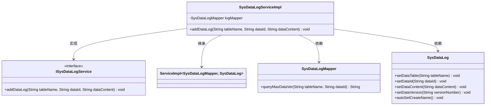
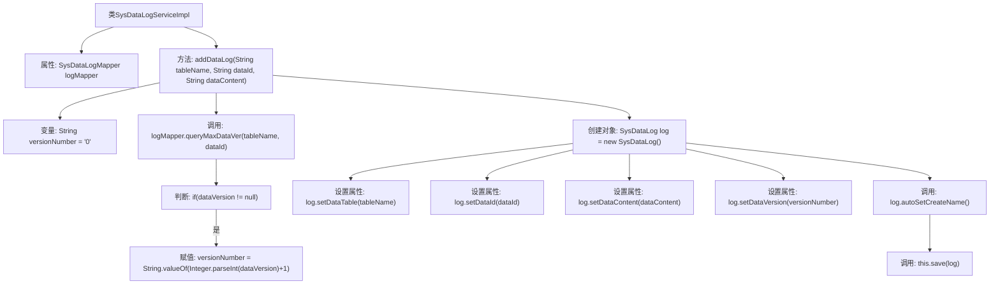

# 基础信息

|      |      |
|------|------|
| 名称 | SysDataLogServiceImpl |
| 编码语言 | .java |
| 代码路径 | JeecgBoot/jeecg-boot/jeecg-module-system/jeecg-system-biz/src/main/java/org/jeecg/modules/system/service/impl/SysDataLogServiceImpl.java |
| 包名 | org.jeecg.modules.system.service.impl |
| 依赖项 | ['org.jeecg.modules.system.entity.SysDataLog', 'org.jeecg.modules.system.mapper.SysDataLogMapper', 'org.jeecg.modules.system.service.ISysDataLogService', 'org.springframework.beans.factory.annotation.Autowired', 'org.springframework.stereotype.Service', 'com.baomidou.mybatisplus.extension.service.impl.ServiceImpl'] |
| 概述说明 | SysDataLogServiceImpl类实现数据日志添加，自动生成版本号并保存日志。 |

# 说明

SysDataLogServiceImpl类负责实现数据日志的添加功能。其主要任务包括自动生成日志的版本号，并将生成的日志信息保存到系统中。通过这一实现，系统能够有效地记录和管理数据变更历史，确保日志信息的完整性和可追溯性。该类的设计简化了日志添加流程，提升了系统的自动化水平和数据管理效率。

# 类列表 Class Summary

| 名称   | 类型  | 说明 |
|-------|------|-------------|
| SysDataLogServiceImpl | class | SysDataLogServiceImpl类实现数据日志添加功能，自动生成版本号并保存日志。 |

## 类 SysDataLogServiceImpl

|      |      |
|------|------|
| 访问范围 | @Service;public |
| 类型 | class |
| 名称 | SysDataLogServiceImpl |
| 说明 | SysDataLogServiceImpl类实现数据日志添加功能，自动生成版本号并保存日志。 |

### UML类图

这段代码描述了一个服务类 `SysDataLogServiceImpl`，它继承自 `ServiceImpl` 并实现了 `ISysDataLogService` 接口。该类通过 `SysDataLogMapper` 进行数据访问，并在 `addDataLog` 方法中处理数据日志的添加逻辑。`SysDataLog` 类用于存储日志信息，包含设置表名、数据ID、数据内容和版本号等方法。整个流程通过查询最大版本号、生成新版本号、创建日志对象并保存日志来实现数据日志的添加。

### 内部方法调用关系图

这段代码定义了一个`SysDataLogServiceImpl`类，用于处理数据日志的添加操作。`addDataLog`方法首先查询指定表和数据的最大版本号，如果存在则递增版本号，然后创建一个`SysDataLog`对象并设置其属性，最后调用`save`方法保存日志。流程图展示了从方法调用到日志保存的完整流程，确保每个步骤都清晰可见。

### 字段列表 Field List

| 名称  | 类型  | 说明 |
|-------|-------|------|
| logMapper | SysDataLogMapper | 使用@Autowired自动注入SysDataLogMapper实例。 |

### 方法列表 Method List

| 名称  | 类型  | 说明 |
|-------|-------|------|
| addDataLog | void | 方法`addDataLog`用于添加数据日志，自动生成版本号并保存日志。 |

