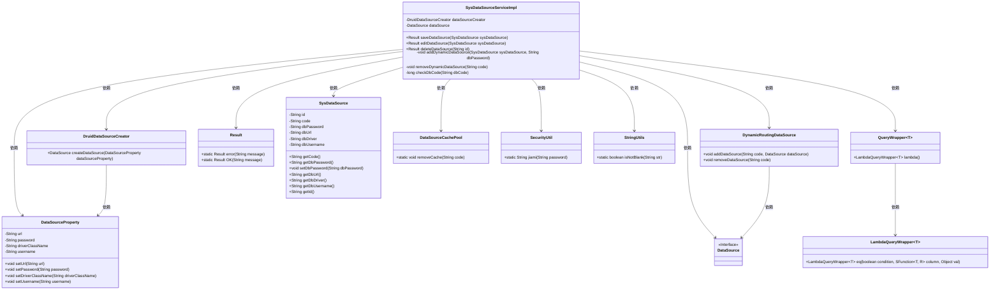
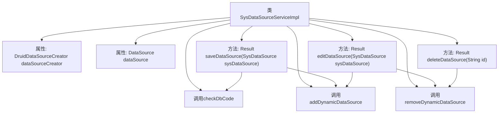
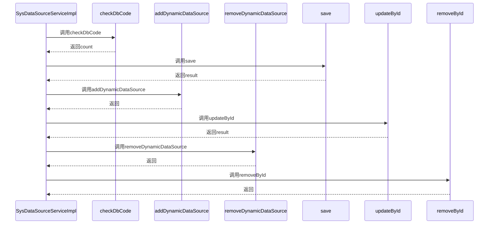

# 基础信息

|      |      |
|------|------|
| 名称 | SysDataSourceServiceImpl |
| 编码语言 | .java |
| 代码路径 | JeecgBoot/jeecg-boot/jeecg-module-system/jeecg-system-biz/src/main/java/org/jeecg/modules/system/service/impl/SysDataSourceServiceImpl.java |
| 包名 | org.jeecg.modules.system.service.impl |
| 依赖项 | ['com.baomidou.dynamic.datasource.DynamicRoutingDataSource', 'com.baomidou.dynamic.datasource.creator.DataSourceProperty', 'com.baomidou.dynamic.datasource.creator.druid.DruidDataSourceCreator', 'com.baomidou.mybatisplus.core.conditions.query.QueryWrapper', 'com.baomidou.mybatisplus.extension.service.impl.ServiceImpl', 'org.apache.commons.lang.StringUtils', 'org.jeecg.common.api.vo.Result', 'org.jeecg.common.util.dynamic.db.DataSourceCachePool', 'org.jeecg.modules.system.entity.SysDataSource', 'org.jeecg.modules.system.mapper.SysDataSourceMapper', 'org.jeecg.modules.system.service.ISysDataSourceService', 'org.jeecg.modules.system.util.SecurityUtil', 'org.springframework.beans.factory.annotation.Autowired', 'org.springframework.stereotype.Service', 'javax.sql.DataSource'] |
| 概述说明 | 实现数据源增删改查，支持动态添加删除，确保编码唯一性。 |

# 说明

该内容描述了一个功能模块，主要实现数据源的增删改查操作。具体包括动态添加和删除数据源的功能，以及在添加或修改数据源时检查编码的唯一性，确保数据源编码不重复。这些功能旨在提供灵活的数据源管理，同时保证数据的完整性和唯一性。

# 类列表 Class Summary

| 名称   | 类型  | 说明 |
|-------|------|-------------|
| SysDataSourceServiceImpl | class | 实现数据源增删改查，动态添加删除数据源，检查编码唯一性。 |

## 类 SysDataSourceServiceImpl

|      |      |
|------|------|
| 访问范围 | @Service;public |
| 类型 | class |
| 名称 | SysDataSourceServiceImpl |
| 说明 | 实现数据源增删改查，动态添加删除数据源，检查编码唯一性。 |

### UML类图

这段代码定义了一个`SysDataSourceServiceImpl`类，该类负责管理数据源的增删改查操作。它依赖于多个外部类和工具类，如`DruidDataSourceCreator`、`DataSource`、`DynamicRoutingDataSource`等，用于创建、删除和动态管理数据源。`SysDataSourceServiceImpl`类通过调用这些依赖类的方法，实现了对数据源的加密、校验和缓存管理等功能。

### 内部方法调用关系图

这段代码是一个Spring服务类`SysDataSourceServiceImpl`，主要负责数据源的增删改操作。代码中包含了多个方法，如`saveDataSource`、`editDataSource`和`deleteDataSource`，分别用于保存、编辑和删除数据源。此外，还有一些私有方法如`addDynamicDataSource`和`removeDynamicDataSource`，用于动态添加和删除数据源。代码通过调用这些方法，实现了对数据源的管理，并且在操作过程中进行了数据源编码的检查、密码加密等处理。

### 字段列表 Field List

| 名称  | 类型  | 说明 |
|-------|-------|------|
| dataSourceCreator | DruidDataSourceCreator | 自动注入Druid数据源创建器实例。 |
| dataSource | DataSource | 自动注入数据源实例。 |

### 方法列表 Method List

| 名称  | 类型  | 说明 |
|-------|-------|------|
| checkDbCode | long | 检查数据库代码是否存在，返回匹配记录数。 |
| removeDynamicDataSource | void | 移除指定代码的动态数据源。 |
| deleteDataSource | Result | 删除数据源方法：根据ID获取数据源，清除缓存并删除记录，返回成功提示。 |
| editDataSource | Result | 编辑数据源方法：更新密码、移除缓存、返回成功。 |
| addDynamicDataSource | void | 动态添加数据源，配置URL、密码、驱动和用户名，并加入路由数据源。 |
| saveDataSource | Result | 保存数据源前检查编码，加密密码，成功后返回添加成功。 |

