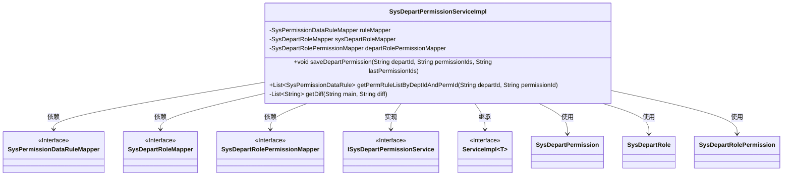
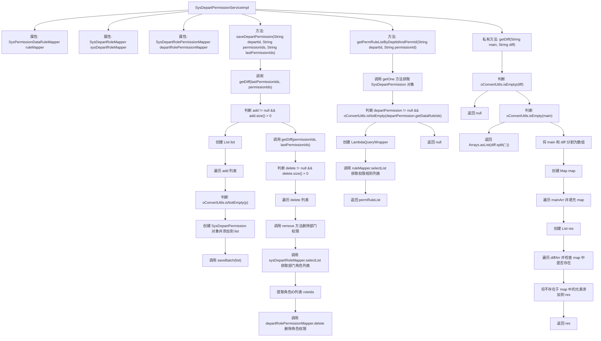

# 基础信息

|      |      |
|------|------|
| 名称 | SysDepartPermissionServiceImpl |
| 编码语言 | .java |
| 代码路径 | JeecgBoot/jeecg-boot/jeecg-module-system/jeecg-system-biz/src/main/java/org/jeecg/modules/system/service/impl/SysDepartPermissionServiceImpl.java |
| 包名 | org.jeecg.modules.system.service.impl |
| 依赖项 | ['com.baomidou.mybatisplus.core.conditions.query.LambdaQueryWrapper', 'com.baomidou.mybatisplus.core.conditions.query.QueryWrapper', 'org.jeecg.common.util.oConvertUtils', 'org.jeecg.modules.system.entity.SysDepartPermission', 'org.jeecg.modules.system.entity.SysDepartRole', 'org.jeecg.modules.system.entity.SysDepartRolePermission', 'org.jeecg.modules.system.entity.SysPermissionDataRule', 'org.jeecg.modules.system.mapper.SysDepartPermissionMapper', 'org.jeecg.modules.system.mapper.SysDepartRoleMapper', 'org.jeecg.modules.system.mapper.SysDepartRolePermissionMapper', 'org.jeecg.modules.system.mapper.SysPermissionDataRuleMapper', 'org.jeecg.modules.system.service.ISysDepartPermissionService', 'org.springframework.stereotype.Service', 'com.baomidou.mybatisplus.extension.service.impl.ServiceImpl', 'org.springframework.transaction.annotation.Transactional', 'javax.annotation.Resource', 'java.util', 'java.util.stream.Collectors'] |
| 概述说明 | 实现部门权限管理，支持新增、删除及规则查询功能。 |

# 说明

实现部门权限管理功能，涵盖权限的新增、删除以及规则查询等操作。该功能旨在有效管理各部门的权限设置，确保权限的灵活配置与及时更新。通过新增权限，可以为部门添加新的操作权限；删除功能则用于移除不再需要的权限；规则查询功能则支持对现有权限规则的快速检索与查看，以便进行权限的合理分配与调整。整体功能设计旨在提升权限管理的效率与准确性。

# 类列表 Class Summary

| 名称   | 类型  | 说明 |
|-------|------|-------------|
| SysDepartPermissionServiceImpl | class | 实现部门权限管理，包括权限新增、删除及规则查询功能。 |

## 类 SysDepartPermissionServiceImpl

|      |      |
|------|------|
| 访问范围 | @Service;public |
| 类型 | class |
| 名称 | SysDepartPermissionServiceImpl |
| 说明 | 实现部门权限管理，包括权限新增、删除及规则查询功能。 |

### UML类图

这段代码定义了一个服务类 `SysDepartPermissionServiceImpl`，它继承自 `ServiceImpl` 并实现了 `ISysDepartPermissionService` 接口。该类通过依赖注入的方式使用了三个 Mapper 接口：`SysPermissionDataRuleMapper`、`SysDepartRoleMapper` 和 `SysDepartRolePermissionMapper`。主要功能包括保存部门权限和获取权限规则列表。`saveDepartPermission` 方法通过对比新旧权限列表，新增或删除部门权限，并同步更新部门角色中的权限。`getPermRuleListByDeptIdAndPermId` 方法则根据部门 ID 和权限 ID 获取权限规则列表。`getDiff` 方法用于计算两个字符串列表的差异。

### 内部方法调用关系图

**流程图描述：**  
该流程图展示了 `SysDepartPermissionServiceImpl` 类的主要方法及其内部调用关系。`saveDepartPermission` 方法用于保存部门权限，首先通过 `getDiff` 方法获取新增和删除的权限列表，然后分别处理新增和删除操作。`getPermRuleListByDeptIdAndPermId` 方法用于根据部门和权限ID获取权限规则列表。`getDiff` 方法用于比较两个字符串并返回差异部分。

### 字段列表 Field List

| 名称  | 类型  | 说明 |
|-------|-------|------|
| ruleMapper | SysPermissionDataRuleMapper | 注入权限数据规则映射器实例。 |
| departRolePermissionMapper | SysDepartRolePermissionMapper | 私有字段注入部门角色权限映射器实例。 |
| sysDepartRoleMapper | SysDepartRoleMapper | 私有字段sysDepartRoleMapper注入SysDepartRoleMapper实例。 |

### 方法列表 Method List

| 名称  | 类型  | 说明 |
|-------|-------|------|
| getDiff | List<String> | 获取两个字符串的差异元素列表。 |
| saveDepartPermission | void | 保存部门权限，对比新增和删除权限，更新数据库。 |
| getPermRuleListByDeptIdAndPermId | List<SysPermissionDataRule> | 根据部门ID和权限ID获取权限规则列表，按创建时间降序排列。 |

