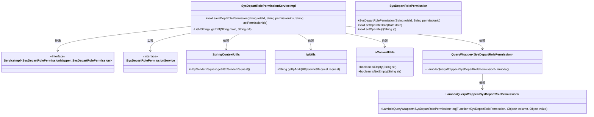
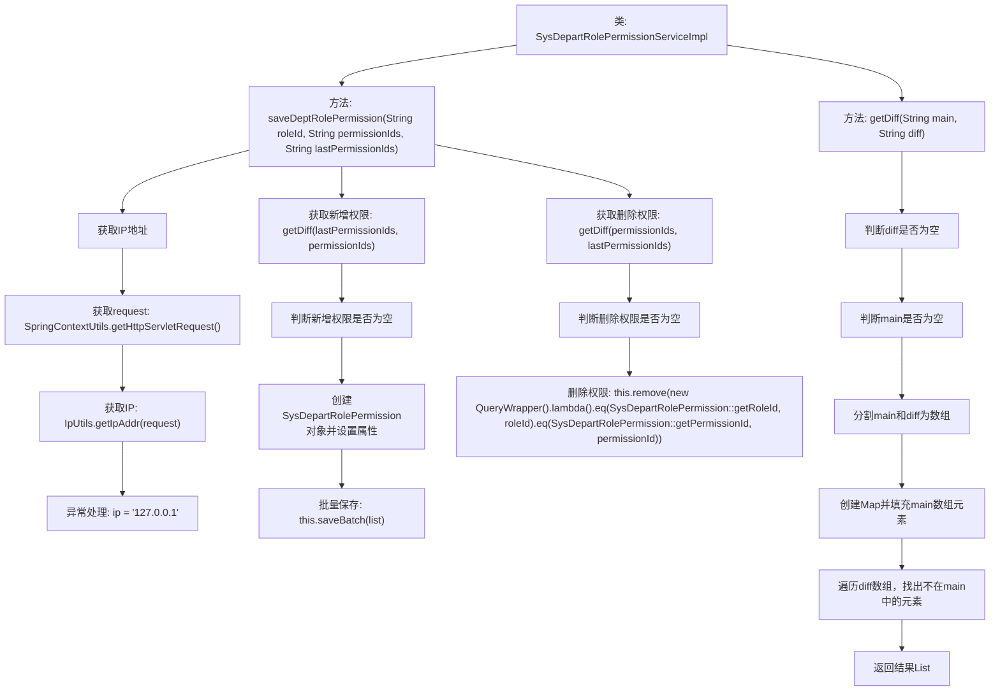

# 基础信息

|      |      |
|------|------|
| 名称 | SysDepartRolePermissionServiceImpl |
| 编码语言 | .java |
| 代码路径 | JeecgBoot/jeecg-boot/jeecg-module-system/jeecg-system-biz/src/main/java/org/jeecg/modules/system/service/impl/SysDepartRolePermissionServiceImpl.java |
| 包名 | org.jeecg.modules.system.service.impl |
| 依赖项 | ['com.baomidou.mybatisplus.core.conditions.query.QueryWrapper', 'org.jeecg.common.util.IpUtils', 'org.jeecg.common.util.SpringContextUtils', 'org.jeecg.common.util.oConvertUtils', 'org.jeecg.modules.system.entity.SysDepartRolePermission', 'org.jeecg.modules.system.mapper.SysDepartRolePermissionMapper', 'org.jeecg.modules.system.service.ISysDepartRolePermissionService', 'org.springframework.stereotype.Service', 'com.baomidou.mybatisplus.extension.service.impl.ServiceImpl', 'javax.servlet.http.HttpServletRequest', 'java.util'] |
| 概述说明 | 服务类实现部门角色权限的保存、删除，处理IP和操作日期。 |

# 说明

该服务类实现了部门角色权限的保存和删除功能，同时处理了IP地址和操作日期的记录。通过这一服务，系统能够有效地管理不同部门角色的权限配置，确保权限的准确性和安全性。此外，服务还捕获并记录了每次操作的IP地址和具体日期，为后续的审计和追踪提供了必要的信息支持。整体功能设计全面，兼顾了权限管理和操作日志的需求。

# 类列表 Class Summary

| 名称   | 类型  | 说明 |
|-------|------|-------------|
| SysDepartRolePermissionServiceImpl | class | 服务类实现保存和删除部门角色权限，处理IP地址和操作日期。 |

## 类 SysDepartRolePermissionServiceImpl

|      |      |
|------|------|
| 访问范围 | @Service;public |
| 类型 | class |
| 名称 | SysDepartRolePermissionServiceImpl |
| 说明 | 服务类实现保存和删除部门角色权限，处理IP地址和操作日期。 |

### UML类图

**描述：**  
`SysDepartRolePermissionServiceImpl` 是一个服务类，继承自 `ServiceImpl` 并实现了 `ISysDepartRolePermissionService` 接口。它提供了 `saveDeptRolePermission` 方法，用于保存部门角色权限。该方法通过 `SpringContextUtils` 获取请求对象，并使用 `IpUtils` 获取客户端IP地址。`oConvertUtils` 用于字符串的空值检查，`QueryWrapper` 和 `LambdaQueryWrapper` 用于构建查询条件。`SysDepartRolePermission` 类表示部门角色权限实体，包含角色ID、权限ID、操作日期和操作IP等属性。

### 内部方法调用关系图

这段代码是`SysDepartRolePermissionServiceImpl`类中的`saveDeptRolePermission`方法，用于保存部门角色权限。首先，它尝试获取请求的IP地址，如果失败则使用默认IP。然后，它通过`getDiff`方法计算新增和删除的权限，并分别进行批量保存和删除操作。`getDiff`方法用于比较两个字符串，找出差异部分并返回。整个流程涵盖了权限的增删操作，确保权限管理的准确性和完整性。

### 字段列表 Field List

| 名称  | 类型  | 说明 |
|-------|-------|------|

### 方法列表 Method List

| 名称  | 类型  | 说明 |
|-------|-------|------|
| saveDeptRolePermission | void | 保存部门角色权限，处理新增和删除权限，记录操作IP和时间。 |
| getDiff | List<String> | 比较两个字符串差异，返回不同元素列表。 |

