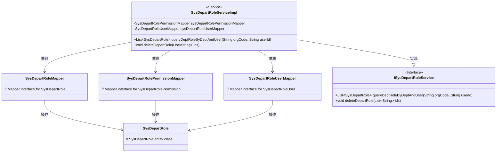
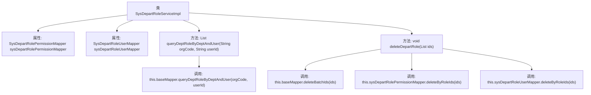

# 基础信息

|      |      |
|------|------|
| 名称 | SysDepartRoleServiceImpl |
| 编码语言 | .java |
| 代码路径 | JeecgBoot/jeecg-boot/jeecg-module-system/jeecg-system-biz/src/main/java/org/jeecg/modules/system/service/impl/SysDepartRoleServiceImpl.java |
| 包名 | org.jeecg.modules.system.service.impl |
| 依赖项 | ['org.jeecg.modules.system.entity.SysDepartRole', 'org.jeecg.modules.system.mapper.SysDepartRoleMapper', 'org.jeecg.modules.system.mapper.SysDepartRolePermissionMapper', 'org.jeecg.modules.system.mapper.SysDepartRoleUserMapper', 'org.jeecg.modules.system.service.ISysDepartRoleService', 'org.springframework.beans.factory.annotation.Autowired', 'org.springframework.stereotype.Service', 'com.baomidou.mybatisplus.extension.service.impl.ServiceImpl', 'org.springframework.transaction.annotation.Transactional', 'javax.annotation.Resource', 'java.util.List'] |
| 概述说明 | SysDepartRoleServiceImpl类负责部门角色查询、删除及权限用户关联处理。 |

# 说明

SysDepartRoleServiceImpl类负责实现部门角色的查询和删除功能，同时处理与权限和用户相关的关联操作。该类确保在查询和删除部门角色时，能够正确管理权限和用户之间的关联关系，以保证系统的一致性和完整性。

# 类列表 Class Summary

| 名称   | 类型  | 说明 |
|-------|------|-------------|
| SysDepartRoleServiceImpl | class | SysDepartRoleServiceImpl类实现部门角色查询和删除功能，包含权限和用户关联处理。 |

## 类 SysDepartRoleServiceImpl

|      |      |
|------|------|
| 访问范围 | @Service;public |
| 类型 | class |
| 名称 | SysDepartRoleServiceImpl |
| 说明 | SysDepartRoleServiceImpl类实现部门角色查询和删除功能，包含权限和用户关联处理。 |

### UML类图

### 描述
`SysDepartRoleServiceImpl` 是一个服务类，实现了 `ISysDepartRoleService` 接口，并依赖 `SysDepartRoleMapper`、`SysDepartRolePermissionMapper` 和 `SysDepartRoleUserMapper` 三个映射器类。该类提供了查询部门角色和删除部门角色及其关联信息的功能。`SysDepartRole` 是实体类，其他映射器类负责对 `SysDepartRole` 进行数据库操作。

### 内部方法调用关系图

这段代码是一个Spring服务类`SysDepartRoleServiceImpl`，它继承自`ServiceImpl`并实现了`ISysDepartRoleService`接口。类中注入了两个Mapper对象：`sysDepartRolePermissionMapper`和`sysDepartRoleUserMapper`。类提供了两个方法：`queryDeptRoleByDeptAndUser`用于查询部门和用户相关的角色，`deleteDepartRole`用于删除部门角色及其关联的权限和用户信息。`deleteDepartRole`方法使用了事务注解，确保在异常情况下回滚。

### 字段列表 Field List

| 名称  | 类型  | 说明 |
|-------|-------|------|
| sysDepartRolePermissionMapper | SysDepartRolePermissionMapper | 自动注入系统部门角色权限映射器。 |
| sysDepartRoleUserMapper | SysDepartRoleUserMapper | 自动注入SysDepartRoleUserMapper实例。 |

### 方法列表 Method List

| 名称  | 类型  | 说明 |
|-------|-------|------|
| deleteDepartRole | void | 删除部门角色及其关联权限和用户。 |
| queryDeptRoleByDeptAndUser | List<SysDepartRole> | 查询指定部门和用户的部门角色列表。 |

