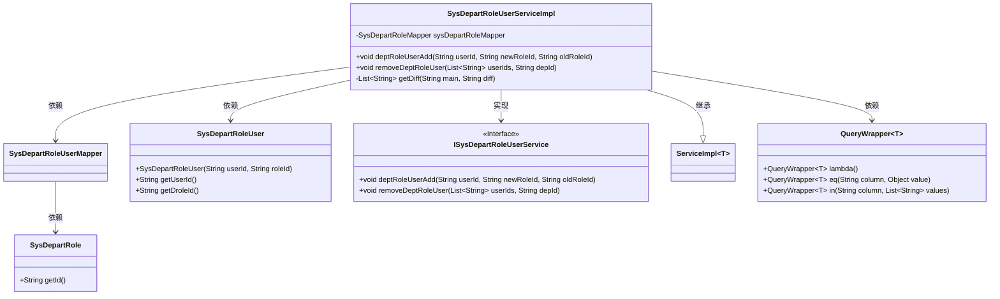
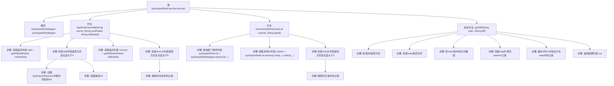

# 基础信息

|      |      |
|------|------|
| 名称 | SysDepartRoleUserServiceImpl |
| 编码语言 | .java |
| 代码路径 | JeecgBoot/jeecg-boot/jeecg-module-system/jeecg-system-biz/src/main/java/org/jeecg/modules/system/service/impl/SysDepartRoleUserServiceImpl.java |
| 包名 | org.jeecg.modules.system.service.impl |
| 依赖项 | ['com.baomidou.mybatisplus.core.conditions.query.QueryWrapper', 'org.jeecg.common.util.oConvertUtils', 'org.jeecg.modules.system.entity.SysDepartRole', 'org.jeecg.modules.system.entity.SysDepartRoleUser', 'org.jeecg.modules.system.mapper.SysDepartRoleMapper', 'org.jeecg.modules.system.mapper.SysDepartRoleUserMapper', 'org.jeecg.modules.system.service.ISysDepartRoleUserService', 'org.springframework.beans.factory.annotation.Autowired', 'org.springframework.stereotype.Service', 'com.baomidou.mybatisplus.extension.service.impl.ServiceImpl', 'org.springframework.transaction.annotation.Transactional', 'java.util', 'java.util.stream.Collectors'] |
| 概述说明 | 实现部门角色用户管理，支持添加、移除及批量删除用户角色。 |

# 说明

实现部门角色用户管理功能，涵盖添加角色、移除角色以及批量删除用户角色等操作。该功能旨在优化部门内部角色分配与管理，提升用户权限控制的效率与灵活性。通过添加角色，可为用户分配特定权限；移除角色则可撤销用户的相关权限；批量删除用户角色功能则支持一次性处理多个用户的角色调整，简化管理流程。整体设计注重操作的便捷性与系统管理的全面性。

# 类列表 Class Summary

| 名称   | 类型  | 说明 |
|-------|------|-------------|
| SysDepartRoleUserServiceImpl | class | 实现部门角色用户管理，包括添加、移除角色及批量删除用户角色功能。 |

## 类 SysDepartRoleUserServiceImpl

|      |      |
|------|------|
| 访问范围 | @Service;public |
| 类型 | class |
| 名称 | SysDepartRoleUserServiceImpl |
| 说明 | 实现部门角色用户管理，包括添加、移除角色及批量删除用户角色功能。 |

### UML类图

### 描述
`SysDepartRoleUserServiceImpl` 是一个服务实现类，继承自 `ServiceImpl` 并实现了 `ISysDepartRoleUserService` 接口。该类主要负责处理部门角色用户的添加和删除操作。它依赖于 `SysDepartRoleUserMapper` 进行数据库操作，并使用 `QueryWrapper` 构建查询条件。`getDiff` 方法用于比较两个字符串列表的差异。

### 内部方法调用关系图

这段代码是一个Spring Boot服务类，用于管理系统部门和角色用户的关系。它包含两个主要方法：`deptRoleUserAdd`用于添加和移除用户角色，`removeDeptRoleUser`用于移除部门角色用户。代码通过`getDiff`方法计算两个字符串的差异，并根据差异进行相应的操作。流程图中详细展示了各个方法的调用关系和步骤，确保代码逻辑清晰易懂。

### 字段列表 Field List

| 名称  | 类型  | 说明 |
|-------|-------|------|
| sysDepartRoleMapper | SysDepartRoleMapper | 自动注入SysDepartRoleMapper实例。 |

### 方法列表 Method List

| 名称  | 类型  | 说明 |
|-------|-------|------|
| removeDeptRoleUser | void | 删除部门角色用户，遍历用户ID，查询并移除相关角色。 |
| getDiff | List<String> | 比较两个字符串，返回差异项列表。 |
| deptRoleUserAdd | void | 方法实现用户角色更新，包括新增和删除角色操作。 |

