# 基础信息

|      |      |
|------|------|
| 名称 | SysDepartServiceImpl |
| 编码语言 | .java |
| 代码路径 | JeecgBoot/jeecg-boot/jeecg-module-system/jeecg-system-biz/src/main/java/org/jeecg/modules/system/service/impl/SysDepartServiceImpl.java |
| 包名 | org.jeecg.modules.system.service.impl |
| 依赖项 | ['cn.hutool.core.collection.CollectionUtil', 'cn.hutool.core.util.ArrayUtil', 'com.alibaba.fastjson.JSONArray', 'com.alibaba.fastjson.JSONObject', 'com.baomidou.mybatisplus.core.conditions.query.LambdaQueryWrapper', 'com.baomidou.mybatisplus.core.conditions.query.QueryWrapper', 'com.baomidou.mybatisplus.core.metadata.IPage', 'com.baomidou.mybatisplus.core.toolkit.IdWorker', 'com.baomidou.mybatisplus.extension.plugins.pagination.Page', 'com.baomidou.mybatisplus.extension.service.impl.ServiceImpl', 'io.netty.util.internal.StringUtil', 'org.apache.commons.lang.StringUtils', 'org.apache.shiro.SecurityUtils', 'org.jeecg.common.config.TenantContext', 'org.jeecg.common.constant.CommonConstant', 'org.jeecg.common.constant.FillRuleConstant', 'org.jeecg.common.constant.SymbolConstant', 'org.jeecg.common.system.vo.LoginUser', 'org.jeecg.common.util.FillRuleUtil', 'org.jeecg.common.util.ImportExcelUtil', 'org.jeecg.common.util.YouBianCodeUtil', 'org.jeecg.common.util.oConvertUtils', 'org.jeecg.config.mybatis.MybatisPlusSaasConfig', 'org.jeecg.modules.system.entity', 'org.jeecg.modules.system.mapper', 'org.jeecg.modules.system.model.DepartIdModel', 'org.jeecg.modules.system.model.SysDepartTreeModel', 'org.jeecg.modules.system.service.ISysDepartService', 'org.jeecg.modules.system.util.FindsDepartsChildrenUtil', 'org.jeecg.modules.system.vo.SysDepartExportVo', 'org.jeecg.modules.system.vo.lowapp.ExportDepartVo', 'org.springframework.beans.factory.annotation.Autowired', 'org.springframework.stereotype.Service', 'org.springframework.transaction.annotation.Transactional', 'java.util', 'java.util.function.Consumer', 'java.util.stream.Collectors'] |
| 概述说明 | SysDepartServiceImpl 实现 ISysDepartService，提供部门管理功能，支持多租户和部门编码生成。 |

# 说明

SysDepartServiceImpl 类实现了 ISysDepartService 接口，主要负责部门管理功能。该类提供了查询部门树、保存、更新和删除部门数据的操作，并支持多租户模式。此外，它还处理部门与用户之间的关系，并负责生成部门编码，确保部门数据的完整性和一致性。

# 类列表 Class Summary

| 名称   | 类型  | 说明 |
|-------|------|-------------|
| SysDepartServiceImpl | class | SysDepartServiceImpl 类实现了 ISysDepartService 接口，提供部门管理功能，包括查询部门树、保存、更新、删除部门数据，支持多租户模式，处理部门与用户关系，并生成部门编码。 |


## 类 SysDepartServiceImpl

|      |      |
|------|------|
| 访问范围 | @Service;public |
| 类型 | class |
| 名称 | SysDepartServiceImpl |
| 说明 | SysDepartServiceImpl 类实现了 ISysDepartService 接口，提供部门管理功能，包括查询部门树、保存、更新、删除部门数据，支持多租户模式，处理部门与用户关系，并生成部门编码。 |


### UML类图

```mermaid
classDiagram
    class SysDepartServiceImpl {
        -SysUserDepartMapper userDepartMapper
        -SysDepartRoleMapper sysDepartRoleMapper
        -SysDepartPermissionMapper departPermissionMapper
        -SysDepartRolePermissionMapper departRolePermissionMapper
        -SysDepartRoleUserMapper departRoleUserMapper
        -SysUserMapper sysUserMapper
        -SysDepartMapper departMapper
        +List~SysDepartTreeModel~ queryMyDeptTreeList(String departIds)
        +List~SysDepartTreeModel~ queryTreeList()
        +List~SysDepartTreeModel~ queryTreeList(String ids)
        +List~DepartIdModel~ queryDepartIdTreeList()
        +void saveDepartData(SysDepart sysDepart, String username)
        +Boolean updateDepartDataById(SysDepart sysDepart, String username)
        +void deleteBatchWithChildren(List~String~ ids)
        +List~String~ getSubDepIdsByDepId(String departId)
        +List~String~ getMySubDepIdsByDepId(String departIds)
        +List~SysDepartTreeModel~ searchByKeyWord(String keyWord, String myDeptSearch, String departIds)
        +boolean delete(String id)
        +List~SysDepart~ queryUserDeparts(String userId)
        +List~SysDepart~ queryDepartsByUsername(String username)
        +List~String~ queryDepartsByUserId(String userId)
        +List~SysDepartTreeModel~ queryTreeByKeyWord(String keyWord)
        +List~SysDepartTreeModel~ queryTreeListByPid(String parentId, String ids, String primaryKey)
        +JSONObject queryAllParentIdByDepartId(String departId)
        +JSONObject queryAllParentIdByOrgCode(String orgCode)
        +SysDepart queryCompByOrgCode(String orgCode)
        +List~SysDepart~ queryDeptByPid(String pid)
        +void getTreeByKeyWord(String keyWord, List~SysDepartTreeModel~ allResult, List~SysDepartTreeModel~ newResult)
        +void addDepartByUserIds(SysDepart sysDepart, String userIds)
        +void updateChargeDepart(SysDepart sysDepart)
        +void deleteChargeDepId(String departId, String userId)
        +void setUserIdsByDepList(List~SysDepart~ departList)
        +List~SysDepart~ getMyDepartList()
        +void deleteDepart(String id)
        +List~SysDepartTreeModel~ queryBookDepTreeSync(String parentId, Integer tenantId, String departName)
        +SysDepart getDepartById(String id)
        +IPage~SysDepart~ getMaxCodeDepart(Page~SysDepart~ page, String parentId)
        +void updateIzLeaf(String id, Integer izLeaf)
        +List~ExportDepartVo~ getExcelDepart(int tenantId)
        +void importExcel(List~ExportDepartVo~ listSysDeparts, List~String~ errorMessageList)
        +List~SysDepartExportVo~ getExportDepart(Integer tenantId, List~String~ idList)
        +void importSysDepart(List~SysDepartExportVo~ listSysDeparts, List~String~ errorMessageList)
    }
    class SysDepart {
        <<Interface>>
        +String getId()
        +String getParentId()
        +String getOrgCode()
        +String getOrgType()
        +String getDepartName()
        +String getDelFlag()
        +String getTenantId()
        +String getDepartOrder()
        +String getDirectorUserIds()
        +void setParentId(String parentId)
        +void setOrgCode(String orgCode)
        +void setOrgType(String orgType)
        +void setDepartName(String departName)
        +void setDelFlag(String delFlag)
        +void setTenantId(String tenantId)
        +void setDepartOrder(String departOrder)
        +void setDirectorUserIds(String directorUserIds)
    }
    class SysDepartTreeModel {
        +SysDepartTreeModel(SysDepart depart)
        +String getKey()
        +void setKey(String key)
        +List~SysDepartTreeModel~ getChildren()
        +void setChildren(List~SysDepartTreeModel~ children)
    }
    class DepartIdModel {
        +DepartIdModel(SysDepart depart)
        +String getId()
        +String getParentId()
        +String getOrgCode()
        +String getOrgType()
        +String getDepartName()
        +String getDelFlag()
        +String getTenantId()
        +String getDepartOrder()
        +String getDirectorUserIds()
        +void setParentId(String parentId)
        +void setOrgCode(String orgCode)
        +void setOrgType(String orgType)
        +void setDepartName(String departName)
        +void setDelFlag(String delFlag)
        +void setTenantId(String tenantId)
        +void setDepartOrder(String departOrder)
        +void setDirectorUserIds(String directorUserIds)
    }
    class ExportDepartVo {
        +String getId()
        +String getParentId()
        +String getOrgCode()
        +String getOrgType()
        +String getDepartName()
        +String getDelFlag()
        +String getTenantId()
        +String getDepartOrder()
        +String getDirectorUserIds()
        +void setParentId(String parentId)
        +void setOrgCode(String orgCode)
        +void setOrgType(String orgType)
        +void setDepartName(String departName)
        +void setDelFlag(String delFlag)
        +void setTenantId(String tenantId)
        +void setDepartOrder(String departOrder)
        +void setDirectorUserIds(String directorUserIds)
    }
    class SysDepartExportVo {
        +String getId()
        +String getParentId()
        +String getOrgCode()
        +String getOrgType()
        +String getDepartName()
        +String getDelFlag()
        +String getTenantId()
        +String getDepartOrder()
        +String getDirectorUserIds()
        +void setParentId(String parentId)
        +void setOrgCode(String orgCode)
        +void setOrgType(String orgType)
        +void setDepartName(String departName)
        +void setDelFlag(String delFlag)
        +void setTenantId(String tenantId)
        +void setDepartOrder(String departOrder)
        +void setDirectorUserIds(String directorUserIds)
    }
    class SysUser {
        +String getId()
        +String getDepartIds()
        +void setDepartIds(String departIds)
        +String getUserIdentity()
        +void setUserIdentity(String userIdentity)
    }
    class SysUserDepart {
        +String getUserId()
        +String getDepId()
    }
    class SysDepartRole {
        +String getId()
        +String getDepartId()
    }
    class SysDepartPermission {
        +String getId()
        +String getDepartId()
    }
    class SysDepartRolePermission {
        +String getId()
        +String getRoleId()
    }
    class SysDepartRoleUser {
        +String getId()
        +String getDroleId()
    }
    class FindsDepartsChildrenUtil {
        +List~SysDepartTreeModel~ wrapTreeDataToTreeList(List~SysDepart~ listDepts)
        +List~DepartIdModel~ wrapTreeDataToDepartIdTreeList(List~SysDepart~ list)
    }
    class MybatisPlusSaasConfig {
        +boolean OPEN_SYSTEM_TENANT_CONTROL
    }
    class TenantContext {
        +String getTenant()
    }
    class oConvertUtils {
        +int getInt(String value, int defaultValue)
        +boolean isEmpty(String value)
        +boolean isNotEmpty(String value)
        +String getString(String value, String defaultValue)
    }
    class FillRuleUtil {
        +Object executeRule(String ruleName, JSONObject formData)
    }
    class FillRuleConstant {
        +String DEPART
    }
    class YouBianCodeUtil {
        +String getNextYouBianCode(String orgCode)
        +String getSubYouBianCode(String parentCode, String subCode)
        +int ZHANWEI_LENGTH
    }
    class CommonConstant {
        +String DEL_FLAG_0
        +String IS_LEAF
        +String NOT_LEAF
        +String USER_IDENTITY_2
    }
    class ImportExcelUtil {
        +void importDateSaveOne(Object obj, Class~?~ clazz, List~String~ errorMessageList, int num, String uniqueKey)
    }
    class SymbolConstant {
        +String COMMA
        +String SINGLE_SLASH
    }
    class CollectionUtil {
        +boolean isNotEmpty(Collection~?~ collection)
    }
    class QueryWrapper~T~ {
        +QueryWrapper~T~ eq(String column, Object value)
        +QueryWrapper~T~ in(String column, Object... values)
        +QueryWrapper~T~ orderByAsc(String... columns)
        +QueryWrapper~T~ orderByDesc(String... columns)
    }
    class LambdaQueryWrapper~T~ {
        +LambdaQueryWrapper~T~ eq(SFunction~T, ?~ column, Object value)
        +LambdaQueryWrapper~T~ in(SFunction~T, ?~ column, Object... values)
        +LambdaQueryWrapper~T~ orderByAsc(SFunction~T, ?~ column)
        +LambdaQueryWrapper~T~ orderByDesc(SFunction~T, ?~ column)
        +LambdaQueryWrapper~T~ like(SFunction~T, ?~ column, Object value)
        +LambdaQueryWrapper~T~ nested(Consumer~LambdaQueryWrapper~T~~ consumer)
        +LambdaQueryWrapper~T~ func(Consumer~LambdaQueryWrapper~T~~ consumer)
    }
    class Page~T~ {
        +Page~T~(int current, int size)
        +List~T~ getRecords()
        +void setRecords(List~T~ records)
    }
    class JSONObject {
        +void put(String key, Object value)
        +Object get(String key)
        +JSONArray getJSONArray(String key)
        +JSONObject getJSONObject(String key)
    }
    class JSONArray {
        +void add(Object value)
        +Object get(int index)
    }
    class LoginUser {
        +String getId()
    }
    class SecurityUtils {
        +Object getSubject()
    }
    class SysDepartServiceImpl --> SysUserDepartMapper : 依赖
    SysDepartServiceImpl --> SysDepartRoleMapper : 依赖
    SysDepartServiceImpl --> SysDepartPermissionMapper : 依赖
    SysDepartServiceImpl --> SysDepartRolePermissionMapper : 依赖
    SysDepartServiceImpl --> SysDepartRoleUserMapper : 依赖
    SysDepartServiceImpl --> SysUserMapper : 依赖
    SysDepartServiceImpl --> SysDepartMapper : 依赖
    SysDepartServiceImpl --> FindsDepartsChildrenUtil : 依赖
    SysDepartServiceImpl --> MybatisPlusSaasConfig : 依赖
    SysDepartServiceImpl --> TenantContext : 依赖
    SysDepartServiceImpl --> oConvertUtils : 依赖
    SysDepartServiceImpl --> FillRuleUtil : 依赖
    SysDepartServiceImpl --> FillRuleConstant : 依赖
    SysDepartServiceImpl --> YouBianCodeUtil : 依赖
    SysDepartServiceImpl --> CommonConstant : 依赖
    SysDepartServiceImpl --> ImportExcelUtil : 依赖
    SysDepartServiceImpl --> SymbolConstant : 依赖
    SysDepartServiceImpl --> CollectionUtil : 依赖
    SysDepartServiceImpl --> QueryWrapper~T~ : 依赖
    SysDepartServiceImpl --> LambdaQueryWrapper~T~ : 依赖
    SysDepartServiceImpl --> Page~T~ : 依赖
    SysDepartServiceImpl --> JSONObject : 依赖
    SysDepartServiceImpl --> JSONArray : 依赖
    SysDepartServiceImpl --> LoginUser : 依赖
    SysDepartServiceImpl --> SecurityUtils : 依赖
    SysDepart --> SysDepartTreeModel : 依赖
    SysDepart --> DepartIdModel : 依赖
    SysDepart --> ExportDepartVo : 依赖
    SysDepart --> SysDepartExportVo : 依赖
    SysUser --> SysUserDepart : 依赖
    SysDepartRole --> SysDepartRolePermission : 依赖
    SysDepartRole --> SysDepartRoleUser : 依赖
    SysDepartPermission --> SysDepartRolePermission : 依赖
    SysDepartRolePermission --> SysDepartRoleUser : 依赖
    FindsDepartsChildrenUtil --> SysDepartTreeModel : 依赖
    FindsDepartsChildrenUtil --> DepartIdModel : 依赖
    MybatisPlusSaasConfig --> TenantContext : 依赖
    FillRuleUtil --> FillRuleConstant : 依赖
    YouBianCodeUtil --> CommonConstant : 依赖
    ImportExcelUtil --> JSONObject : 依赖
    ImportExcelUtil --> JSONArray : 依赖
    SecurityUtils --> LoginUser : 依赖
```

### 描述：
`SysDepartServiceImpl` 是一个服务类，负责处理部门相关的业务逻辑，包括部门的增删改查、树形结构的生成、部门与用户的关联等。它依赖于多个 Mapper 类（如 `SysUserDepartMapper`、`SysDepartRoleMapper` 等）来访问数据库，并使用了工具类（如 `FindsDepartsChildrenUtil`、`YouBianCodeUtil` 等）来辅助生成部门树结构和编码。该类还处理了多租户场景下的部门数据隔离，并通过 `MybatisPlusSaasConfig` 和 `TenantContext` 来实现租户相关的逻辑。


### 内部方法调用关系图

```mermaid
graph TD
    A["SysDepartServiceImpl"]
    B["属性: SysUserDepartMapper userDepartMapper"]
    C["属性: SysDepartRoleMapper sysDepartRoleMapper"]
    D["属性: SysDepartPermissionMapper departPermissionMapper"]
    E["属性: SysDepartRolePermissionMapper departRolePermissionMapper"]
    F["属性: SysDepartRoleUserMapper departRoleUserMapper"]
    G["属性: SysUserMapper sysUserMapper"]
    H["属性: SysDepartMapper departMapper"]
    I["方法: List<SysDepartTreeModel> queryMyDeptTreeList(String departIds)"]
    J["方法: List<SysDepartTreeModel> queryTreeList()"]
    K["方法: List<SysDepartTreeModel> queryTreeList(String ids)"]
    L["方法: List<DepartIdModel> queryDepartIdTreeList()"]
    M["方法: void saveDepartData(SysDepart sysDepart, String username)"]
    N["方法: Boolean updateDepartDataById(SysDepart sysDepart, String username)"]
    O["方法: void deleteBatchWithChildren(List<String> ids)"]
    P["方法: List<String> getSubDepIdsByDepId(String departId)"]
    Q["方法: List<String> getMySubDepIdsByDepId(String departIds)"]
    R["方法: List<SysDepartTreeModel> searchByKeyWord(String keyWord, String myDeptSearch, String departIds)"]
    S["方法: boolean delete(String id)"]
    T["方法: List<SysDepart> queryUserDeparts(String userId)"]
    U["方法: List<SysDepart> queryDepartsByUsername(String username)"]
    V["方法: List<String> queryDepartsByUserId(String userId)"]
    W["方法: List<SysDepartTreeModel> queryTreeListByPid(String parentId, String ids, String primaryKey)"]
    X["方法: JSONObject queryAllParentIdByDepartId(String departId)"]
    Y["方法: JSONObject queryAllParentIdByOrgCode(String orgCode)"]
    Z["方法: SysDepart queryCompByOrgCode(String orgCode)"]
    AA["方法: List<SysDepart> queryDeptByPid(String pid)"]
    AB["方法: void getTreeByKeyWord(String keyWord, List<SysDepartTreeModel> allResult, List<SysDepartTreeModel> newResult)"]
    AC["方法: void addDepartByUserIds(SysDepart sysDepart, String userIds)"]
    AD["方法: void updateChargeDepart(SysDepart sysDepart)"]
    AE["方法: void deleteChargeDepId(String departId, String userId)"]
    AF["方法: void setUserIdsByDepList(List<SysDepart> departList)"]
    AG["方法: List<SysDepart> getMyDepartList()"]
    AH["方法: void deleteDepart(String id)"]
    AI["方法: List<SysDepartTreeModel> queryBookDepTreeSync(String parentId, Integer tenantId, String departName)"]
    AJ["方法: SysDepart getDepartById(String id)"]
    AK["方法: IPage<SysDepart> getMaxCodeDepart(Page<SysDepart> page, String parentId)"]
    AL["方法: void updateIzLeaf(String id, Integer izLeaf)"]
    AM["方法: void setIzLeaf(String id)"]
    AN["方法: List<ExportDepartVo> getExcelDepart(int tenantId)"]
    AO["方法: void findPath(ExportDepartVo departVo, List<String> path, Integer tenantId, List<ExportDepartVo> childrenDepart, List<String> departIdList)"]
    AP["方法: void importExcel(List<ExportDepartVo> listSysDeparts, List<String> errorMessageList)"]
    AQ["方法: Boolean addDepartByName(String departNameUrl, String departName, SysDepart sysDepart, List<String> errorMessageList, Integer tenantId, Map<String,SysDepart> departMap, int num)"]
    AR["方法: String getDepartListByName(String departName, Integer tenantId, SysDepart sysDepart, String[] departNameUrls, int count, int departNum, String name, Map<String,SysDepart> departMap)"]
    AS["方法: void setParentDepartIzLeaf(List<String> parentIdList)"]
    AT["方法: List<SysDepartExportVo> getExportDepart(Integer tenantId, List<String> idList)"]
    AU["方法: void importSysDepart(List<SysDepartExportVo> listSysDeparts, List<String> errorMessageList)"]
    AV["方法: void findSysDepartPath(SysDepartExportVo departVo, List<String> path, Integer tenantId, List<SysDepartExportVo> childrenDepart, List<String> departIdList, List<String> idList)"]

    A --> B
    A --> C
    A --> D
    A --> E
    A --> F
    A --> G
    A --> H
    A --> I
    A --> J
    A --> K
    A --> L
    A --> M
    A --> N
    A --> O
    A --> P
    A --> Q
    A --> R
    A --> S
    A --> T
    A --> U
    A --> V
    A --> W
    A --> X
    A --> Y
    A --> Z
    A --> AA
    A --> AB
    A --> AC
    A --> AD
    A --> AE
    A --> AF
    A --> AG
    A --> AH
    A --> AI
    A --> AJ
    A --> AK
    A --> AL
    A --> AM
    A --> AN
    A --> AO
    A --> AP
    A --> AQ
    A --> AR
    A --> AS
    A --> AT
    A --> AU
    A --> AV
```



这段代码是一个名为 `SysDepartServiceImpl` 的服务实现类，主要负责处理与部门相关的业务逻辑。它继承自 `ServiceImpl` 并实现了 `ISysDepartService` 接口。类中包含了多个方法，用于处理部门的查询、保存、更新、删除等操作。代码中使用了多种数据访问对象（如 `SysUserDepartMapper`、`SysDepartRoleMapper` 等）来与数据库进行交互。每个方法都有特定的功能，例如 `queryMyDeptTreeList` 用于查询当前用户的部门树结构，`saveDepartData` 用于保存部门数据，`deleteBatchWithChildren` 用于批量删除部门及其子部门等。代码中还包含了一些复杂的逻辑处理，如部门编码的生成、部门树的构建等。

### 字段列表 Field List

| 名称  | 类型  | 说明 |
|-------|-------|------|
| sysDepartRoleMapper | SysDepartRoleMapper | 自动注入SysDepartRoleMapper实例。 |
| userDepartMapper | SysUserDepartMapper | 自动注入SysUserDepartMapper实例。 |
| departPermissionMapper | SysDepartPermissionMapper | 自动注入SysDepartPermissionMapper实例。 |
| departMapper | SysDepartMapper | 自动注入SysDepartMapper依赖。 |
| sysUserMapper | SysUserMapper | 自动注入SysUserMapper对象。 |
| departRoleUserMapper | SysDepartRoleUserMapper | 自动注入SysDepartRoleUserMapper实例。 |
| departRolePermissionMapper | SysDepartRolePermissionMapper | 自动注入部门角色权限映射器实例。 |

### 方法列表 Method List

| 名称  | 类型  | 说明 |
|-------|-------|------|
| queryAllParentIdByOrgCode | JSONObject | 方法查询组织代码的所有父ID并返回JSON对象。 |
| checkChildrenExists | void | 递归检查子部门是否存在并收集ID列表。 |
| queryDeptByPid | List<SysDepart> | 根据父部门ID查询子部门列表。 |
| queryBookDepTreeSync | List<SysDepartTreeModel> | 方法查询部门树结构，返回树模型列表。 |
| queryTreeList | List<SysDepartTreeModel> | 查询部门树列表，支持多租户数据隔离和排序。 |
| deleteChargeDepId | void | 根据部门ID和用户ID删除相关用户部门信息并更新。 |
| queryDepartsByUserId | List<String> | 重写方法查询用户ID对应的部门列表并返回。 |
| getMinLengthNode | String | 获取字符串数组中长度最短的节点并拼接成字符串。 |
| getDepartById | SysDepart | 通过ID查询部门信息的方法。 |
| getTreeByKeyWord | void | 通过关键字递归筛选部门树结构，匹配名称或子节点。 |
| deleteDepart | void | 删除部门时，更新叶子节点并删除部门及用户关系。 |
| delete | boolean | 删除部门及其关联数据，包括角色、用户关系和授权信息。 |
| queryAllParentIdRecursion | void | 递归查询所有父节点ID并存储到JSON对象中。 |
| getMaxCodeDepart | IPage<SysDepart> | 重写方法获取最大编码部门信息并返回分页结果。 |
| queryDepartIdTreeList | List<DepartIdModel> | 查询部门ID树列表，支持多租户数据隔离，返回树状结构结果。 |
| findSysDepartPath | void | 方法递归查询部门路径，拼接子部门名称并存储结果。 |
| queryAllParentIdByDepartId | JSONObject | 方法根据部门ID查询所有父ID，返回JSON对象。 |
| queryCompByOrgCode | SysDepart | 重写方法queryCompByOrgCode，截取orgCode前几位并查询公司信息。 |
| addDepartByUserIds | void | 根据用户ID为部门添加用户，更新用户部门和身份信息。 |
| queryAllParentId | JSONObject | 查询指定字段值的所有父ID及其部门数据。 |
| queryUserDeparts | List<SysDepart> | 重写方法查询用户部门列表。 |
| queryTreeList | List<SysDepartTreeModel> | 查询部门树状列表，支持多租户隔离，按顺序排序并设置用户ID。 |
| queryDepartsByUsername | List<SysDepart> | 根据用户名查询部门列表并返回。 |
| queryTreeByKeyWord | List<SysDepartTreeModel> | 根据关键词查询部门树结构，返回匹配的树状数据或完整树结构。 |
| getExcelDepart | List<ExportDepartVo> | 获取并导出部门层级结构，包括父部门和子部门，避免重复。 |
| getMyDeptParentOrgCode | String[] | 根据部门ID查询所属部门，考虑多租户隔离，返回排序后的父部门编码数组。 |
| deleteBatchWithChildren | void | 批量删除部门及其子级，更新父级叶子节点，清理相关角色和用户数据。 |
| getExportDepart | List<SysDepartExportVo> | 获取并导出部门信息，包含父级和子级部门，避免重复。 |
| getSubDepIdsByDepId | List<String> | 重写方法，通过部门ID获取子部门ID列表。 |
| setParentDepartIzLeaf | void | 检查父部门无子部门时，更新为叶子节点。 |
| findPath | void | 递归查找部门路径并生成URL，处理子部门数据。 |
| queryTreeListByPid | List<SysDepartTreeModel> | 该方法根据父ID和ID列表查询部门树结构，支持SASS控制和排序，返回部门树模型列表。 |
| queryMyDeptTreeList | List<SysDepartTreeModel> | 根据部门ID查询部门树，处理空数据，生成树状结构并返回。 |
| importSysDepart | void | 导入部门数据，处理路径排序、编码校验及错误信息记录。 |
| updateIzLeaf | void | 更新指定ID的主叶状态为izLeaf值。 |
| getMySubDepIdsByDepId | List<String> | 根据部门ID获取子部门ID列表，若部门代码为空则返回null。 |
| setUserIdsByDepList | void | 根据部门列表设置用户ID，查询负责部门不为空的用户，按部门ID拼接用户ID，更新部门负责人ID。 |
| getDepartListByName | String | 递归查找部门列表，比较名称路径，返回匹配部门ID或空。 |
| generateOrgCode | String[] | 该方法生成组织机构代码，根据父级ID查询同级部门，使用工具类生成新编码并返回。 |
| updateDepartDataById | Boolean | 更新部门数据，设置更新时间及更新人，并处理部门负责人变更。 |
| importExcel | void | 导入Excel数据，排序部门路径，循环导入部门信息，处理错误并保存数据。 |
| addDepartByName | Boolean | 方法检查部门路径和名称，验证一致性并生成新部门代码。 |
| saveDepartData | void | 保存部门数据，处理父节点、编码、类型、创建时间等信息，并设置负责人。 |
| getMyDeptParentNode | String | 方法将部门按公司归类，提取根节点并返回其组织代码。 |
| setIzLeaf | void | 该方法通过ID设置部门为叶子节点，若父节点无其他子节点，则父节点设为叶子节点。 |
| updateChargeDepart | void | 更新部门负责人，处理新旧用户ID，执行添加或删除操作。 |
| searchByKeyWord | List<SysDepartTreeModel> | 根据关键词搜索部门，支持我的部门搜索和模糊匹配，返回树形结构结果。 |
| getMyDepartList | List<SysDepart> | 方法获取当前用户加入的部门列表，提取一级部门编码并查询相关信息。 |


