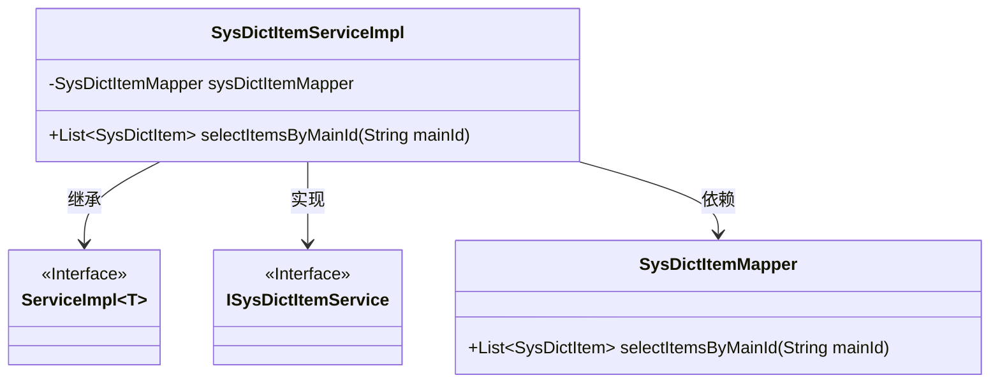
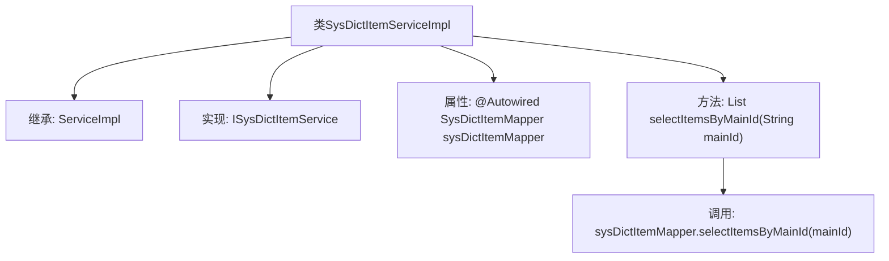

# 基础信息

|      |      |
|------|------|
| 名称 | SysDictItemServiceImpl |
| 编码语言 | .java |
| 代码路径 | JeecgBoot/jeecg-boot/jeecg-module-system/jeecg-system-biz/src/main/java/org/jeecg/modules/system/service/impl/SysDictItemServiceImpl.java |
| 包名 | org.jeecg.modules.system.service.impl |
| 依赖项 | ['org.jeecg.modules.system.entity.SysDictItem', 'org.jeecg.modules.system.mapper.SysDictItemMapper', 'org.jeecg.modules.system.service.ISysDictItemService', 'com.baomidou.mybatisplus.extension.service.impl.ServiceImpl', 'org.springframework.beans.factory.annotation.Autowired', 'org.springframework.stereotype.Service', 'java.util.List'] |
| 概述说明 | SysDictItemServiceImpl类实现ISysDictItemService接口，使用sysDictItemMapper查询主ID对应的字典项。 |

# 说明

SysDictItemServiceImpl类实现了ISysDictItemService接口，通过sysDictItemMapper查询与主ID对应的字典项。该类主要负责处理与字典项相关的业务逻辑，利用sysDictItemMapper进行数据访问操作，确保能够根据主ID准确获取所需的字典项信息。

# 类列表 Class Summary

| 名称   | 类型  | 说明 |
|-------|------|-------------|
| SysDictItemServiceImpl | class | SysDictItemServiceImpl类实现ISysDictItemService接口，通过sysDictItemMapper查询主ID对应的字典项。 |

## 类 SysDictItemServiceImpl

|      |      |
|------|------|
| 访问范围 | @Service;public |
| 类型 | class |
| 名称 | SysDictItemServiceImpl |
| 说明 | SysDictItemServiceImpl类实现ISysDictItemService接口，通过sysDictItemMapper查询主ID对应的字典项。 |

### UML类图

这段代码展示了一个服务实现类 `SysDictItemServiceImpl`，它继承了 `ServiceImpl` 并实现了 `ISysDictItemService` 接口。该类通过依赖注入的方式使用了 `SysDictItemMapper` 来执行数据库操作。具体来说，`SysDictItemServiceImpl` 提供了一个方法 `selectItemsByMainId`，该方法通过调用 `SysDictItemMapper` 的 `selectItemsByMainId` 方法来获取与指定 `mainId` 相关的 `SysDictItem` 列表。整个类图清晰地展示了类之间的继承、实现和依赖关系。

### 内部方法调用关系图

这段代码定义了一个名为 `SysDictItemServiceImpl` 的服务类，该类继承自 `ServiceImpl` 并实现了 `ISysDictItemService` 接口。类中通过 `@Autowired` 注解自动注入了一个 `SysDictItemMapper` 实例。`selectItemsByMainId` 方法通过调用 `sysDictItemMapper.selectItemsByMainId(mainId)` 来根据主ID查询字典项列表。该流程展示了类的继承关系、属性注入以及方法调用的逻辑。

### 字段列表 Field List

| 名称  | 类型  | 说明 |
|-------|-------|------|
| sysDictItemMapper | SysDictItemMapper | 自动注入SysDictItemMapper对象。 |

### 方法列表 Method List

| 名称  | 类型  | 说明 |
|-------|-------|------|
| selectItemsByMainId | List<SysDictItem> | 重写方法，通过主ID查询字典项列表。 |

