# 基础信息

|      |      |
|------|------|
| 名称 | SysDictServiceImpl |
| 编码语言 | .java |
| 代码路径 | JeecgBoot/jeecg-boot/jeecg-module-system/jeecg-system-biz/src/main/java/org/jeecg/modules/system/service/impl/SysDictServiceImpl.java |
| 包名 | org.jeecg.modules.system.service.impl |
| 依赖项 | ['cn.hutool.core.util.RandomUtil', 'com.baomidou.dynamic.datasource.toolkit.DynamicDataSourceContextHolder', 'com.baomidou.mybatisplus.core.conditions.query.LambdaQueryWrapper', 'com.baomidou.mybatisplus.core.metadata.IPage', 'com.baomidou.mybatisplus.extension.plugins.pagination.Page', 'com.baomidou.mybatisplus.extension.service.impl.ServiceImpl', 'lombok.extern.slf4j.Slf4j', 'org.apache.commons.lang.StringUtils', 'org.jeecg.common.config.TenantContext', 'org.jeecg.common.constant.CacheConstant', 'org.jeecg.common.constant.CommonConstant', 'org.jeecg.common.constant.DataBaseConstant', 'org.jeecg.common.constant.SymbolConstant', 'org.jeecg.common.exception.JeecgBootException', 'org.jeecg.common.system.api.ISysBaseAPI', 'org.jeecg.common.system.query.QueryGenerator', 'org.jeecg.common.system.util.ResourceUtil', 'org.jeecg.common.system.vo.DictModel', 'org.jeecg.common.system.vo.DictModelMany', 'org.jeecg.common.system.vo.DictQuery', 'org.jeecg.common.util.CommonUtils', 'org.jeecg.common.util.RedisUtil', 'org.jeecg.common.util.SqlInjectionUtil', 'org.jeecg.common.util.dynamic.db.DbTypeUtils', 'org.jeecg.common.util.oConvertUtils', 'org.jeecg.config.mybatis.MybatisPlusSaasConfig', 'org.jeecg.modules.system.entity.SysDict', 'org.jeecg.modules.system.entity.SysDictItem', 'org.jeecg.modules.system.mapper.SysDictItemMapper', 'org.jeecg.modules.system.mapper.SysDictMapper', 'org.jeecg.modules.system.model.DuplicateCheckVo', 'org.jeecg.modules.system.model.TreeSelectModel', 'org.jeecg.modules.system.security.DictQueryBlackListHandler', 'org.jeecg.modules.system.service.ISysDictService', 'org.jeecg.modules.system.vo.lowapp.SysDictVo', 'org.mybatis.spring.MyBatisSystemException', 'org.springframework.beans.BeanUtils', 'org.springframework.beans.factory.annotation.Autowired', 'org.springframework.cache.annotation.Cacheable', 'org.springframework.context.annotation.Lazy', 'org.springframework.stereotype.Service', 'org.springframework.transaction.annotation.Transactional', 'org.springframework.util.CollectionUtils', 'java.util', 'java.util.stream.Collectors'] |
| 概述说明 | SysDictServiceImpl类实现字典服务，涵盖数据校验、SQL防护、查询与缓存管理。 |

# 说明

SysDictServiceImpl类是一个实现字典服务的核心类，主要负责字典相关的功能。该类包含多个关键模块，确保系统的稳定性和安全性。首先，它具备数据校验功能，确保输入数据的合法性和完整性。其次，类中集成了SQL注入防护机制，有效防止恶意SQL攻击，保障数据库安全。此外，该类提供了字典查询功能，能够高效地检索和返回字典数据。最后，SysDictServiceImpl还实现了缓存管理，通过缓存机制提升字典数据的访问速度，减少数据库负载，优化系统性能。整体设计兼顾了功能、安全与效率。

# 类列表 Class Summary

| 名称   | 类型  | 说明 |
|-------|------|-------------|
| SysDictServiceImpl | class | SysDictServiceImpl类实现字典服务，包含数据校验、SQL注入防护、字典查询与缓存管理。 |

## 类 SysDictServiceImpl

|      |      |
|------|------|
| 访问范围 | @Service;@Slf4j;public |
| 类型 | class |
| 名称 | SysDictServiceImpl |
| 说明 | SysDictServiceImpl类实现字典服务，包含数据校验、SQL注入防护、字典查询与缓存管理。 |

### UML类图

```mermaid
classDiagram
    class SysDictServiceImpl {
        -SysDictMapper sysDictMapper
        -SysDictItemMapper sysDictItemMapper
        -DictQueryBlackListHandler dictQueryBlackListHandler
        -ISysBaseAPI sysBaseAPI
        -RedisUtil redisUtil
        +boolean duplicateCheckData(DuplicateCheckVo duplicateCheckVo)
        +List~DictModel~ queryDictItemsByCode(String code)
        +List~DictModel~ queryEnableDictItemsByCode(String code)
        +Map~String, List~DictModel~~ queryDictItemsByCodeList(List~String~ dictCodeList)
        +Map~String, List~DictModel~~ queryAllDictItems()
        +String queryDictTextByKey(String code, String key)
        +Map~String, List~DictModel~~ queryManyDictByKeys(List~String~ dictCodeList, List~String~ keys)
        +List~DictModel~ queryTableDictItemsByCode(String tableFilterSql, String text, String code)
        +List~DictModel~ queryTableDictItemsByCodeAndFilter(String table, String text, String code, String filterSql)
        +String queryTableDictTextByKey(String table, String text, String code, String key)
        +List~DictModel~ queryTableDictTextByKeys(String table, String text, String code, List~String~ codeValues, String dataSource)
        +List~String~ queryTableDictByKeys(String table, String text, String code, String keys)
        +List~String~ queryTableDictByKeys(String table, String text, String code, String codeValuesStr, boolean delNotExist)
        +boolean deleteByDictId(SysDict sysDict)
        +Integer saveMain(SysDict sysDict, List~SysDictItem~ sysDictItemList)
        +List~DictModel~ queryAllDepartBackDictModel()
        +List~DictModel~ queryAllUserBackDictModel()
        +List~DictModel~ queryLittleTableDictItems(String tableSql, String text, String code, String condition, String keyword, int pageNo, int pageSize)
        +List~DictModel~ queryAllTableDictItems(String table, String text, String code, String condition, String keyword)
        +List~TreeSelectModel~ queryTreeList(Map~String, String~ query, String table, String text, String code, String pidField, String pid, String hasChildField, int converIsLeafVal)
        +void deleteOneDictPhysically(String id)
        +void updateDictDelFlag(int delFlag, String id)
        +List~SysDict~ queryDeleteList(String tenantId)
        +List~DictModel~ queryDictTablePageList(DictQuery query, int pageSize, int pageNo)
        +List~DictModel~ getDictItems(String dictCode)
        +List~DictModel~ loadDict(String dictCode, String keyword, Integer pageNo, Integer pageSize)
        +List~SysDictVo~ getDictListByLowAppId(String lowAppId)
        +String addDictByLowAppId(SysDictVo sysDictVo)
        +void editDictByLowAppId(SysDictVo sysDictVo)
        +boolean revertLogicDeleted(List~String~ ids)
        +boolean removeLogicDeleted(List~String~ ids)
        -String[] addDict(String dictName, String lowAppId, Integer tenantId)
        -void addDictItem(String id, List~SysDictItem~ dictItemList)
        -void updateDictItem(String id, List~SysDictItem~ dictItemList)
    }

    class SysDictMapper {
        <<Interface>>
        +Long duplicateCheckCountSql(DuplicateCheckVo duplicateCheckVo)
        +Long duplicateCheckCountSqlNoDataId(DuplicateCheckVo duplicateCheckVo)
        +List~DictModel~ queryDictItemsByCode(String code)
        +List~DictModel~ queryEnableDictItemsByCode(String code)
        +List~DictModelMany~ queryDictItemsByCodeList(List~String~ dictCodeList)
        +List~DictModelMany~ queryAllDictItems(List~Integer~ tenantIds)
        +String queryDictTextByKey(String code, String key)
        +List~DictModelMany~ queryManyDictByKeys(List~String~ dictCodeList, List~String~ keys)
        +List~DictModel~ queryTableDictWithFilter(String table, String text, String code, String filterSql)
        +List~DictModel~ queryTableDictByKeysAndFilterSql(String table, String text, String code, String filterSql, List~String~ codeValues)
        +List~DictModel~ queryPageTableDictWithFilter(Page~DictModel~ page, String table, String text, String code, String filterSql)
        +List~TreeSelectModel~ queryTreeList(Map~String, String~ queryParams, String table, String text, String code, String pidField, String pid, String hasChildField, int converIsLeafVal)
        +void deleteOneById(String id)
        +void updateDictDelFlag(int delFlag, String id)
        +List~SysDict~ queryDeleteList()
        +List~SysDict~ queryDeleteListBtTenantId(Integer tenantId)
        +List~DictModel~ queryDictTablePageList(Page~DictModel~ page, DictQuery query)
        +List~SysDict~ getDictListByLowAppId(String lowAppId, Integer tenantId)
        +int insert(SysDict sysDict)
        +int updateById(SysDict sysDict)
        +int revertLogicDeleted(List~String~ ids)
        +int removeLogicDeleted(List~String~ ids)
    }

    class SysDictItemMapper {
        <<Interface>>
        +int insert(SysDictItem sysDictItem)
        +List~SysDictItem~ selectItemsByMainId(String dictId)
        +int delete(LambdaQueryWrapper~SysDictItem~ query)
    }

    class DictQueryBlackListHandler {
        +boolean isPass(String checkSql)
        +String getError()
    }

    class ISysBaseAPI {
        <<Interface>>
        +void dictTableWhiteListCheckByDict(String table, String text, String code)
    }

    class RedisUtil {
        +void removeAll(String key)
    }

    SysDictServiceImpl --> SysDictMapper : 依赖
    SysDictServiceImpl --> SysDictItemMapper : 依赖
    SysDictServiceImpl --> DictQueryBlackListHandler : 依赖
    SysDictServiceImpl --> ISysBaseAPI : 依赖
    SysDictServiceImpl --> RedisUtil : 依赖
```

**类图描述：**  
`SysDictServiceImpl` 是一个服务实现类，负责处理字典相关的业务逻辑。它依赖于 `SysDictMapper` 和 `SysDictItemMapper` 进行数据库操作，`DictQueryBlackListHandler` 用于黑名单检查，`ISysBaseAPI` 提供基础API支持，`RedisUtil` 用于缓存操作。该类实现了多个字典查询、校验、缓存管理等功能，确保字典数据的安全性和高效性。

### 内部方法调用关系图

```mermaid
graph TD
    A["类SysDictServiceImpl"]
    B["属性: SysDictMapper sysDictMapper"]
    C["属性: SysDictItemMapper sysDictItemMapper"]
    D["属性: DictQueryBlackListHandler dictQueryBlackListHandler"]
    E["属性: ISysBaseAPI sysBaseAPI"]
    F["属性: RedisUtil redisUtil"]
    G["方法: boolean duplicateCheckData(DuplicateCheckVo duplicateCheckVo)"]
    H["方法: List<DictModel> queryDictItemsByCode(String code)"]
    I["方法: List<DictModel> queryEnableDictItemsByCode(String code)"]
    J["方法: Map<String, List<DictModel>> queryDictItemsByCodeList(List<String> dictCodeList)"]
    K["方法: Map<String, List<DictModel>> queryAllDictItems()"]
    L["方法: String queryDictTextByKey(String code, String key)"]
    M["方法: Map<String, List<DictModel>> queryManyDictByKeys(List<String> dictCodeList, List<String> keys)"]
    N["方法: List<DictModel> queryTableDictItemsByCode(String tableFilterSql, String text, String code)"]
    O["方法: List<DictModel> queryTableDictItemsByCodeAndFilter(String table, String text, String code, String filterSql)"]
    P["方法: String queryTableDictTextByKey(String table, String text, String code, String key)"]
    Q["方法: List<DictModel> queryTableDictTextByKeys(String table, String text, String code, List<String> codeValues, String dataSource)"]
    R["方法: List<String> queryTableDictByKeys(String table, String text, String code, String keys)"]
    S["方法: boolean deleteByDictId(SysDict sysDict)"]
    T["方法: Integer saveMain(SysDict sysDict, List<SysDictItem> sysDictItemList)"]
    U["方法: List<DictModel> queryAllDepartBackDictModel()"]
    V["方法: List<DictModel> queryAllUserBackDictModel()"]
    W["方法: List<DictModel> queryLittleTableDictItems(String tableSql, String text, String code, String condition, String keyword, int pageNo, int pageSize)"]
    X["方法: List<DictModel> queryAllTableDictItems(String table, String text, String code, String condition, String keyword)"]
    Y["方法: List<TreeSelectModel> queryTreeList(Map<String, String> query, String table, String text, String code, String pidField, String pid, String hasChildField, int converIsLeafVal)"]
    Z["方法: void deleteOneDictPhysically(String id)"]
    AA["方法: void updateDictDelFlag(int delFlag, String id)"]
    AB["方法: List<SysDict> queryDeleteList(String tenantId)"]
    AC["方法: List<DictModel> queryDictTablePageList(DictQuery query, int pageSize, int pageNo)"]
    AD["方法: List<DictModel> getDictItems(String dictCode)"]
    AE["方法: List<DictModel> loadDict(String dictCode, String keyword, Integer pageNo, Integer pageSize)"]
    AF["方法: List<SysDictVo> getDictListByLowAppId(String lowAppId)"]
    AG["方法: String addDictByLowAppId(SysDictVo sysDictVo)"]
    AH["方法: void editDictByLowAppId(SysDictVo sysDictVo)"]
    AI["方法: boolean revertLogicDeleted(List<String> ids)"]
    AJ["方法: boolean removeLogicDeleted(List<String> ids)"]
    AK["方法: String[] addDict(String dictName, String lowAppId, Integer tenantId)"]
    AL["方法: void addDictItem(String id, List<SysDictItem> dictItemList)"]
    AM["方法: void updateDictItem(String id, List<SysDictItem> dictItemList)"]

    A --> B
    A --> C
    A --> D
    A --> E
    A --> F
    A --> G
    A --> H
    A --> I
    A --> J
    A --> K
    A --> L
    A --> M
    A --> N
    A --> O
    A --> P
    A --> Q
    A --> R
    A --> S
    A --> T
    A --> U
    A --> V
    A --> W
    A --> X
    A --> Y
    A --> Z
    A --> AA
    A --> AB
    A --> AC
    A --> AD
    A --> AE
    A --> AF
    A --> AG
    A --> AH
    A --> AI
    A --> AJ
    A --> AK
    A --> AL
    A --> AM
```

这段代码定义了一个名为 `SysDictServiceImpl` 的服务类，主要用于处理系统字典相关的业务逻辑。该类包含了多个方法，用于执行字典数据的查询、校验、插入、更新和删除等操作。代码中使用了多种工具类和注解，如 `@Service`、`@Slf4j`、`@Autowired` 等，确保了服务的依赖注入和日志记录功能。此外，代码还涉及了SQL注入防护、缓存管理、多租户支持等高级功能，确保了系统的安全性和可扩展性。

### 字段列表 Field List

| 名称  | 类型  | 说明 |
|-------|-------|------|
| sysDictItemMapper | SysDictItemMapper | 自动注入SysDictItemMapper依赖。 |
| sysDictMapper | SysDictMapper | 自动注入SysDictMapper实例。 |
| redisUtil | RedisUtil | 使用@Autowired自动注入RedisUtil实例。 |
| dictQueryBlackListHandler | DictQueryBlackListHandler | 自动注入字典查询黑名单处理器实例。 |
| sysBaseAPI | ISysBaseAPI | 使用Lazy和Autowired注解注入ISysBaseAPI依赖。 |

### 方法列表 Method List

| 名称  | 类型  | 说明 |
|-------|-------|------|
| getDictListByLowAppId | List<SysDictVo> | 根据低应用ID获取字典列表及字典项。 |
| queryAllUserBackDictModel | List<DictModel> | 该方法返回所有用户后台字典模型列表。 |
| queryAllDepartBackDictModel | List<DictModel> | 重写方法查询所有部门字典模型并返回结果。 |
| deleteOneDictPhysically | void | 删除指定ID的字典及其关联项。 |
| queryEnableDictItemsByCode | List<DictModel> | 缓存未命中时查询启用字典项列表。 |
| updateDictDelFlag | void | 该方法更新字典删除标志，接受删除标志和ID作为参数。 |
| queryAllTableDictItems | List<DictModel> | 查询表字典项，防止SQL注入，返回结果列表。 |
| queryTableDictByKeys | List<String> | 方法查询表字典，检查白名单和黑名单，返回结果或空。 |
| editDictByLowAppId | void | 根据应用ID修改字典数据，校验一致性并更新缓存。 |
| removeLogicDeleted | boolean | 逻辑删除字典及其配置项，返回删除结果。 |
| updateDictItem | void | 通过删除并新增字典项，确保排序一致。 |
| getDictItems | List<DictModel> | 根据字典代码获取字典项，支持关联表和枚举类数据。 |
| queryDictTablePageList | List<DictModel> | 方法查询字典表分页列表，防SQL注入并检查黑白名单。 |
| queryDictItemsByCode | List<DictModel> | 查询字典项并缓存，若结果为空则不缓存。 |
| addDictByLowAppId | String | 重写方法，添加字典并返回字典代码。 |
| addDictItem | void | 私有方法添加字典项，遍历列表复制属性并插入数据库。 |
| queryTableDictTextByKey | String | 查询表字典文本，检查白名单、黑名单、SQL注入，返回首个结果。 |
| queryTreeList | List<TreeSelectModel> | 方法查询树列表，防SQL注入，校验参数与表名，返回查询结果。 |
| saveMain | Integer | 方法保存字典及项，若项值为空则返回-1，异常时返回已插入数。 |
| queryDictItemsByCodeList | Map<String, List<DictModel>> | 方法查询字典项并返回按字典代码分类的映射。 |
| queryAllDictItems | Map<String, List<DictModel>> | 查询系统字典项，分组后合并枚举数据，记录耗时。 |
| duplicateCheckData | boolean | 该方法进行数据重复检查，包括SQL注入防护、表字典白名单和黑名单校验，最终返回检查结果。 |
| deleteByDictId | boolean | 重写方法删除字典项，设置删除标志并更新记录。 |
| queryLittleTableDictItems | List<DictModel> | 方法查询字典数据，防SQL注入，返回分页结果。 |
| loadDict | List<DictModel> | 方法加载字典数据，检查白名单、黑名单和SQL注入风险，处理字典Code格式并返回查询结果。 |
| queryTableDictItemsByCodeAndFilter | List<DictModel> | 方法查询表字典项，校验SQL注入，检查白黑名单，转义表名字段，返回过滤结果。 |
| queryDeleteList | List<SysDict> | 修复回收站查询未判断多租户导致数据泄露问题。 |
| queryTableDictItemsByCode | List<DictModel> | 该方法查询表字典项，进行白名单、黑名单、SQL注入检查，并处理表名和字段转义。 |
| getFilterSql | String | 生成SQL过滤条件，支持排序、多选和关键字查询，防止SQL注入。 |
| queryTableDictTextByKeys | List<DictModel> | 查询表字典文本，检查数据源、表字典白名单和黑名单，处理SQL注入，切换数据源并返回结果。 |
| queryTableDictByKeys | List<String> | 该方法通过SQL注入检查、表字典黑白名单验证及条件值处理，查询并排序字典数据，返回结果列表。 |
| queryManyDictByKeys | Map<String, List<DictModel>> | 方法通过字典代码和键查询多个字典，合并系统字典和自定义枚举数据返回。 |
| addDict | String[] | 方法`addDict`创建并插入字典对象，返回ID和字典码。 |
| queryDictTextByKey | String | 方法`queryDictTextByKey`根据`code`和`key`查询字典文本，结果缓存，除非为空。 |
| revertLogicDeleted | boolean | 方法用于恢复逻辑删除的记录，返回操作是否成功。 |

