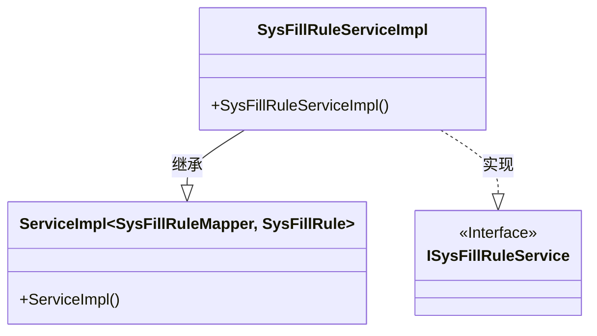
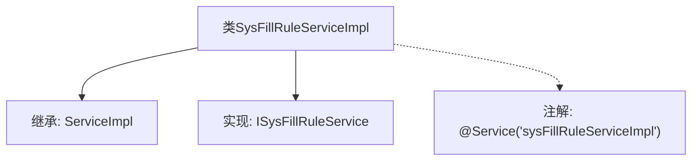

# 基础信息

|      |      |
|------|------|
| 名称 | SysFillRuleServiceImpl |
| 编码语言 | .java |
| 代码路径 | JeecgBoot/jeecg-boot/jeecg-module-system/jeecg-system-biz/src/main/java/org/jeecg/modules/system/service/impl/SysFillRuleServiceImpl.java |
| 包名 | org.jeecg.modules.system.service.impl |
| 依赖项 | ['com.baomidou.mybatisplus.extension.service.impl.ServiceImpl', 'org.jeecg.modules.system.entity.SysFillRule', 'org.jeecg.modules.system.mapper.SysFillRuleMapper', 'org.jeecg.modules.system.service.ISysFillRuleService', 'org.springframework.stereotype.Service'] |
| 概述说明 | SysFillRuleServiceImpl类实现ISysFillRuleService接口并继承ServiceImpl类。 |

# 说明

SysFillRuleServiceImpl类实现了ISysFillRuleService接口，并继承了ServiceImpl类。这意味着SysFillRuleServiceImpl类不仅具备ISysFillRuleService接口定义的所有功能，还继承了ServiceImpl类的属性和方法，从而实现了接口与类之间的双重继承关系。

# 类列表 Class Summary

| 名称   | 类型  | 说明 |
|-------|------|-------------|
| SysFillRuleServiceImpl | class | SysFillRuleServiceImpl类实现ISysFillRuleService接口，继承ServiceImpl类。 |

## 类 SysFillRuleServiceImpl

|      |      |
|------|------|
| 访问范围 | @Service("sysFillRuleServiceImpl");public |
| 类型 | class |
| 名称 | SysFillRuleServiceImpl |
| 说明 | SysFillRuleServiceImpl类实现ISysFillRuleService接口，继承ServiceImpl类。 |

### UML类图

这段代码描述了一个服务实现类 `SysFillRuleServiceImpl`，它继承了 `ServiceImpl` 泛型类，并实现了 `ISysFillRuleService` 接口。`ServiceImpl` 是一个泛型类，接受两个类型参数 `SysFillRuleMapper` 和 `SysFillRule`。`ISysFillRuleService` 是一个接口，标记为 `<<Interface>>`。`SysFillRuleServiceImpl` 通过继承和实现关系，将泛型类的功能与接口的规范结合起来，形成一个完整的服务实现类。

### 内部方法调用关系图

这段代码定义了一个名为 `SysFillRuleServiceImpl` 的类，该类继承了 `ServiceImpl<SysFillRuleMapper, SysFillRule>` 并实现了 `ISysFillRuleService` 接口。类上使用了 `@Service` 注解，指定了服务名称为 `'sysFillRuleServiceImpl'`。该类的设计主要用于处理与 `SysFillRule` 相关的业务逻辑，通过继承和实现的方式，提供了对数据库操作的基本功能。

### 字段列表 Field List

| 名称  | 类型  | 说明 |
|-------|-------|------|

### 方法列表 Method List

| 名称  | 类型  | 说明 |
|-------|-------|------|

